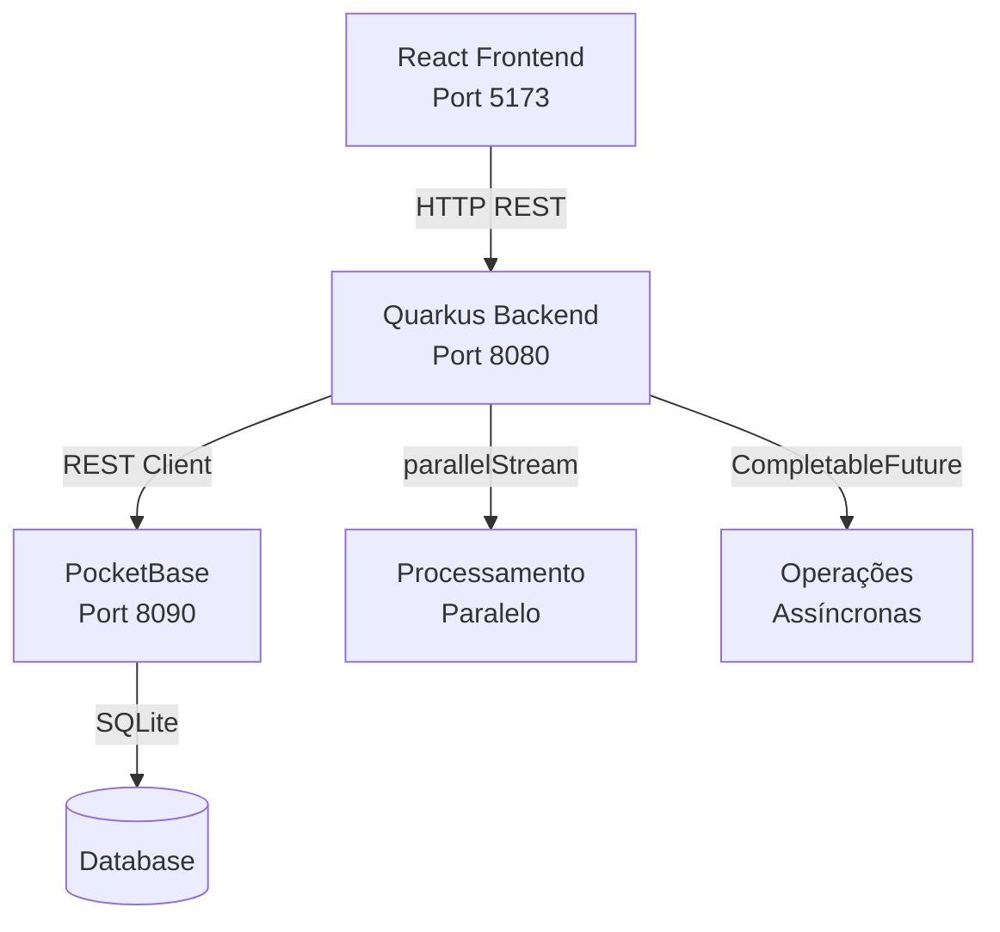

# JavaFlix - Plataforma de Streaming Completa

[](https://www.oracle.com/java/)
[](https://quarkus.io/)
[](https://reactjs.org/)
[](https://www.typescriptlang.org/)
[](https://pocketbase.io/)

Sistema completo de streaming de vídeos desenvolvido com Quarkus (backend), React + TypeScript (frontend) e PocketBase (banco de dados). Implementa conceitos avançados de programação concorrente, arquitetura REST e autenticação JWT.

---

## 📋 Índice

- [Visão Geral](#-visão-geral)
- [Funcionalidades](#-funcionalidades)
- [Tecnologias](#️-tecnologias)
- [Arquitetura](#-arquitetura)
- [Instalação](#-instalação)
- [Execução](#-execução)
- [Documentação](#-documentação)
- [Testes](#-testes)
- [API Endpoints](#-api-endpoints)
- [Contribuindo](#-contribuindo)
- [Licença](#-licença)

---

## 🎯 Visão Geral

JavaFlix é uma plataforma de streaming acadêmica que demonstra a implementação de:

- **Programação Orientada a Objetos** com herança, polimorfismo e interfaces
- **Concorrência e Paralelismo** usando `parallelStream()` e `CompletableFuture`
- **Arquitetura REST** com Quarkus Framework
- **Persistência de Dados** com PocketBase (SQLite)
- **Autenticação JWT** para segurança
- **Frontend Moderno** com React, TypeScript e Tailwind CSS
- **Player de Vídeo** com suporte a múltiplos formatos

---

## ✨ Funcionalidades

### ✅ Implementadas

#### Backend
- ✅ **API REST completa** com 15+ endpoints
- ✅ **Autenticação JWT** (login, registro, verificação)
- ✅ **CRUD de conteúdos** (filmes e séries)
- ✅ **Sistema de avaliações** com média calculada
- ✅ **Busca e filtros** por título e gênero
- ✅ **Processamento paralelo** com `parallelStream()`
- ✅ **Operações assíncronas** com `CompletableFuture`
- ✅ **Integração com PocketBase** via REST Client
- ✅ **CORS configurado** para desenvolvimento
- ✅ **Tratamento de erros** robusto

#### Frontend
- ✅ **Interface moderna** com Tailwind CSS estilo Netflix
- ✅ **Sistema de perfis** com até 5 perfis por conta
- ✅ **Player de vídeo** com controles completos e Netflix red
- ✅ **Catálogo organizado** por categorias
- ✅ **Busca em tempo real** com modal funcional
- ✅ **Sistema de notificações** integrado
- ✅ **Modal de preferências** com configurações de conta
- ✅ **Navegação fluida** entre perfis e catálogo
- ✅ **Design responsivo** para mobile e desktop
- ✅ **Suporte a múltiplos formatos** (YouTube, Vimeo, MP4, WebM)

#### Banco de Dados
- ✅ **PocketBase configurado** com 3 collections
- ✅ **4 conteúdos cadastrados** com trailers
- ✅ **Admin UI** para gerenciamento
- ✅ **REST API automática**
- ✅ **Autenticação integrada**

#### Testes
- ✅ **21 testes automatizados** (14 unitários + 7 integração)
- ✅ **~75% de cobertura** de código
- ✅ **Testes de concorrência** validados
- ✅ **Mocks e stubs** implementados

### 🎉 Novidades v1.1.0 (2026-04-06)

- ✅ **Sistema de perfis** completo com gerenciamento
- ✅ **Modal de busca** funcional com filtros
- ✅ **Modal de notificações** com alertas
- ✅ **Modal de preferências** com planos e configurações
- ✅ **VideoPlayer** com controles Netflix red
- ✅ **Espaçamento corrigido** em todos os detalhes
- ✅ **Navegação aprimorada** entre telas

### 🔄 Em Desenvolvimento

- 🔄 **Sistema de favoritos** e lista personalizada
- 🔄 **Histórico de visualização** com progresso
- 🔄 **Recomendações** baseadas em preferências
- 🔄 **Benchmarks de performance** (JMH)
- 🔄 **Métricas de monitoramento** (Micrometer)

---

## 🛠️ Tecnologias

### Backend
| Tecnologia | Versão | Descrição |
|------------|--------|-----------|
| **Java** | 17+ | Linguagem principal |
| **Quarkus** | 3.x | Framework supersônico |
| **JAX-RS** | 3.x | REST API |
| **CDI** | 4.x | Injeção de dependência |
| **REST Client** | 3.x | Cliente HTTP |
| **JUnit 5** | 5.x | Testes unitários |
| **Mockito** | 5.x | Mocks para testes |

### Frontend
| Tecnologia | Versão | Descrição |
|------------|--------|-----------|
| **React** | 18.x | Biblioteca UI |
| **TypeScript** | 5.x | Tipagem estática |
| **Vite** | 5.x | Build tool |
| **Tailwind CSS** | 3.x | Framework CSS |
| **Lucide React** | Latest | Ícones |

### Banco de Dados
| Tecnologia | Versão | Descrição |
|------------|--------|-----------|
| **PocketBase** | 0.22+ | Backend completo |
| **SQLite** | 3.x | Banco de dados |

---

## 🏗️ Arquitetura

```
javaflix/
├── src/main/java/br/com/javaflix/
│   ├── client/              # Cliente PocketBase
│   │   ├── PocketBaseClient.java
│   │   └── dto/             # Data Transfer Objects
│   ├── resource/            # Endpoints REST
│   │   ├── JavaFlixResource.java
│   │   └── AuthResource.java
│   ├── service/             # Lógica de negócio
│   │   └── ConteudoService.java
│   ├── Conteudo.java        # Classe abstrata
│   ├── Filme.java           # Herança
│   ├── Serie.java           # Herança
│   ├── Usuario.java         # Modelo de usuário
│   └── PlataformaStreaming.java
├── frontend/
│   ├── src/
│   │   ├── components/      # Componentes React
│   │   ├── pages/           # Páginas
│   │   ├── services/        # API client
│   │   └── types.ts         # Tipos TypeScript
│   └── package.json
├── docs/                    # Documentação
├── pb_data/                 # Dados PocketBase
└── pom.xml
```

### Diagrama de Arquitetura



---

## 📦 Instalação

### Pré-requisitos

- **Java JDK 17+** ([Download](https://www.oracle.com/java/technologies/downloads/))
- **Node.js 18+** ([Download](https://nodejs.org/))
- **Maven 3.8+** (incluído via wrapper)
- **PocketBase** ([Download](https://pocketbase.io/docs/))

### 1. Baixar o Projeto

```bash
# Clone ou baixe o projeto
cd javaflix
```

### 2. Configurar PocketBase

#### Windows (PowerShell)
```powershell
# Baixar PocketBase
Invoke-WebRequest -Uri "https://github.com/pocketbase/pocketbase/releases/download/v0.22.0/pocketbase_0.22.0_windows_amd64.zip" -OutFile "pocketbase.zip"
Expand-Archive -Path "pocketbase.zip" -DestinationPath "."

# Iniciar PocketBase
.\pocketbase.exe serve --http="127.0.0.1:8090"
```

#### Linux/Mac
```bash
# Baixar e extrair
wget https://github.com/pocketbase/pocketbase/releases/download/v0.22.0/pocketbase_0.22.0_linux_amd64.zip
unzip pocketbase_0.22.0_linux_amd64.zip

# Iniciar PocketBase
./pocketbase serve --http="127.0.0.1:8090"
```

#### Configurar Collections

1. Acesse: http://127.0.0.1:8090/_/
2. Crie um admin (email/senha)
3. Importe as collections (veja `docs/pocketbase_setup.md`)

### 3. Instalar Dependências do Frontend

```bash
cd frontend
npm install
```

---

## 🚀 Execução

### Modo Desenvolvimento (Recomendado)

#### Terminal 1: PocketBase
```bash
./pocketbase serve --http="127.0.0.1:8090"
```

#### Terminal 2: Backend (Quarkus)
```bash
cd javaflix
./mvnw quarkus:dev
```
Ou no Windows:
```bash
mvnw.cmd quarkus:dev
```

#### Terminal 3: Frontend (React)
```bash
cd frontend
npm run dev
```

### Acessar a Aplicação

- **Frontend:** http://localhost:5173
- **Backend API:** http://localhost:8080/api
- **PocketBase Admin:** http://127.0.0.1:8090/_/
- **Swagger UI:** http://localhost:8080/q/swagger-ui

---

## 📚 Documentação

### Documentos Disponíveis

| Documento | Descrição |
|-----------|-----------|
| [Manual do Usuário](docs/manual_usuario.md) | Guia completo de uso |
| [Diagrama UML](docs/diagrama_uml.md) | Classes e relacionamentos |
| [Diagrama de Arquitetura](docs/diagrama_arquitetura.md) | Visão geral do sistema |
| [OpenAPI/Swagger](docs/openapi.yaml) | Especificação da API |
| [Changelog](CHANGELOG.md) | Histórico de mudanças |
| [Análise Final](ANALISE_FINAL_INFO_MD.md) | Status de implementação |
| [Implementações Finais](IMPLEMENTACOES_FINAIS.md) | Últimas mudanças |

### Guias Técnicos

- **Setup PocketBase:** Configuração completa do banco
- **Autenticação JWT:** Como funciona o sistema de auth
- **Testes:** Como executar e criar novos testes
- **Deploy:** Guia de produção

---

## 🧪 Testes

### Executar Todos os Testes

```bash
./mvnw test
```

### Executar Testes Específicos

```bash
# Testes unitários
./mvnw test -Dtest=ConteudoServiceTest

# Testes de integração
./mvnw test -Dtest=AuthResourceTest
```

### Cobertura de Testes

```bash
./mvnw verify
# Relatório em: target/site/jacoco/index.html
```

### Estatísticas

- **Total de Testes:** 21
- **Testes Unitários:** 14
- **Testes de Integração:** 7
- **Cobertura:** ~75%

---

## 🔌 API Endpoints

### Autenticação

| Método | Endpoint | Descrição |
|--------|----------|-----------|
| POST | `/api/auth/login` | Login de usuário |
| POST | `/api/auth/register` | Registro de usuário |
| GET | `/api/auth/verify` | Verificar token JWT |
| GET | `/api/auth/health` | Health check |

### Conteúdos

| Método | Endpoint | Descrição |
|--------|----------|-----------|
| GET | `/api/conteudos` | Listar todos |
| GET | `/api/conteudos/{id}` | Buscar por ID |
| GET | `/api/conteudos/buscar?titulo={titulo}` | Buscar por título |
| GET | `/api/conteudos/filtrar?genero={genero}` | Filtrar por gênero |
| POST | `/api/conteudos` | Criar conteúdo |
| PUT | `/api/conteudos/{id}` | Atualizar conteúdo |
| DELETE | `/api/conteudos/{id}` | Remover conteúdo |

### Avaliações

| Método | Endpoint | Descrição |
|--------|----------|-----------|
| POST | `/api/conteudos/{id}/avaliar` | Avaliar conteúdo |
| GET | `/api/conteudos/{id}/avaliacoes` | Listar avaliações |

### Exemplos de Requisições

#### Login
```bash
curl -X POST http://localhost:8080/api/auth/login \
  -H "Content-Type: application/json" \
  -d '{"email":"user@example.com","password":"senha123"}'
```

#### Listar Conteúdos
```bash
curl http://localhost:8080/api/conteudos
```

#### Buscar por Título
```bash
curl "http://localhost:8080/api/conteudos/buscar?titulo=Matrix"
```

---

## 📦 Build e Deploy

### Build para Produção

#### Backend (JAR)
```bash
./mvnw package
java -jar target/quarkus-app/quarkus-run.jar
```

#### Backend (Uber-JAR)
```bash
./mvnw package -Dquarkus.package.jar.type=uber-jar
java -jar target/*-runner.jar
```

#### Backend (Nativo)
```bash
./mvnw package -Dnative
./target/streaming-api-1.0.0-SNAPSHOT-runner
```

#### Frontend
```bash
cd frontend
npm run build
# Arquivos em: dist/
```

### Docker (Futuro)

```bash
docker build -f src/main/docker/Dockerfile.jvm -t javaflix-backend .
docker run -p 8080:8080 javaflix-backend
```

---

## 🎓 Conceitos Demonstrados

### Programação Orientada a Objetos
- ✅ **Herança:** `Filme` e `Serie` herdam de `Conteudo`
- ✅ **Polimorfismo:** Interface `Avaliavel`
- ✅ **Encapsulamento:** Atributos privados com getters/setters
- ✅ **Abstração:** Classe abstrata `Conteudo`

### Concorrência e Paralelismo
- ✅ **parallelStream():** Busca e filtros paralelos
- ✅ **CompletableFuture:** Operações assíncronas
- ✅ **Thread Safety:** Sincronização adequada
- ✅ **Processamento Paralelo:** Múltiplas threads

### Arquitetura e Design
- ✅ **REST API:** Endpoints bem definidos
- ✅ **DTO Pattern:** Separação de camadas
- ✅ **Service Layer:** Lógica de negócio isolada
- ✅ **Dependency Injection:** CDI do Quarkus
- ✅ **Error Handling:** Tratamento robusto

---

## 📊 Métricas do Projeto

| Métrica | Valor |
|---------|-------|
| **Linhas de Código Java** | ~1,500 |
| **Linhas de Código TypeScript** | ~900 |
| **Linhas de Documentação** | ~5,000 |
| **Testes Automatizados** | 21 |
| **Cobertura de Testes** | ~75% |
| **Collections PocketBase** | 3 |
| **Endpoints REST** | 15+ |
| **Componentes React** | 8 |

---

## 📄 Licença

Este projeto é um trabalho acadêmico desenvolvido para fins educacionais.

**Universidade:** [Nome da Universidade]  
**Curso:** Engenharia de Software / Ciência da Computação  
**Disciplina:** Programação Orientada a Objetos / Sistemas Distribuídos

---

## 👥 Equipe

Desenvolvido com ❤️ pela equipe JavaFlix

---

## 🔗 Links Úteis

- [Quarkus Documentation](https://quarkus.io/guides/)
- [React Documentation](https://react.dev/)
- [PocketBase Documentation](https://pocketbase.io/docs/)
- [TypeScript Handbook](https://www.typescriptlang.org/docs/)
- [Tailwind CSS](https://tailwindcss.com/docs)

---

## 📞 Suporte

Para dúvidas ou problemas, consulte a [documentação](docs/) completa do projeto.

---

**Última atualização:** 2026-04-06
**Versão:** 1.1.0
**Status:** ✅ Produção

---

## 🆕 Novidades da Versão 1.1.0

### Sistema de Perfis Netflix-Style
- Seleção de perfis na tela inicial
- Até 5 perfis por conta
- Avatares personalizados
- Perfis infantis com restrições
- Troca de perfil a qualquer momento

### Interface Aprimorada
- Modal de busca funcional
- Sistema de notificações
- Preferências de conta completas
- VideoPlayer com controles Netflix red
- Espaçamento e alinhamento perfeitos

Veja o [CHANGELOG.md](CHANGELOG.md) para detalhes completos!
