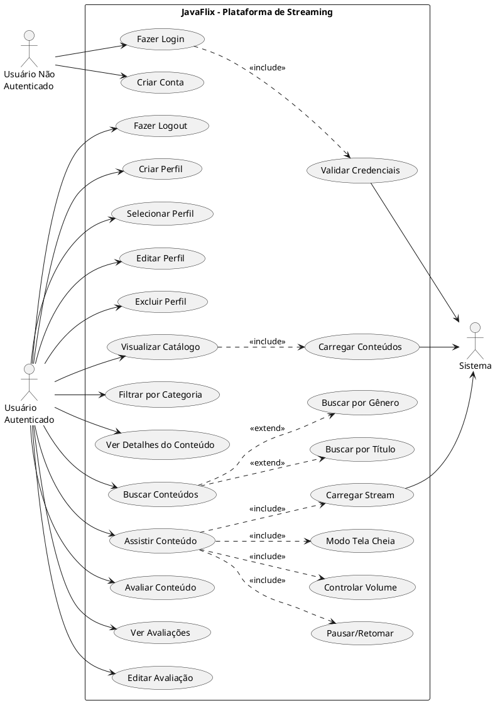
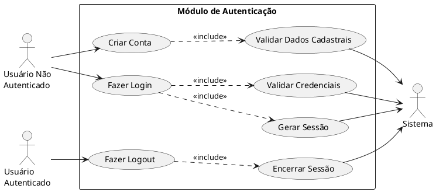
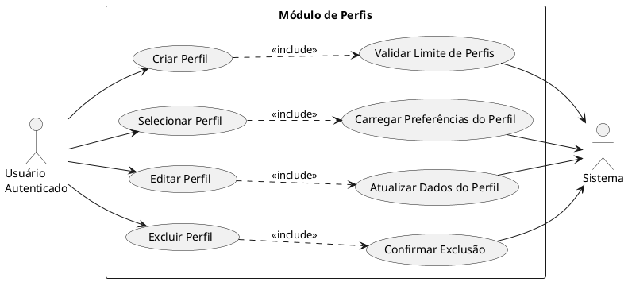
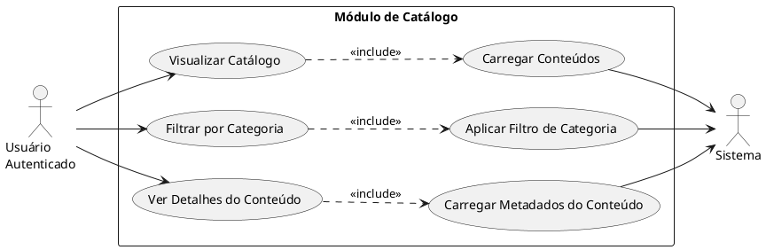
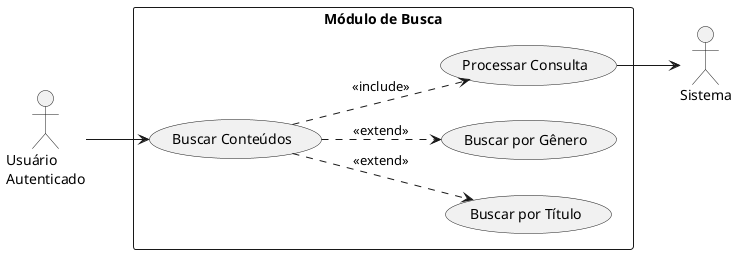
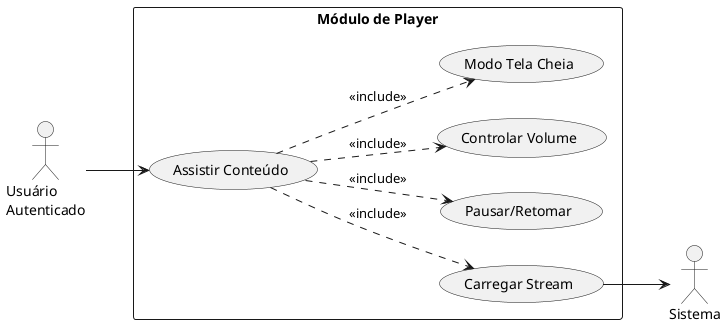
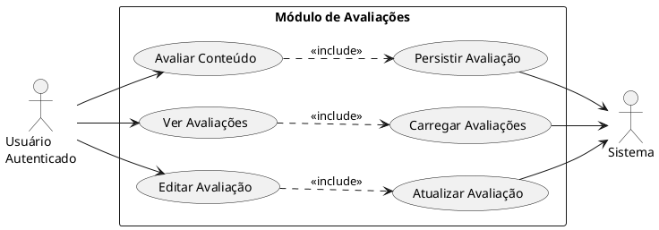

# Diagramas UML de Casos de Uso do JavaFlix

## 1. Introdução aos Diagramas de Casos de Uso

Os diagramas de casos de uso fazem parte do padrão UML 2.5 e são utilizados para representar, de forma visual, as funcionalidades oferecidas por um sistema sob a perspectiva de quem interage com ele. Em vez de detalhar implementação técnica, esse tipo de diagrama evidencia objetivos do usuário, responsabilidades do sistema e relacionamentos entre funcionalidades.

No contexto do JavaFlix, os diagramas apresentados neste documento descrevem o comportamento funcional do MVP da plataforma de streaming educacional, considerando os módulos de autenticação, perfis, catálogo, busca, player e avaliações. O foco está na interação entre atores externos e os serviços disponibilizados pela aplicação composta por backend Quarkus REST API e frontend React SPA.

### 1.1 Objetivos deste documento

- documentar os principais casos de uso do JavaFlix;
- apresentar uma visão geral e também visões modulares do sistema;
- detalhar os fluxos principais e alternativos dos casos de uso centrais;
- padronizar a comunicação funcional entre produto, desenvolvimento e testes;
- fornecer uma base consistente para evolução futura da solução.

### 1.2 Atores do sistema

| Ator | Descrição |
|---|---|
| Usuário Não Autenticado | Pessoa que acessa a plataforma sem sessão válida e pode criar conta ou iniciar autenticação. |
| Usuário Autenticado | Pessoa com sessão ativa, capaz de gerenciar perfis, navegar no catálogo, buscar conteúdos, assistir vídeos e registrar avaliações. |
| Sistema | Representação dos serviços internos da plataforma, responsáveis por validar credenciais, carregar dados, disponibilizar stream e persistir operações. |

### 1.3 Convenções utilizadas

Este documento adota as seguintes convenções de modelagem UML 2.5:

- atores são representados fora da fronteira do sistema;
- casos de uso são nomeados com verbos no infinitivo;
- a fronteira do sistema identifica o escopo funcional do JavaFlix;
- relacionamentos [`<<include>>`](javaflix/docs/DIAGRAMAS_UML.md:31) indicam comportamento obrigatório reutilizado;
- relacionamentos [`<<extend>>`](javaflix/docs/DIAGRAMAS_UML.md:32) indicam comportamento opcional ou especializado;
- associações representam interação direta entre ator e caso de uso;
- generalizações representam especialização entre atores ou entre casos de uso.

### 1.4 Link base para renderização online

Os blocos PlantUML deste documento podem ser copiados e colados no renderizador online oficial:

- http://www.plantuml.com/plantuml/uml/

---

## 2. Diagrama Geral do Sistema

### 2.1 Visão consolidada do MVP

O diagrama abaixo reúne todos os casos de uso do MVP do JavaFlix em uma única visão funcional.

**Renderização online:** http://www.plantuml.com/plantuml/uml/

### 2.2 Leitura do diagrama geral

A visão geral demonstra que:

- o acesso inicial ao sistema é dividido entre autenticação e criação de conta;
- as funcionalidades centrais do produto são acionadas por usuário autenticado;
- alguns comportamentos dependem de serviços internos obrigatórios, como validação de credenciais, carga de catálogo e entrega de stream;
- a busca foi modelada com especializações por critério;
- o player inclui ações operacionais que compõem a experiência de assistir conteúdo.

---

## 3. Diagramas Detalhados por Módulo

### 3.1 Módulo de Autenticação

**Renderização online:** http://www.plantuml.com/plantuml/uml/

### 3.2 Módulo de Perfis

**Renderização online:** http://www.plantuml.com/plantuml/uml/

### 3.3 Módulo de Catálogo

**Renderização online:** http://www.plantuml.com/plantuml/uml/

### 3.4 Módulo de Busca

**Renderização online:** http://www.plantuml.com/plantuml/uml/

### 3.5 Módulo de Player

**Renderização online:** http://www.plantuml.com/plantuml/uml/

### 3.6 Módulo de Avaliações

**Renderização online:** http://www.plantuml.com/plantuml/uml/

---

## 4. Descrição Detalhada dos Casos de Uso

A seguir são apresentados 10 casos de uso principais do MVP, com identificação, ator principal, pré-condições, fluxo principal, fluxos alternativos e pós-condições.

### 4.1 UC-01 — Criar Conta

| Campo | Descrição |
|---|---|
| ID do Caso de Uso | UC-01 |
| Nome | Criar Conta |
| Ator Principal | Usuário Não Autenticado |
| Pré-condições | O usuário não possui sessão autenticada e acessa a interface pública da plataforma. |
| Fluxo Principal | 1. O usuário acessa a opção de cadastro.   2. O sistema apresenta o formulário de criação de conta.   3. O usuário informa os dados obrigatórios.   4. O sistema valida os dados cadastrados.   5. O sistema cria a conta com sucesso.   6. O sistema confirma a criação da conta. |
| Fluxos Alternativos | A1. Dados obrigatórios ausentes: o sistema informa os campos pendentes.   A2. E-mail já cadastrado: o sistema rejeita o cadastro e solicita outro endereço.   A3. Dados inválidos: o sistema apresenta mensagens de validação. |
| Pós-condições | A conta do usuário fica registrada e apta para autenticação posterior. |

### 4.2 UC-02 — Fazer Login

| Campo | Descrição |
|---|---|
| ID do Caso de Uso | UC-02 |
| Nome | Fazer Login |
| Ator Principal | Usuário Não Autenticado |
| Pré-condições | O usuário possui conta previamente cadastrada e não está autenticado. |
| Fluxo Principal | 1. O usuário acessa a tela de login.   2. O usuário informa credenciais válidas.   3. O sistema valida as credenciais.   4. O sistema cria a sessão autenticada.   5. O sistema redireciona o usuário para a área autenticada. |
| Fluxos Alternativos | A1. Credenciais inválidas: o sistema nega o acesso e informa erro.   A2. Conta inexistente: o sistema orienta a criação de conta.   A3. Falha interna de autenticação: o sistema informa indisponibilidade temporária. |
| Pós-condições | Sessão autenticada ativa para o usuário. |

### 4.3 UC-03 — Criar Perfil

| Campo | Descrição |
|---|---|
| ID do Caso de Uso | UC-03 |
| Nome | Criar Perfil |
| Ator Principal | Usuário Autenticado |
| Pré-condições | O usuário está autenticado e ainda possui capacidade para cadastrar novo perfil. |
| Fluxo Principal | 1. O usuário acessa o gerenciamento de perfis.   2. O usuário seleciona a opção de criar perfil.   3. O sistema exibe formulário de perfil.   4. O usuário informa nome e preferências do perfil.   5. O sistema valida o limite de perfis e os dados informados.   6. O sistema registra o novo perfil. |
| Fluxos Alternativos | A1. Limite de perfis atingido: o sistema impede a criação.   A2. Nome inválido ou vazio: o sistema solicita correção. |
| Pós-condições | Novo perfil associado à conta autenticada. |

### 4.4 UC-04 — Selecionar Perfil

| Campo | Descrição |
|---|---|
| ID do Caso de Uso | UC-04 |
| Nome | Selecionar Perfil |
| Ator Principal | Usuário Autenticado |
| Pré-condições | O usuário está autenticado e possui ao menos um perfil cadastrado. |
| Fluxo Principal | 1. O sistema apresenta os perfis disponíveis.   2. O usuário escolhe um perfil.   3. O sistema carrega preferências, restrições e contexto do perfil.   4. O sistema libera o acesso às funcionalidades de catálogo e consumo de conteúdo. |
| Fluxos Alternativos | A1. Nenhum perfil disponível: o sistema direciona para criação de perfil.   A2. Perfil inválido ou indisponível: o sistema solicita nova seleção. |
| Pós-condições | Perfil ativo definido para a sessão atual. |

### 4.5 UC-05 — Visualizar Catálogo

| Campo | Descrição |
|---|---|
| ID do Caso de Uso | UC-05 |
| Nome | Visualizar Catálogo |
| Ator Principal | Usuário Autenticado |
| Pré-condições | O usuário está autenticado e com perfil selecionado. |
| Fluxo Principal | 1. O usuário acessa a área principal do catálogo.   2. O sistema carrega os conteúdos disponíveis.   3. O sistema organiza os itens por categorias e destaques.   4. O sistema apresenta a lista de conteúdos ao usuário. |
| Fluxos Alternativos | A1. Falha ao carregar conteúdos: o sistema informa erro e permite tentar novamente.   A2. Catálogo vazio: o sistema informa indisponibilidade de conteúdos. |
| Pós-condições | O catálogo é exibido com conteúdos disponíveis ao perfil selecionado. |

### 4.6 UC-06 — Buscar Conteúdos

| Campo | Descrição |
|---|---|
| ID do Caso de Uso | UC-06 |
| Nome | Buscar Conteúdos |
| Ator Principal | Usuário Autenticado |
| Pré-condições | O usuário está autenticado, com perfil selecionado e acesso ao catálogo. |
| Fluxo Principal | 1. O usuário acessa o campo de busca.   2. O usuário informa um critério de pesquisa.   3. O sistema processa a consulta.   4. O sistema retorna conteúdos compatíveis com o critério informado. |
| Fluxos Alternativos | A1. Busca por título: o sistema filtra resultados pelo nome da obra.   A2. Busca por gênero: o sistema retorna conteúdos da categoria correspondente.   A3. Nenhum resultado encontrado: o sistema informa ausência de correspondências. |
| Pós-condições | Lista de resultados de busca apresentada ao usuário. |

### 4.7 UC-07 — Ver Detalhes do Conteúdo

| Campo | Descrição |
|---|---|
| ID do Caso de Uso | UC-07 |
| Nome | Ver Detalhes do Conteúdo |
| Ator Principal | Usuário Autenticado |
| Pré-condições | O usuário está autenticado, com perfil selecionado e visualizando o catálogo ou os resultados de busca. |
| Fluxo Principal | 1. O usuário seleciona um conteúdo.   2. O sistema recupera os metadados do conteúdo.   3. O sistema apresenta sinopse, gênero, classificação, duração e avaliações. |
| Fluxos Alternativos | A1. Conteúdo indisponível: o sistema informa indisponibilidade temporária.   A2. Falha ao carregar detalhes: o sistema apresenta mensagem de erro. |
| Pós-condições | Os detalhes do conteúdo selecionado ficam visíveis ao usuário. |

### 4.8 UC-08 — Assistir Conteúdo

| Campo | Descrição |
|---|---|
| ID do Caso de Uso | UC-08 |
| Nome | Assistir Conteúdo |
| Ator Principal | Usuário Autenticado |
| Pré-condições | O usuário está autenticado, com perfil selecionado, e o conteúdo está disponível para reprodução. |
| Fluxo Principal | 1. O usuário seleciona a opção de reprodução.   2. O sistema carrega o stream do vídeo.   3. O player inicia a reprodução.   4. O usuário pode pausar ou retomar a execução.   5. O usuário pode ajustar volume e tela cheia durante a reprodução. |
| Fluxos Alternativos | A1. Falha ao carregar stream: o sistema informa erro de reprodução.   A2. Conteúdo bloqueado por restrição do perfil: o sistema impede a execução. |
| Pós-condições | Conteúdo em reprodução ou reprodução encerrada com interação registrada na sessão. |

### 4.9 UC-09 — Avaliar Conteúdo

| Campo | Descrição |
|---|---|
| ID do Caso de Uso | UC-09 |
| Nome | Avaliar Conteúdo |
| Ator Principal | Usuário Autenticado |
| Pré-condições | O usuário está autenticado, com perfil selecionado, e acessou um conteúdo elegível para avaliação. |
| Fluxo Principal | 1. O usuário acessa a opção de avaliação.   2. O usuário informa nota e, quando aplicável, comentário.   3. O sistema valida os dados da avaliação.   4. O sistema persiste a avaliação.   5. O sistema confirma o registro e atualiza a visualização de avaliações. |
| Fluxos Alternativos | A1. Nota fora da faixa permitida: o sistema solicita correção.   A2. Falha ao salvar avaliação: o sistema informa erro. |
| Pós-condições | Avaliação registrada e vinculada ao conteúdo e ao usuário. |

### 4.10 UC-10 — Editar Avaliação

| Campo | Descrição |
|---|---|
| ID do Caso de Uso | UC-10 |
| Nome | Editar Avaliação |
| Ator Principal | Usuário Autenticado |
| Pré-condições | O usuário está autenticado e possui avaliação previamente registrada para o conteúdo. |
| Fluxo Principal | 1. O usuário acessa sua avaliação existente.   2. O sistema apresenta os dados atuais.   3. O usuário altera nota ou comentário.   4. O sistema valida os novos dados.   5. O sistema atualiza a avaliação.   6. O sistema confirma a edição. |
| Fluxos Alternativos | A1. Avaliação inexistente: o sistema impede a edição.   A2. Dados inválidos: o sistema solicita ajuste.   A3. Falha de atualização: o sistema informa erro. |
| Pós-condições | Avaliação previamente existente é atualizada com os novos dados. |

---

## 5. Glossário de Relacionamentos UML

### 5.1 Associação

Associação é a ligação básica entre um ator e um caso de uso. Ela indica que o ator participa, inicia ou interage diretamente com determinada funcionalidade do sistema.

**Exemplo no JavaFlix:** o ator Usuário Autenticado está associado ao caso de uso “Assistir Conteúdo”.

### 5.2 [`<<include>>`](javaflix/docs/DIAGRAMAS_UML.md:31)

O relacionamento [`<<include>>`](javaflix/docs/DIAGRAMAS_UML.md:31) representa a inclusão obrigatória de um comportamento comum dentro de outro caso de uso. Ele é usado quando uma funcionalidade sempre depende da execução de outra funcionalidade reutilizável.

**Exemplo no JavaFlix:** “Fazer Login” inclui “Validar Credenciais”, porque a validação é obrigatória em toda autenticação.

### 5.3 [`<<extend>>`](javaflix/docs/DIAGRAMAS_UML.md:32)

O relacionamento [`<<extend>>`](javaflix/docs/DIAGRAMAS_UML.md:32) representa uma extensão opcional ou condicional do comportamento de um caso de uso base. Ele é apropriado quando há especializações ou variações que não ocorrem obrigatoriamente em todas as execuções.

**Exemplo no JavaFlix:** “Buscar Conteúdos” pode ser estendido por “Buscar por Título” ou “Buscar por Gênero”, conforme o critério escolhido.

### 5.4 Generalização

Generalização representa herança ou especialização entre elementos UML. Em atores, indica que um ator especializado pode herdar comportamentos de outro ator mais genérico. Em casos de uso, indica variação especializada de um comportamento.

**Exemplo conceitual:** um ator especializado pode estender as capacidades de outro ator base sem duplicar a modelagem de relacionamentos já existentes.

---

## 6. Observações Finais

Os diagramas deste documento representam o escopo funcional do MVP do JavaFlix em conformidade com UML 2.5, com foco em clareza de comunicação e aderência ao domínio da plataforma de streaming educacional. Os blocos PlantUML podem ser reutilizados em documentação técnica, apresentações acadêmicas e validações de requisitos.