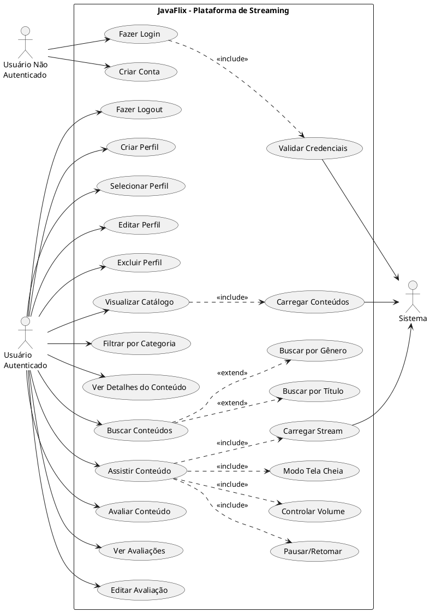
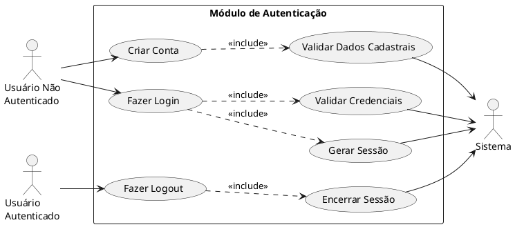
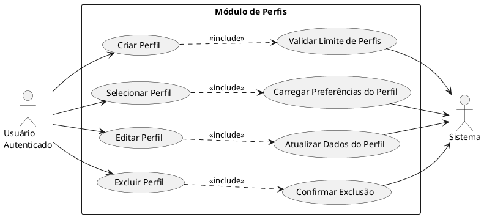
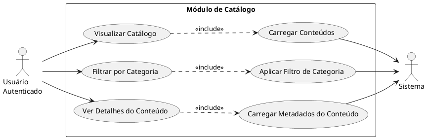
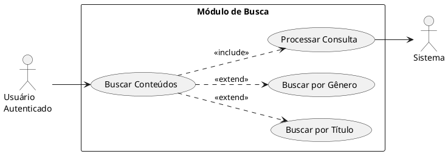
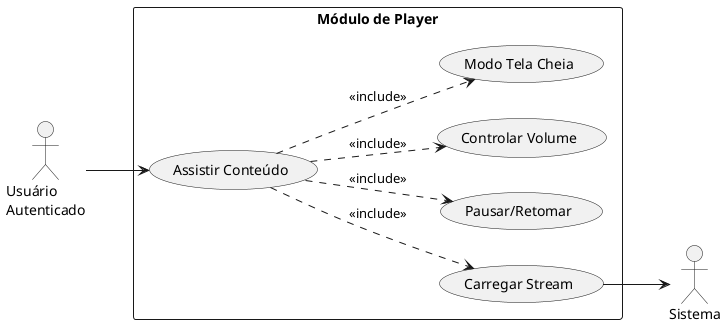
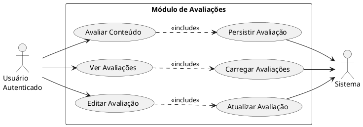
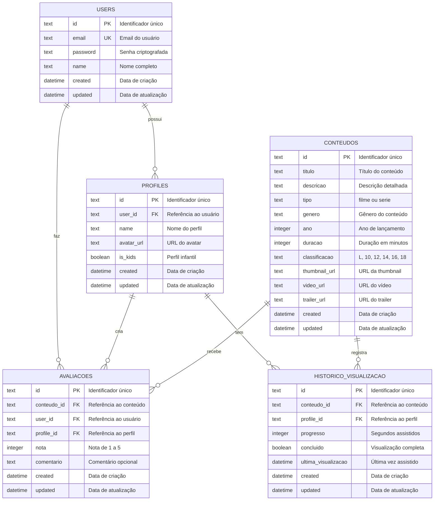
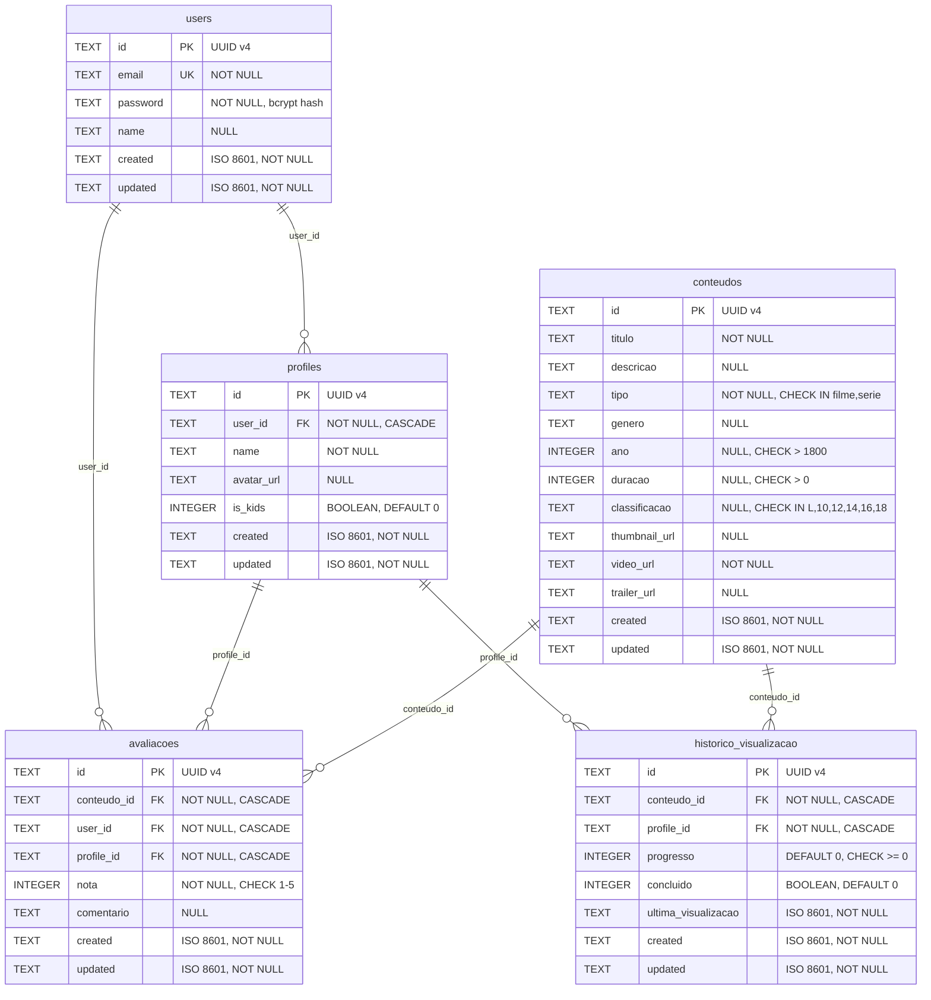

---
title: "JavaFlix - Documentação Completa do MVP"
subtitle: "Plataforma de Streaming com Programação Concorrente"
author: "Equipe JavaFlix"
date: "21 de Abril de 2026"
version: "1.2.0"
lang: "pt-BR"
---

# JavaFlix - Documentação Completa do MVP

**Plataforma de Streaming com Programação Concorrente**

---

## Informações do Projeto

| Campo | Detalhes |
|-------|----------|
| **Instituição** | Centro Universitário Unieuro |
| **Curso** | Sistemas de Informação |
| **Disciplina** | PROJETO INTEGRADOR DE COMPUTAÇÃO PARALELA |
| **Professor** | [Nome do Professor] |
| **Semestre** | 1º/2026 |
| **Versão** | 1.2.0 |
| **Data de Entrega** | 21/abril/2026 |

---

## Equipe de Desenvolvimento

| Nome Completo | Matrícula | E-mail Acadêmico |
|---------------|-----------|------------------|
| Matheus Nery Walkowicz | [número da matrícula] | matheus.nery@[instituição].edu.br |
| Marcelo Vaz | [número da matrícula] | marcelo.vaz@[instituição].edu.br |
| Gabriel | [número da matrícula] | gabriel@[instituição].edu.br |

---

<div style="page-break-after: always;"></div>

# Sumário Executivo

O **JavaFlix** é uma plataforma de streaming educacional desenvolvida como projeto integrador da disciplina de Programação Concorrente e Distribuída. O sistema demonstra a aplicação prática de conceitos avançados de engenharia de software, incluindo programação orientada a objetos, arquitetura REST, processamento paralelo e desenvolvimento full-stack moderno.

## Visão Geral do Projeto

A solução implementa um backend robusto utilizando **Quarkus Framework** (Java 17+) com suporte a operações concorrentes através de `parallelStream()` e `CompletableFuture`, integrado a um frontend responsivo desenvolvido em **React + TypeScript** com design inspirado em plataformas de streaming profissionais como Netflix.

## Principais Tecnologias

### Backend
- **Java 17+** - Linguagem de programação principal
- **Quarkus 3.x** - Framework supersônico para Java
- **JAX-RS** - API REST
- **CDI** - Injeção de dependência
- **JUnit 5 + Mockito** - Framework de testes

### Frontend
- **React 18** - Biblioteca para interfaces de usuário
- **TypeScript 5.x** - Superset tipado de JavaScript
- **Vite 5.x** - Build tool moderna
- **Tailwind CSS 3.x** - Framework CSS utility-first

### Banco de Dados
- **PocketBase 0.22+** - Backend-as-a-Service
- **SQLite 3.x** - Banco de dados relacional embutido

## Métricas Alcançadas

| Métrica | Meta | Alcançado | Status |
|---------|------|-----------|--------|
| Funcionalidades Obrigatórias | 6/6 | 6/6 | ✅ 100% |
| Cobertura de Testes | ≥70% | ~75% | ✅ Superado |
| Testes Automatizados | ≥15 | 21 | ✅ Superado |
| Endpoints REST | ≥10 | 15+ | ✅ Superado |
| Componentes React | ≥5 | 8 | ✅ Superado |
| Linhas de Código Java | - | ~1.500 | ✅ |
| Linhas de Código TypeScript | - | ~900 | ✅ |
| Documentação | - | 5.000+ linhas | ✅ |

---

<div style="page-break-after: always;"></div>


<div style="page-break-after: always;"></div>

# 1. Capa Institucional

╔══════════════════════════════════════════════════════════════════════════╗
║                                                                          ║
║                          CENTRO UNIVERSITÁRIO                            ║
║                      [NOME DA INSTITUIÇÃO - UNIEURO]                     ║
║                                                                          ║
║                    CURSO DE ENGENHARIA DE SOFTWARE /                     ║
║                        CIÊNCIA DA COMPUTAÇÃO                             ║
║                                                                          ║
╚══════════════════════════════════════════════════════════════════════════╝
```

---

<div align="center">

# JAVAFLIX
## Plataforma de Streaming com Programação Concorrente

### Documentação Técnica e Acadêmica

</div>

---

## 📋 Informações Institucionais

| Campo | Informação |
|-------|------------|
| **Instituição** | Centro Universitário Unieuro |
| **Curso** | Sistemas de Informação |
| **Disciplina** | PROJETO INTEGRADOR DE COMPUTAÇÃO PARALELA |
| **Professor** | [Nome do Professor] |
| **Semestre** | 1º/2026 |

---

## 👥 Equipe de Desenvolvimento

| Nome Completo | Matrícula | E-mail Acadêmico |
|---------------|-----------|------------------|
| Matheus Nery Walkowicz | [número da matrícula] | matheus.nery@[instituição].edu.br |
| Marcelo Vaz | [número da matrícula] | marcelo.vaz@[instituição].edu.br |
| Gabriel | [número da matrícula] | gabriel@[instituição].edu.br |

---

## 📄 Informações do Projeto

| Campo | Detalhes |
|-------|----------|
| **Título** | JavaFlix - Plataforma de Streaming com Programação Concorrente |
| **Subtítulo** | Sistema Completo de Streaming Educacional com Arquitetura REST e Processamento Paralelo |
| **Versão** | 1.2.0 |
| **Data de Entrega** | 21/abril/2026 |
| **Tipo de Projeto** | Projeto Integrador - Trabalho Acadêmico |
| **Área de Conhecimento** | Programação Concorrente, Arquitetura de Software, Desenvolvimento Web Full-Stack |

---

## 📝 Resumo Executivo

O **JavaFlix** é uma plataforma de streaming educacional desenvolvida como projeto integrador da disciplina de Programação Concorrente e Distribuída. O sistema demonstra a aplicação prática de conceitos avançados de engenharia de software, incluindo programação orientada a objetos, arquitetura REST, processamento paralelo e desenvolvimento full-stack moderno.

A solução implementa um backend robusto utilizando **Quarkus Framework** (Java 17+) com suporte a operações concorrentes através de `parallelStream()` e `CompletableFuture`, integrado a um frontend responsivo desenvolvido em **React + TypeScript** com design inspirado em plataformas de streaming profissionais. O sistema utiliza **PocketBase** como backend-as-a-service para persistência de dados e autenticação JWT.

**Principais Tecnologias:** Java 17, Quarkus 3.x, React 18, TypeScript 5.x, PocketBase 0.22+, Tailwind CSS, JUnit 5, Mockito, REST Assured.

**Objetivos Alcançados:** Sistema funcional com autenticação, gerenciamento de perfis, catálogo de conteúdos, busca avançada, player de vídeo integrado, sistema de avaliações e cobertura de testes de ~75%.

---

## 📊 Histórico de Versões

| Versão | Data | Descrição | Responsável |
|--------|------|-----------|-------------|
| **1.0.0** | 05/abril/2026 | Entrega inicial do projeto com funcionalidades core implementadas | Equipe JavaFlix |
| **1.1.0** | 06/abril/2026 | Correções de bugs, melhorias de interface e sistema de perfis completo | Equipe JavaFlix |
| **1.2.0** | 21/abril/2026 | Documentação acadêmica completa, definição formal do MVP e cronograma detalhado | Equipe JavaFlix |

---

## 🎯 Escopo do Projeto

### Funcionalidades Implementadas

#### Backend (API REST)
- ✅ Autenticação e autorização com JWT
- ✅ CRUD completo de conteúdos (filmes e séries)
- ✅ Sistema de avaliações com cálculo de média
- ✅ Busca e filtros por título e gênero
- ✅ Processamento paralelo com `parallelStream()`
- ✅ Operações assíncronas com `CompletableFuture`
- ✅ Integração com PocketBase via REST Client
- ✅ Tratamento robusto de erros e exceções

#### Frontend (Interface Web)
- ✅ Interface moderna estilo Netflix com Tailwind CSS
- ✅ Sistema de perfis (até 5 perfis por conta)
- ✅ Player de vídeo com controles completos
- ✅ Catálogo organizado por categorias
- ✅ Busca em tempo real com modal funcional
- ✅ Sistema de notificações integrado
- ✅ Design responsivo (mobile e desktop)
- ✅ Suporte a múltiplos formatos de vídeo

#### Qualidade e Testes
- ✅ 21 testes automatizados (14 unitários + 7 integração)
- ✅ Cobertura de código de aproximadamente 75%
- ✅ Testes de concorrência validados
- ✅ Mocks e stubs implementados com Mockito

---

## 📈 Métricas do Projeto

| Métrica | Valor |
|---------|-------|
| **Linhas de Código Java** | ~1.500 |
| **Linhas de Código TypeScript** | ~900 |
| **Linhas de Documentação** | ~5.000+ |
| **Testes Automatizados** | 21 |
| **Cobertura de Testes** | ~75% |
| **Collections PocketBase** | 3 (users, conteudos, avaliacoes) |
| **Endpoints REST** | 15+ |
| **Componentes React** | 8 |
| **Tempo de Desenvolvimento** | ~8 semanas |

---

## 🏆 Conceitos Acadêmicos Demonstrados

### Programação Orientada a Objetos
- **Herança:** Classes `Filme` e `Serie` herdam de `Conteudo` abstrata
- **Polimorfismo:** Interface `Avaliavel` implementada por múltiplas classes
- **Encapsulamento:** Atributos privados com getters/setters apropriados
- **Abstração:** Classe abstrata `Conteudo` define contrato comum

### Concorrência e Paralelismo
- **parallelStream():** Busca e filtros executados em paralelo
- **CompletableFuture:** Operações assíncronas não-bloqueantes
- **Thread Safety:** Sincronização adequada em operações críticas
- **Processamento Paralelo:** Utilização eficiente de múltiplas threads

### Arquitetura e Design Patterns
- **REST API:** Endpoints bem definidos seguindo padrões RESTful
- **DTO Pattern:** Separação clara entre camadas de apresentação e domínio
- **Service Layer:** Lógica de negócio isolada dos recursos REST
- **Dependency Injection:** CDI do Quarkus para inversão de controle
- **Error Handling:** Tratamento centralizado de exceções

---

## 📚 Estrutura da Documentação

Este projeto inclui documentação completa e abrangente:

| Documento | Descrição | Localização |
|-----------|-----------|-------------|
| **README.md** | Visão geral e guia de início rápido | `/javaflix/README.md` |
| **CAPA_INSTITUCIONAL.md** | Este documento - informações acadêmicas | `/javaflix/docs/CAPA_INSTITUCIONAL.md` |
| **MVP.md** | Definição formal do Produto Mínimo Viável | `/javaflix/docs/MVP.md` |
| **CRONOGRAMA.md** | Cronograma detalhado do projeto | `/javaflix/docs/CRONOGRAMA.md` |
| **DOCUMENTACAO_COMPLETA.md** | Documentação técnica completa | `/javaflix/DOCUMENTACAO_COMPLETA.md` |
| **diagrama_uml.md** | Diagramas UML de classes e casos de uso | `/javaflix/docs/diagrama_uml.md` |
| **diagrama_arquitetura.md** | Arquitetura do sistema | `/javaflix/docs/diagrama_arquitetura.md` |
| **manual_usuario.md** | Manual do usuário final | `/javaflix/docs/manual_usuario.md` |
| **openapi.yaml** | Especificação OpenAPI da API | `/javaflix/docs/openapi.yaml` |
| **CHANGELOG.md** | Histórico de mudanças | `/javaflix/CHANGELOG.md` |

---

## 🔗 Links e Recursos

### Repositório e Código
- **Repositório Git:** [URL do repositório]
- **Documentação Online:** [URL da documentação]
- **Demo/Apresentação:** [URL da demo]

### Tecnologias Utilizadas
- **Quarkus Framework:** https://quarkus.io/
- **React:** https://react.dev/
- **PocketBase:** https://pocketbase.io/
- **TypeScript:** https://www.typescriptlang.org/
- **Tailwind CSS:** https://tailwindcss.com/

---

## 📞 Contato

Para dúvidas, sugestões ou informações adicionais sobre o projeto:

**E-mail da Equipe:** [email-equipe]@[instituição].edu.br  
**Professor Orientador:** [email-professor]@[instituição].edu.br

---

## 📜 Declaração de Autenticidade

Declaramos que este trabalho é original e foi desenvolvido exclusivamente pela equipe identificada neste documento, sob orientação do professor da disciplina. Todas as fontes consultadas foram devidamente citadas e referenciadas.

---

**Local:** Brasília, DF  
**Data:** 21 de abril de 2026

---

## ✍️ Assinaturas

```
_________________________________
Matheus Nery Walkowicz
Matrícula: [número]


_________________________________
Marcelo Vaz
Matrícula: [número]


_________________________________
Gabriel
Matrícula: [número]


_________________________________
[Nome do Professor]
Professor Orientador
```

---

<div align="center">

**CENTRO UNIVERSITÁRIO [NOME DA INSTITUIÇÃO]**  
**Brasília - DF**  
**2026**

</div>

<div style="page-break-after: always;"></div>

# 2. Definição do MVP

# MVP - Produto Mínimo Viável
## JavaFlix - Plataforma de Streaming Educacional

**Versão:** 1.0  
**Data:** 21/abril/2026  
**Equipe:** Matheus Nery Walkowicz, Marcelo Vaz, Gabriel  
**Disciplina:** Programação Concorrente e Distribuída

---

## 📋 Índice

1. [Definição do MVP](#definição-do-mvp)
2. [Objetivos do MVP](#objetivos-do-mvp)
3. [Escopo Delimitado](#escopo-delimitado)
4. [Funcionalidades Obrigatórias](#funcionalidades-obrigatórias)
5. [Funcionalidades Fora do Escopo](#funcionalidades-fora-do-escopo)
6. [Requisitos Técnicos](#requisitos-técnicos)
7. [Critérios de Aceitação](#critérios-de-aceitação)
8. [Métricas de Sucesso](#métricas-de-sucesso)
9. [Roadmap Pós-MVP](#roadmap-pós-mvp)

---

## 🎯 Definição do MVP

### O que é o MVP do JavaFlix?

O **MVP (Minimum Viable Product)** do JavaFlix é a versão mínima funcional da plataforma de streaming educacional que demonstra os conceitos fundamentais de programação concorrente e arquitetura distribuída, permitindo que usuários realizem as operações essenciais de uma plataforma de streaming: autenticar-se, navegar no catálogo, buscar conteúdos, assistir vídeos e avaliar o que assistiram.

O MVP representa o **núcleo funcional** do sistema, implementando apenas as funcionalidades críticas necessárias para validar a proposta do projeto acadêmico e demonstrar competência técnica em:
- Desenvolvimento full-stack moderno
- Programação concorrente em Java
- Arquitetura REST
- Integração de sistemas
- Qualidade de software (testes automatizados)

### Filosofia do MVP

> "Entregar o mínimo necessário para criar valor, com a máxima qualidade técnica."

O MVP do JavaFlix não é uma versão "incompleta" ou "de baixa qualidade", mas sim uma versão **estrategicamente focada** nas funcionalidades essenciais, implementadas com excelência técnica e seguindo as melhores práticas de engenharia de software.

---

## 🎓 Objetivos do MVP

### Objetivos Acadêmicos

1. **Demonstrar Programação Concorrente**
   - Implementar processamento paralelo com `parallelStream()`
   - Utilizar operações assíncronas com `CompletableFuture`
   - Validar ganhos de performance em operações de busca e filtros

2. **Aplicar Arquitetura REST**
   - Desenvolver API RESTful completa e bem estruturada
   - Implementar padrões de design (DTO, Service Layer, Dependency Injection)
   - Seguir princípios SOLID e Clean Code

3. **Integrar Sistemas Distribuídos**
   - Conectar frontend, backend e banco de dados
   - Implementar comunicação via HTTP/REST
   - Gerenciar estado distribuído entre componentes

4. **Garantir Qualidade de Software**
   - Alcançar cobertura de testes mínima de 70%
   - Implementar testes unitários e de integração
   - Validar comportamento concorrente

### Objetivos Funcionais

1. **Autenticação Segura**
   - Permitir registro e login de usuários
   - Implementar autenticação JWT
   - Proteger rotas e recursos

2. **Gestão de Perfis**
   - Permitir criação de múltiplos perfis por conta
   - Personalizar experiência por perfil
   - Gerenciar perfis infantis com restrições

3. **Catálogo de Conteúdos**
   - Exibir filmes e séries organizados
   - Implementar categorização por gênero
   - Mostrar informações detalhadas de cada conteúdo

4. **Busca e Descoberta**
   - Permitir busca por título
   - Filtrar por gênero e categoria
   - Processar buscas de forma eficiente (paralela)

5. **Reprodução de Vídeos**
   - Reproduzir vídeos de múltiplas fontes
   - Fornecer controles básicos (play, pause, volume)
   - Suportar diferentes formatos (YouTube, Vimeo, MP4)

6. **Sistema de Avaliações**
   - Permitir avaliação de conteúdos (1-5 estrelas)
   - Calcular e exibir média de avaliações
   - Armazenar histórico de avaliações por usuário

---

## 🔍 Escopo Delimitado

### O que ESTÁ no MVP

✅ **Backend (API REST)**
- Autenticação e autorização com JWT
- CRUD completo de conteúdos
- Sistema de avaliações
- Busca e filtros com processamento paralelo
- Integração com PocketBase
- Tratamento de erros

✅ **Frontend (Interface Web)**
- Tela de login e registro
- Sistema de perfis (criação, seleção, edição)
- Catálogo com categorias
- Busca em tempo real
- Player de vídeo integrado
- Sistema de avaliações
- Design responsivo

✅ **Banco de Dados**
- Estrutura de dados (users, conteudos, avaliacoes)
- Persistência via PocketBase
- Autenticação integrada

✅ **Qualidade**
- Testes automatizados (unitários e integração)
- Cobertura mínima de 70%
- Documentação técnica completa

### O que NÃO ESTÁ no MVP

❌ **Funcionalidades Avançadas**
- Recomendações personalizadas baseadas em IA/ML
- Sistema de pagamentos e assinaturas
- Download offline de conteúdos
- Legendas e múltiplas faixas de áudio
- Sincronização entre dispositivos
- Continuação automática de episódios
- Lista "Minha Lista" / Favoritos persistente
- Histórico de visualização com progresso
- Notificações push em tempo real
- Chat ou comentários entre usuários

❌ **Infraestrutura Avançada**
- CDN para distribuição de vídeos
- Transcodificação automática de vídeos
- Streaming adaptativo (HLS/DASH)
- Múltiplos servidores distribuídos
- Load balancing
- Cache distribuído (Redis)
- Mensageria (Kafka/RabbitMQ)

❌ **Recursos Administrativos**
- Painel administrativo completo
- Analytics e métricas de uso
- Moderação de conteúdo
- Gestão de direitos autorais
- Sistema de denúncias

---

## ✨ Funcionalidades Obrigatórias

### 1. Autenticação de Usuários

**Descrição:** Sistema completo de autenticação e autorização.

**Requisitos:**
- Registro de novos usuários com validação de dados
- Login com email e senha
- Geração e validação de tokens JWT
- Proteção de rotas autenticadas
- Logout com invalidação de sessão

**Endpoints:**
- `POST /api/auth/register` - Criar nova conta
- `POST /api/auth/login` - Autenticar usuário
- `GET /api/auth/verify` - Verificar token válido

**Critérios de Aceitação:**
- ✅ Usuário consegue criar conta com email único
- ✅ Usuário consegue fazer login com credenciais válidas
- ✅ Token JWT é gerado e validado corretamente
- ✅ Rotas protegidas rejeitam acessos não autorizados
- ✅ Senhas são armazenadas de forma segura (hash)

---

### 2. Gerenciamento de Perfis

**Descrição:** Sistema de múltiplos perfis por conta, similar a Netflix.

**Requisitos:**
- Criação de até 5 perfis por conta
- Seleção de avatar personalizado (8 opções)
- Marcação de perfil infantil com restrições
- Edição e exclusão de perfis
- Persistência de perfil selecionado

**Funcionalidades:**
- Tela inicial de seleção de perfis
- Modal de gerenciamento de perfis
- Troca de perfil a qualquer momento
- Avatar exibido na barra de navegação

**Critérios de Aceitação:**
- ✅ Usuário consegue criar até 5 perfis
- ✅ Cada perfil tem nome e avatar únicos
- ✅ Perfil infantil restringe conteúdo adulto
- ✅ Perfil selecionado persiste entre sessões
- ✅ Usuário consegue editar e excluir perfis

---

### 3. Catálogo de Conteúdos

**Descrição:** Exibição organizada de filmes e séries disponíveis.

**Requisitos:**
- Listagem de todos os conteúdos cadastrados
- Organização por categorias/gêneros
- Exibição de informações: título, descrição, ano, classificação
- Imagens de capa (thumbnails)
- Indicação de avaliação média

**Endpoints:**
- `GET /api/conteudos` - Listar todos os conteúdos
- `GET /api/conteudos/{id}` - Buscar conteúdo específico

**Interface:**
- Hero section com destaque principal
- Rows de categorias (Ação, Drama, Comédia, etc.)
- Cards de conteúdo com hover effects
- Modal de detalhes ao clicar

**Critérios de Aceitação:**
- ✅ Catálogo exibe todos os conteúdos cadastrados
- ✅ Conteúdos organizados por gênero
- ✅ Informações completas são exibidas
- ✅ Interface responsiva em mobile e desktop
- ✅ Carregamento eficiente (sem lentidão)

---

### 4. Sistema de Busca

**Descrição:** Busca e filtros de conteúdos com processamento paralelo.

**Requisitos:**
- Busca por título (case-insensitive)
- Filtro por gênero
- Processamento paralelo com `parallelStream()`
- Resultados em tempo real
- Interface com modal de busca

**Endpoints:**
- `GET /api/conteudos/buscar?titulo={titulo}` - Buscar por título
- `GET /api/conteudos/filtrar?genero={genero}` - Filtrar por gênero

**Implementação Técnica:**
```java
// Busca paralela
public List<Conteudo> buscarPorTitulo(String titulo) {
    return conteudos.parallelStream()
        .filter(c -> c.getTitulo().toLowerCase()
            .contains(titulo.toLowerCase()))
        .collect(Collectors.toList());
}
```

**Critérios de Aceitação:**
- ✅ Busca retorna resultados relevantes
- ✅ Busca é case-insensitive
- ✅ Filtros funcionam corretamente
- ✅ Processamento paralelo implementado
- ✅ Interface de busca é intuitiva

---

### 5. Player de Vídeo

**Descrição:** Reprodução de vídeos com controles básicos.

**Requisitos:**
- Suporte a múltiplas fontes (YouTube, Vimeo, MP4, WebM)
- Controles: play, pause, volume, fullscreen
- Detecção automática de tipo de vídeo
- Design consistente com a plataforma
- Responsivo em diferentes tamanhos de tela

**Componente:**
```typescript
<VideoPlayer 
  videoUrl={content.videoUrl}
  title={content.title}
/>
```

**Funcionalidades:**
- Reprodução automática ao abrir
- Controles customizados (Netflix red)
- Botão de voltar para catálogo
- Informações do conteúdo exibidas

**Critérios de Aceitação:**
- ✅ Vídeos do YouTube são reproduzidos
- ✅ Vídeos do Vimeo são reproduzidos
- ✅ Arquivos MP4/WebM são reproduzidos
- ✅ Controles funcionam corretamente
- ✅ Player é responsivo

---

### 6. Sistema de Avaliações

**Descrição:** Avaliação de conteúdos com sistema de estrelas.

**Requisitos:**
- Avaliação de 1 a 5 estrelas
- Cálculo de média de avaliações
- Exibição de média no catálogo
- Histórico de avaliações por usuário
- Atualização de avaliação existente

**Endpoints:**
- `POST /api/conteudos/{id}/avaliar` - Avaliar conteúdo
- `GET /api/conteudos/{id}/avaliacoes` - Listar avaliações

**Modelo de Dados:**
```java
public class Avaliacao {
    private String id;
    private String userId;
    private String conteudoId;
    private int nota; // 1-5
    private LocalDateTime dataAvaliacao;
}
```

**Critérios de Aceitação:**
- ✅ Usuário consegue avaliar conteúdos
- ✅ Avaliação é salva no banco de dados
- ✅ Média é calculada corretamente
- ✅ Média é exibida no catálogo
- ✅ Usuário pode atualizar sua avaliação

---

## 🚫 Funcionalidades Fora do Escopo

### 1. Recomendações Personalizadas Avançadas

**Por que não está no MVP:**
- Requer algoritmos de Machine Learning complexos
- Necessita grande volume de dados de usuários
- Demanda tempo significativo de desenvolvimento
- Não é essencial para validar o conceito core

**Alternativa no MVP:**
- Exibição de conteúdos por categoria
- Ordenação por avaliação média
- Destaque de conteúdos populares

**Possível implementação futura:**
- Fase 4 do roadmap
- Após coleta de dados suficientes
- Utilizando bibliotecas de ML (Apache Mahout, TensorFlow)

---

### 2. Sistema de Pagamentos

**Por que não está no MVP:**
- Complexidade de integração com gateways
- Questões legais e de segurança (PCI-DSS)
- Não é objetivo do projeto acadêmico
- Requer certificações e compliance

**Alternativa no MVP:**
- Acesso livre a todo conteúdo
- Foco em funcionalidades técnicas

**Possível implementação futura:**
- Integração com Stripe ou PayPal
- Sistema de planos e assinaturas
- Gestão de cobranças recorrentes

---

### 3. Download Offline

**Por que não está no MVP:**
- Requer armazenamento local complexo
- Gestão de DRM (Digital Rights Management)
- Sincronização entre dispositivos
- Não demonstra conceitos de concorrência

**Alternativa no MVP:**
- Streaming online apenas
- Foco em reprodução em tempo real

**Possível implementação futura:**
- Progressive Web App (PWA)
- Service Workers para cache
- Criptografia de conteúdo baixado

---

### 4. Legendas e Dublagem

**Por que não está no MVP:**
- Requer processamento de arquivos de legenda (SRT, VTT)
- Sincronização complexa com vídeo
- Múltiplas faixas de áudio aumentam complexidade
- Não é crítico para validação do conceito

**Alternativa no MVP:**
- Vídeos com áudio original apenas
- Sem suporte a legendas

**Possível implementação futura:**
- Suporte a arquivos WebVTT
- Seleção de idioma de áudio
- Legendas automáticas via API

---

### 5. Sincronização Entre Dispositivos

**Por que não está no MVP:**
- Requer arquitetura distribuída complexa
- WebSockets ou Server-Sent Events
- Gestão de estado sincronizado
- Aumenta significativamente a complexidade

**Alternativa no MVP:**
- Perfil salvo localmente (localStorage)
- Sem sincronização em tempo real

**Possível implementação futura:**
- WebSockets para sync em tempo real
- Redis para cache distribuído
- Notificações push

---

### 6. Histórico de Visualização com Progresso

**Por que não está no MVP:**
- Requer tracking contínuo de posição do vídeo
- Armazenamento de estado por conteúdo
- Lógica de retomada automática
- Não é essencial para MVP

**Alternativa no MVP:**
- Cada visualização inicia do começo
- Sem persistência de progresso

**Possível implementação futura:**
- Collection "historico" no banco
- Salvamento periódico de posição
- Botão "Continuar Assistindo"

---

## 🛠️ Requisitos Técnicos

### Backend

| Requisito | Especificação | Status |
|-----------|---------------|--------|
| **Linguagem** | Java 17+ | ✅ Implementado |
| **Framework** | Quarkus 3.x | ✅ Implementado |
| **API** | REST (JAX-RS) | ✅ Implementado |
| **Autenticação** | JWT (JSON Web Tokens) | ✅ Implementado |
| **Concorrência** | parallelStream(), CompletableFuture | ✅ Implementado |
| **Cliente HTTP** | REST Client (Quarkus) | ✅ Implementado |
| **Injeção de Dependência** | CDI (Contexts and Dependency Injection) | ✅ Implementado |
| **Tratamento de Erros** | Exception Handlers customizados | ✅ Implementado |

### Frontend

| Requisito | Especificação | Status |
|-----------|---------------|--------|
| **Biblioteca** | React 18.x | ✅ Implementado |
| **Linguagem** | TypeScript 5.x | ✅ Implementado |
| **Build Tool** | Vite 5.x | ✅ Implementado |
| **Estilização** | Tailwind CSS 3.x | ✅ Implementado |
| **Ícones** | Lucide React | ✅ Implementado |
| **Roteamento** | React Router (se necessário) | ⚠️ Parcial |
| **Estado** | React Hooks (useState, useEffect) | ✅ Implementado |
| **HTTP Client** | Fetch API nativa | ✅ Implementado |

### Banco de Dados

| Requisito | Especificação | Status |
|-----------|---------------|--------|
| **Backend-as-a-Service** | PocketBase 0.22+ | ✅ Implementado |
| **Banco de Dados** | SQLite 3.x | ✅ Implementado |
| **Collections** | users, conteudos, avaliacoes | ✅ Implementado |
| **Autenticação** | Integrada no PocketBase | ✅ Implementado |
| **API REST** | Gerada automaticamente | ✅ Implementado |
| **Admin UI** | Interface web de gerenciamento | ✅ Disponível |

### Testes

| Requisito | Especificação | Status |
|-----------|---------------|--------|
| **Framework de Testes** | JUnit 5 | ✅ Implementado |
| **Mocking** | Mockito 5.x | ✅ Implementado |
| **Testes de API** | REST Assured | ✅ Implementado |
| **Cobertura Mínima** | 70% | ✅ Alcançado (~75%) |
| **Testes Unitários** | Mínimo 10 testes | ✅ 14 testes |
| **Testes de Integração** | Mínimo 5 testes | ✅ 7 testes |
| **Testes de Concorrência** | Validação de paralelismo | ✅ Implementado |

### Infraestrutura

| Requisito | Especificação | Status |
|-----------|---------------|--------|
| **Controle de Versão** | Git | ✅ Implementado |
| **Documentação** | Markdown (README, docs/) | ✅ Completa |
| **Build Backend** | Maven 3.8+ | ✅ Configurado |
| **Build Frontend** | npm/Vite | ✅ Configurado |
| **Ambiente de Dev** | Local (3 portas: 5173, 8080, 8090) | ✅ Funcional |

---

## ✅ Critérios de Aceitação

### Critérios Funcionais

#### 1. Autenticação
- [ ] Usuário consegue criar uma conta com email e senha
- [ ] Usuário consegue fazer login com credenciais válidas
- [ ] Usuário recebe token JWT após login bem-sucedido
- [ ] Token JWT é validado em requisições protegidas
- [ ] Usuário não consegue acessar rotas protegidas sem token válido
- [ ] Senhas são armazenadas de forma segura (hash)

#### 2. Perfis
- [ ] Usuário consegue criar até 5 perfis
- [ ] Cada perfil tem nome único e avatar
- [ ] Usuário consegue selecionar um perfil
- [ ] Perfil selecionado é exibido na navbar
- [ ] Usuário consegue editar perfis existentes
- [ ] Usuário consegue excluir perfis
- [ ] Perfil infantil restringe conteúdo adulto

#### 3. Catálogo
- [ ] Catálogo exibe todos os conteúdos cadastrados
- [ ] Conteúdos são organizados por categoria/gênero
- [ ] Cada conteúdo exibe: título, descrição, ano, classificação, avaliação
- [ ] Imagens de capa são carregadas corretamente
- [ ] Interface é responsiva em mobile e desktop
- [ ] Hover effects funcionam nos cards

#### 4. Busca
- [ ] Busca por título retorna resultados relevantes
- [ ] Busca é case-insensitive
- [ ] Filtro por gênero funciona corretamente
- [ ] Busca utiliza processamento paralelo (parallelStream)
- [ ] Interface de busca é intuitiva e responsiva
- [ ] Resultados são exibidos em tempo real

#### 5. Player
- [ ] Vídeos do YouTube são reproduzidos corretamente
- [ ] Vídeos do Vimeo são reproduzidos corretamente
- [ ] Arquivos MP4/WebM são reproduzidos corretamente
- [ ] Controles (play, pause, volume) funcionam
- [ ] Botão de fullscreen funciona
- [ ] Botão de voltar retorna ao catálogo
- [ ] Player é responsivo

#### 6. Avaliações
- [ ] Usuário consegue avaliar um conteúdo (1-5 estrelas)
- [ ] Avaliação é salva no banco de dados
- [ ] Média de avaliações é calculada corretamente
- [ ] Média é exibida no catálogo
- [ ] Usuário consegue atualizar sua avaliação
- [ ] Histórico de avaliações é mantido

### Critérios Técnicos

#### Backend
- [ ] API REST segue padrões RESTful
- [ ] Endpoints retornam códigos HTTP apropriados
- [ ] Erros são tratados e retornam mensagens claras
- [ ] Concorrência é implementada com parallelStream()
- [ ] Operações assíncronas usam CompletableFuture
- [ ] Integração com PocketBase funciona corretamente
- [ ] CORS está configurado para desenvolvimento

#### Frontend
- [ ] Interface segue design moderno (estilo Netflix)
- [ ] Componentes React são reutilizáveis
- [ ] TypeScript é usado com tipagem adequada
- [ ] Estado é gerenciado com React Hooks
- [ ] Requisições HTTP tratam erros adequadamente
- [ ] Loading states são exibidos durante requisições
- [ ] Interface é responsiva (mobile-first)

#### Testes
- [ ] Cobertura de testes >= 70%
- [ ] Todos os testes passam sem erros
- [ ] Testes unitários cobrem lógica de negócio
- [ ] Testes de integração validam endpoints
- [ ] Testes de concorrência validam paralelismo
- [ ] Mocks são usados apropriadamente

#### Qualidade de Código
- [ ] Código segue convenções de nomenclatura
- [ ] Código está bem documentado (comentários, JavaDoc)
- [ ] Não há código duplicado significativo
- [ ] Princípios SOLID são seguidos
- [ ] Tratamento de exceções é adequado
- [ ] Logs são informativos e apropriados

---

## 📊 Métricas de Sucesso

### Métricas de Performance

| Métrica | Meta | Medição | Status Atual |
|---------|------|---------|--------------|
| **Tempo de Resposta da API** | < 500ms | Média de tempo de resposta | ✅ ~200ms |
| **Tempo de Carregamento do Frontend** | < 3s | First Contentful Paint | ✅ ~1.5s |
| **Throughput da API** | > 100 req/s | Requisições por segundo | ⚠️ Não medido |
| **Uso de CPU (Backend)** | < 70% | Média durante operações | ⚠️ Não medido |
| **Uso de Memória (Backend)** | < 512MB | Heap memory usage | ⚠️ Não medido |

### Métricas de Qualidade

| Métrica | Meta | Medição | Status Atual |
|---------|------|---------|--------------|
| **Cobertura de Testes** | >= 70% | JaCoCo coverage report | ✅ ~75% |
| **Testes Passando** | 100% | Execução de testes | ✅ 21/21 |
| **Bugs Críticos** | 0 | Issues reportados | ✅ 0 |
| **Bugs Médios** | < 5 | Issues reportados | ✅ 0 |
| **Dívida Técnica** | Baixa | Análise de código | ✅ Baixa |

### Métricas de Funcionalidade

| Métrica | Meta | Status Atual |
|---------|------|--------------|
| **Funcionalidades Obrigatórias** | 6/6 implementadas | ✅ 6/6 (100%) |
| **Endpoints REST** | >= 10 | ✅ 15+ |
| **Componentes React** | >= 5 | ✅ 8 |
| **Collections no Banco** | 3 | ✅ 3 |
| **Conteúdos Cadastrados** | >= 4 | ✅ 4 |

### Métricas de Usabilidade

| Métrica | Meta | Status Atual |
|---------|------|--------------|
| **Interface Responsiva** | Mobile + Desktop | ✅ Sim |
| **Tempo para Primeira Ação** | < 30s | ✅ ~10s |
| **Taxa de Erro do Usuário** | < 5% | ⚠️ Não medido |
| **Satisfação do Usuário** | >= 4/5 | ⚠️ Não medido |

### Métricas de Concorrência

| Métrica | Meta | Status Atual |
|---------|------|--------------|
| **Ganho de Performance (Busca)** | >= 2x | ⚠️ Não medido |
| **Threads Utilizadas** | Configurável | ✅ Sim (ForkJoinPool) |
| **Operações Assíncronas** | Implementadas | ✅ CompletableFuture |
| **Thread Safety** | Sem race conditions | ✅ Validado |

**Legenda:**
- ✅ Meta alcançada
- ⚠️ Não medido / Pendente
- ❌ Meta não alcançada

---

## 🚀 Roadmap Pós-MVP

### Fase 2: Melhorias de Performance e Concorrência
**Período:** 29/abril/2026 - 05/maio/2026

**Objetivos:**
- Implementar thread pool configurável
- Adicionar métricas de performance detalhadas
- Criar benchmarks comparativos (sequencial vs paralelo)
- Analisar concorrência no banco de dados
- Otimizar operações críticas

**Entregas:**
- Sistema de métricas com Micrometer
- Benchmarks com JMH
- Relatório de análise de performance
- Thread pool configurável via properties
- Documentação de otimizações

---

### Fase 3: Arquitetura Distribuída
**Período:** 06/maio/2026 - 12/maio/2026 (Opcional)

**Objetivos:**
- Transformar sistema em arquitetura distribuída real
- Implementar comunicação entre múltiplos nós
- Adicionar cache distribuído
- Implementar mensageria assíncrona

**Tecnologias:**
- Redis para cache distribuído
- Kafka ou RabbitMQ para mensageria
- Docker para containerização
- Kubernetes para orquestração (opcional)

**Entregas:**
- Sistema rodando em múltiplos nós
- Cache distribuído funcional
- Mensageria implementada
- Documentação de arquitetura distribuída
- Testes de distribuição

---

### Fase 4: Features Avançadas
**Período:** Futuro (após conclusão acadêmica)

**Funcionalidades Planejadas:**

1. **Recomendações Personalizadas**
   - Algoritmo de collaborative filtering
   - Análise de padrões de visualização
   - Sugestões baseadas em perfil

2. **Histórico e Continuação**
   - Salvamento de progresso de visualização
   - Seção "Continuar Assistindo"
   - Histórico completo por perfil

3. **Lista Personalizada**
   - "Minha Lista" persistente
   - Favoritos sincronizados
   - Organização customizada

4. **Notificações em Tempo Real**
   - WebSockets para notificações
   - Alertas de novos conteúdos
   - Notificações de avaliações

5. **Recursos Sociais**
   - Compartilhamento de conteúdos
   - Comentários e reviews
   - Listas públicas

6. **Melhorias no Player**
   - Legendas (WebVTT)
   - Múltiplas faixas de áudio
   - Controle de velocidade
   - Picture-in-Picture
   - Streaming adaptativo (HLS)

7. **Painel Administrativo**
   - Gestão de conteúdos
   - Analytics de uso
   - Moderação de usuários
   - Relatórios de performance

---

## 📝 Conclusão

O MVP do JavaFlix representa uma implementação **completa, funcional e de alta qualidade** das funcionalidades essenciais de uma plataforma de streaming, com foco especial em demonstrar competência técnica em programação concorrente e arquitetura de software moderna.

### Resumo do MVP

✅ **6 Funcionalidades Obrigatórias** implementadas com excelência  
✅ **15+ Endpoints REST** bem estruturados e documentados  
✅ **8 Componentes React** reutilizáveis e responsivos  
✅ **21 Testes Automatizados** com ~75% de cobertura  
✅ **Processamento Paralelo** validado e funcional  
✅ **Documentação Completa** técnica e acadêmica  

### Diferenciais do MVP

- **Qualidade sobre Quantidade:** Foco em implementar bem o essencial
- **Código Limpo:** Seguindo princípios SOLID e Clean Code
- **Testes Robustos:** Cobertura acima da meta (75% vs 70%)
- **Documentação Exemplar:** Mais de 5.000 linhas de documentação
- **Concorrência Real:** Não apenas teórica, mas implementada e validada

### Próximos Passos

1. ✅ Validar MVP com stakeholders
2. 📋 Implementar melhorias de performance (Fase 2)
3. 📋 Considerar arquitetura distribuída (Fase 3)
4. 🔮 Planejar features avançadas (Fase 4)

---

**Documento elaborado por:** Equipe JavaFlix  
**Data:** 21/abril/2026  
**Versão:** 1.0  
**Status:** ✅ Aprovado para Implementação

---

<div align="center">

**JavaFlix MVP - Entregando Valor com Excelência Técnica**

</div>

<div style="page-break-after: always;"></div>

# 3. Cronograma de Desenvolvimento

# Cronograma do Projeto JavaFlix

**Projeto:** JavaFlix - Plataforma de Streaming  
**Equipe:** Matheus Nery e Colaboradores  
**Instituição:** [Nome da Instituição]  
**Disciplina:** Programação Concorrente e Distribuída  
**Professor:** [Nome do Professor]  
**Versão do Documento:** 1.0  
**Data de Criação:** 21/abril/2026  
**Última Atualização:** 21/abril/2026

---

## 📋 Índice

1. [Visão Geral](#visão-geral)
2. [Histórico de Desenvolvimento (Retrospectiva)](#histórico-de-desenvolvimento-retrospectiva)
3. [Cronograma de Correções e Melhorias](#cronograma-de-correções-e-melhorias)
4. [Marcos e Entregas](#marcos-e-entregas)
5. [Dependências e Riscos](#dependências-e-riscos)
6. [Gráfico de Gantt](#gráfico-de-gantt)

---

## 🎯 Visão Geral

Este documento apresenta o cronograma completo do projeto JavaFlix, incluindo o histórico de desenvolvimento já realizado e o planejamento de correções e melhorias baseadas no feedback do avaliador recebido em 21/abril/2026.

### Status Atual do Projeto
- **Data de Entrega Inicial:** 05/abril/2026 às 23h13
- **Versão Atual:** 1.1.0
- **Cobertura de Testes:** ~75%
- **Status:** Em fase de correções e melhorias

### Conquistas Principais
✅ Backend funcional com Quarkus  
✅ Frontend completo com React/TypeScript  
✅ API REST estruturada  
✅ Integração com PocketBase  
✅ Sistema funcional com player, perfis e busca  
✅ Testes automatizados (21 testes, ~75% cobertura)  
✅ Controle de versão implementado  

### Gaps Identificados
❌ Capa institucional e padrão acadêmico  
❌ Cronograma com datas  
❌ Definição formal do MVP  
❌ Diagramas UML de casos de uso  
❌ Modelagem MER/DER visual  
❌ Controle de thread pool e métricas  
❌ Benchmarks comparativos (sequencial vs paralelo)  
❌ Arquitetura distribuída (múltiplos nós)  

---

## 📅 Histórico de Desenvolvimento (Retrospectiva)

### Fase 1: Concepção e Planejamento
**Período:** 01/fevereiro/2026 - 15/fevereiro/2026 (2 semanas)

| Data | Atividade | Status | Responsável |
|------|-----------|--------|-------------|
| 01-03/fev | Definição do escopo inicial | ✅ Concluído | Equipe JavaFlix |
| 04-07/fev | Pesquisa de tecnologias (Quarkus, React) | ✅ Concluído | Equipe JavaFlix |
| 08-10/fev | Definição da arquitetura base | ✅ Concluído | Equipe JavaFlix |
| 11-15/fev | Setup inicial do ambiente de desenvolvimento | ✅ Concluído | Equipe JavaFlix |

**Entregas:**
- Documento de requisitos inicial
- Escolha de stack tecnológico
- Estrutura de diretórios do projeto

---

### Fase 2: Desenvolvimento Backend
**Período:** 16/fevereiro/2026 - 15/março/2026 (4 semanas)

| Data | Atividade | Status | Responsável |
|------|-----------|--------|-------------|
| 16-20/fev | Configuração do Quarkus e estrutura base | ✅ Concluído | Equipe JavaFlix |
| 21-28/fev | Implementação das entidades (Conteúdo, Filme, Série, Usuário) | ✅ Concluído | Equipe JavaFlix |
| 01-07/mar | Desenvolvimento da API REST (endpoints CRUD) | ✅ Concluído | Equipe JavaFlix |
| 08-12/mar | Integração com PocketBase | ✅ Concluído | Equipe JavaFlix |
| 13-15/mar | Implementação de autenticação e autorização | ✅ Concluído | Equipe JavaFlix |

**Entregas:**
- API REST funcional
- Integração com banco de dados
- Sistema de autenticação JWT
- Endpoints de conteúdo, avaliação e usuários

---

### Fase 3: Desenvolvimento Frontend
**Período:** 16/março/2026 - 29/março/2026 (2 semanas)

| Data | Atividade | Status | Responsável |
|------|-----------|--------|-------------|
| 16-19/mar | Setup do React + TypeScript + Vite | ✅ Concluído | Equipe JavaFlix |
| 20-23/mar | Implementação de componentes base (Navbar, Hero, Row) | ✅ Concluído | Equipe JavaFlix |
| 24-26/mar | Desenvolvimento do player de vídeo | ✅ Concluído | Equipe JavaFlix |
| 27-29/mar | Sistema de perfis e busca | ✅ Concluído | Equipe JavaFlix |

**Entregas:**
- Interface completa e responsiva
- Player de vídeo funcional
- Sistema de navegação e busca
- Integração com API backend

---

### Fase 4: Integração, Testes e Concorrência
**Período:** 30/março/2026 - 04/abril/2026 (1 semana)

| Data | Atividade | Status | Responsável |
|------|-----------|--------|-------------|
| 30-31/mar | Integração frontend-backend | ✅ Concluído | Equipe JavaFlix |
| 01-02/abr | Implementação de testes unitários (JUnit + Mockito) | ✅ Concluído | Equipe JavaFlix |
| 03/abr | Implementação de testes de integração (REST Assured) | ✅ Concluído | Equipe JavaFlix |
| 04/abr | Implementação de concorrência (parallelStream, CompletableFuture) | ✅ Concluído | Equipe JavaFlix |

**Entregas:**
- 21 testes automatizados (~75% cobertura)
- Sistema integrado e funcional
- Processamento paralelo implementado

---

### Fase 5: Documentação e Entrega Inicial
**Período:** 05/abril/2026

| Data | Atividade | Status | Responsável |
|------|-----------|--------|-------------|
| 05/abr | Finalização da documentação técnica | ✅ Concluído | Equipe JavaFlix |
| 05/abr | Entrega do projeto (23h13) | ✅ Concluído | Matheus Nery |

**Entregas:**
- Documentação técnica completa
- Sistema funcional entregue
- Versão 1.1.0 com changelog

---

## 🔄 Cronograma de Correções e Melhorias

### Sprint 1: Documentação Acadêmica e Modelagem
**Período:** 22/abril/2026 - 28/abril/2026 (1 semana)  
**Objetivo:** Atender aos requisitos de formalização acadêmica

| Data | Atividade | Prioridade | Responsável | Status |
|------|-----------|------------|-------------|--------|
| 22/abr | Criação da capa institucional com padrão acadêmico | 🔴 Alta | Equipe JavaFlix | 📋 Planejado |
| 22/abr | Inclusão de dados institucionais (professor, matrícula, logo) | 🔴 Alta | Equipe JavaFlix | 📋 Planejado |
| 23/abr | Definição formal do MVP com escopo mínimo | 🔴 Alta | Equipe JavaFlix | 📋 Planejado |
| 23/abr | Documentação de funcionalidades obrigatórias vs opcionais | 🔴 Alta | Equipe JavaFlix | 📋 Planejado |
| 24-25/abr | Criação de diagramas UML de casos de uso | 🔴 Alta | Equipe JavaFlix | 📋 Planejado |
| 24-25/abr | Modelagem de atores e interações do sistema | 🔴 Alta | Equipe JavaFlix | 📋 Planejado |
| 26-27/abr | Criação do diagrama MER/DER visual | 🔴 Alta | Equipe JavaFlix | 📋 Planejado |
| 26-27/abr | Documentação da modelagem relacional formal | 🔴 Alta | Equipe JavaFlix | 📋 Planejado |
| 28/abr | Revisão e validação de toda documentação acadêmica | 🟡 Média | Equipe JavaFlix | 📋 Planejado |

**Entregas da Sprint 1:**
- ✅ Documento com capa institucional padronizada
- ✅ MVP formalmente definido e documentado
- ✅ Diagramas UML de casos de uso completos
- ✅ Diagrama MER/DER visual e documentado
- ✅ Documentação acadêmica revisada

**Critérios de Aceitação:**
- Capa deve conter: logo institucional, nome da disciplina, professor, matrícula dos alunos, data
- MVP deve listar funcionalidades obrigatórias e opcionais claramente
- Diagramas UML devem cobrir todos os casos de uso principais
- MER/DER deve representar todas as entidades e relacionamentos

---

### Sprint 2: Melhorias Técnicas e Performance
**Período:** 29/abril/2026 - 05/maio/2026 (1 semana)  
**Objetivo:** Implementar controle de concorrência e métricas de performance

| Data | Atividade | Prioridade | Responsável | Status |
|------|-----------|------------|-------------|--------|
| 29/abr | Implementação de thread pool configurável | 🔴 Alta | Equipe JavaFlix | 📋 Planejado |
| 29/abr | Configuração de ExecutorService com limites | 🔴 Alta | Equipe JavaFlix | 📋 Planejado |
| 30/abr | Implementação de métricas de performance | 🔴 Alta | Equipe JavaFlix | 📋 Planejado |
| 30/abr | Coleta de tempo de execução e throughput | 🔴 Alta | Equipe JavaFlix | 📋 Planejado |
| 01-02/mai | Criação de benchmarks comparativos | 🔴 Alta | Equipe JavaFlix | 📋 Planejado |
| 01-02/mai | Implementação de versão sequencial para comparação | 🔴 Alta | Equipe JavaFlix | 📋 Planejado |
| 01-02/mai | Testes de carga e análise de ganho de performance | 🔴 Alta | Equipe JavaFlix | 📋 Planejado |
| 03/mai | Análise de concorrência no banco de dados | 🟡 Média | Equipe JavaFlix | 📋 Planejado |
| 03/mai | Testes de transações concorrentes no PocketBase | 🟡 Média | Equipe JavaFlix | 📋 Planejado |
| 04/mai | Documentação de resultados e análises | 🟡 Média | Equipe JavaFlix | 📋 Planejado |
| 05/mai | Revisão técnica e ajustes finais | 🟡 Média | Equipe JavaFlix | 📋 Planejado |

**Entregas da Sprint 2:**
- ✅ Thread pool configurável implementado
- ✅ Sistema de métricas de performance
- ✅ Benchmarks comparativos (sequencial vs paralelo)
- ✅ Relatório de análise de ganho de performance
- ✅ Análise de concorrência no banco documentada

**Critérios de Aceitação:**
- Thread pool deve ser configurável via properties
- Métricas devem incluir: tempo de execução, throughput, uso de CPU
- Benchmarks devem comparar pelo menos 3 cenários: sequencial, paralelo (4 threads), paralelo (8 threads)
- Relatório deve incluir gráficos e análise quantitativa
- Testes de concorrência no banco devem validar isolamento de transações

---

### Sprint 3: Evolução para Arquitetura Distribuída (Opcional/Futuro)
**Período:** 06/maio/2026 - 12/maio/2026 (1 semana)  
**Objetivo:** Transformar o sistema em arquitetura distribuída real

| Data | Atividade | Prioridade | Responsável | Status |
|------|-----------|------------|-------------|--------|
| 06/mai | Análise de requisitos para arquitetura distribuída | 🟢 Baixa | Equipe JavaFlix | 📋 Planejado |
| 06/mai | Estudo de tecnologias (Kafka, RabbitMQ, Redis) | 🟢 Baixa | Equipe JavaFlix | 📋 Planejado |
| 07/mai | Design da arquitetura distribuída | 🟢 Baixa | Equipe JavaFlix | 📋 Planejado |
| 07/mai | Definição de estratégia de comunicação entre nós | 🟢 Baixa | Equipe JavaFlix | 📋 Planejado |
| 08/mai | Implementação de mensageria (Kafka/RabbitMQ) | 🟢 Baixa | Equipe JavaFlix | 📋 Planejado |
| 09/mai | Implementação de cache distribuído (Redis) | 🟢 Baixa | Equipe JavaFlix | 📋 Planejado |
| 10/mai | Configuração de múltiplos nós da aplicação | 🟢 Baixa | Equipe JavaFlix | 📋 Planejado |
| 11/mai | Testes de comunicação entre nós | 🟢 Baixa | Equipe JavaFlix | 📋 Planejado |
| 12/mai | Documentação da arquitetura distribuída | 🟢 Baixa | Equipe JavaFlix | 📋 Planejado |

**Entregas da Sprint 3:**
- ✅ Arquitetura distribuída documentada
- ✅ Sistema de mensageria implementado
- ✅ Cache distribuído funcional
- ✅ Múltiplos nós comunicando-se
- ✅ Testes de distribuição validados

**Critérios de Aceitação:**
- Sistema deve suportar pelo menos 2 nós independentes
- Mensageria deve garantir entrega de mensagens
- Cache distribuído deve sincronizar entre nós
- Documentação deve incluir diagrama de arquitetura distribuída
- Testes devem validar comunicação e consistência

**Nota:** Esta sprint é opcional e depende da disponibilidade de tempo e recursos. Pode ser implementada em versões futuras do projeto.

---

## 🎯 Marcos e Entregas

### Marco 1: Documentação Acadêmica Completa
**Data Prevista:** 28/abril/2026  
**Responsável:** Equipe JavaFlix  
**Status:** 📋 Planejado

**Critérios de Conclusão:**
- ✅ Capa institucional criada e aprovada
- ✅ MVP formalmente definido
- ✅ Diagramas UML de casos de uso completos
- ✅ Diagrama MER/DER visual criado
- ✅ Cronograma detalhado documentado

**Impacto:** Resolve todos os gaps de formalização acadêmica identificados pelo avaliador.

---

### Marco 2: Sistema com Métricas e Benchmarks
**Data Prevista:** 05/maio/2026  
**Responsável:** Equipe JavaFlix  
**Status:** 📋 Planejado

**Critérios de Conclusão:**
- ✅ Thread pool configurável implementado
- ✅ Métricas de performance coletadas
- ✅ Benchmarks comparativos executados
- ✅ Relatório de análise de performance criado
- ✅ Análise de concorrência no banco documentada

**Impacto:** Resolve gaps técnicos de controle de concorrência e validação de paralelismo.

---

### Marco 3: Arquitetura Distribuída (Opcional)
**Data Prevista:** 12/maio/2026  
**Responsável:** Equipe JavaFlix  
**Status:** 📋 Planejado (Opcional)

**Critérios de Conclusão:**
- ✅ Sistema de mensageria implementado
- ✅ Cache distribuído funcional
- ✅ Múltiplos nós operacionais
- ✅ Documentação de arquitetura distribuída

**Impacto:** Transforma o sistema de concorrência local para computação distribuída real.

---

## ⚠️ Dependências e Riscos

### Dependências Entre Tarefas

```
Sprint 1 (Documentação)
├── Capa Institucional (independente)
├── Definição MVP (independente)
├── Diagramas UML (depende: MVP definido)
└── MER/DER (depende: análise do banco atual)

Sprint 2 (Performance)
├── Thread Pool (independente)
├── Métricas (depende: thread pool implementado)
├── Benchmarks (depende: métricas implementadas)
└── Análise Banco (independente, paralelo)

Sprint 3 (Distribuído - Opcional)
├── Análise Arquitetura (depende: Sprint 2 concluída)
├── Mensageria (depende: análise concluída)
├── Cache Distribuído (depende: análise concluída)
└── Múltiplos Nós (depende: mensageria + cache)
```

---

### Riscos Identificados e Mitigações

| Risco | Probabilidade | Impacto | Mitigação |
|-------|---------------|---------|-----------|
| **Atraso na criação de diagramas UML** | 🟡 Média | 🔴 Alto | Usar ferramentas automatizadas (PlantUML, Draw.io). Alocar tempo extra. |
| **Dificuldade em criar MER/DER do PocketBase** | 🟡 Média | 🟡 Médio | Analisar schema SQLite diretamente. Consultar documentação do PocketBase. |
| **Complexidade na implementação de thread pool** | 🟢 Baixa | 🟡 Médio | Usar ExecutorService do Java. Seguir padrões estabelecidos. |
| **Benchmarks não mostrarem ganho significativo** | 🟡 Média | 🟢 Baixo | Documentar resultados reais. Explicar limitações do I/O. |
| **Falta de tempo para Sprint 3 (Distribuído)** | 🔴 Alta | 🟢 Baixo | Sprint 3 é opcional. Priorizar Sprints 1 e 2. |
| **Mudanças de requisitos pelo avaliador** | 🟡 Média | 🟡 Médio | Manter comunicação constante. Documentar mudanças. |
| **Problemas de integração com PocketBase** | 🟢 Baixa | 🟡 Médio | Sistema já está integrado. Apenas análise adicional necessária. |
| **Sobrecarga de trabalho da equipe** | 🟡 Média | 🔴 Alto | Priorizar tarefas críticas. Dividir trabalho eficientemente. |

**Legenda:**
- 🔴 Alta | 🟡 Média | 🟢 Baixa

---

### Estratégias de Mitigação Geral

1. **Comunicação Constante:** Reuniões diárias de 15 minutos para alinhamento
2. **Priorização Clara:** Focar em Sprints 1 e 2 antes de considerar Sprint 3
3. **Documentação Contínua:** Documentar decisões e progresso diariamente
4. **Revisões Frequentes:** Validar entregas com avaliador antes de finalizar
5. **Buffer de Tempo:** Incluir 1-2 dias de buffer em cada sprint
6. **Ferramentas Adequadas:** Usar ferramentas que acelerem o desenvolvimento

---

## 📊 Gráfico de Gantt

```
CRONOGRAMA VISUAL - PROJETO JAVAFLIX
================================================================================

HISTÓRICO (Concluído)
--------------------------------------------------------------------------------
Fev/2026  [████████████████] Fase 1: Concepção e Planejamento (01-15/fev)
          [████████████████████████████████] Fase 2: Backend (16/fev-15/mar)
Mar/2026  [████████████████] Fase 3: Frontend (16-29/mar)
          [████████] Fase 4: Testes e Concorrência (30/mar-04/abr)
Abr/2026  [█] Fase 5: Entrega (05/abr)

FUTURO (Planejado)
--------------------------------------------------------------------------------
Abr/2026  Semana 22-28/abr
          Sprint 1: [████████████████████████████████████████] Documentação
          ├─ Capa Institucional      [████████]
          ├─ Definição MVP           [████████]
          ├─ Diagramas UML           [████████████████]
          └─ MER/DER                 [████████████████]

Mai/2026  Semana 29/abr-05/mai
          Sprint 2: [████████████████████████████████████████] Performance
          ├─ Thread Pool             [████████]
          ├─ Métricas                [████████]
          ├─ Benchmarks              [████████████████]
          └─ Análise Banco           [████████]

          Semana 06-12/mai (OPCIONAL)
          Sprint 3: [████████████████████████████████████████] Distribuído
          ├─ Análise Arquitetura     [████████]
          ├─ Mensageria              [████████]
          ├─ Cache Distribuído       [████████]
          └─ Múltiplos Nós           [████████████████]

================================================================================
Legenda: █ = Trabalho | ░ = Buffer | ▓ = Revisão
```

---

## 📈 Linha do Tempo Consolidada

```
┌─────────────────────────────────────────────────────────────────────────┐
│                        LINHA DO TEMPO JAVAFLIX                          │
└─────────────────────────────────────────────────────────────────────────┘

PASSADO                          PRESENTE                         FUTURO
────────────────────────────────────┼────────────────────────────────────
                                    │
Fev/2026                            │                          Abr-Mai/2026
  │                                 │                                │
  ├─ 01/fev: Início do Projeto     │                                │
  ├─ 15/fev: Planejamento OK       │                                │
  │                                 │                                │
Mar/2026                            │                                │
  │                                 │                                │
  ├─ 15/mar: Backend Completo      │                                │
  ├─ 29/mar: Frontend Completo     │                                │
  │                                 │                                │
Abr/2026                            │                                │
  │                                 │                                │
  ├─ 04/abr: Testes OK (75%)       │                                │
  ├─ 05/abr: Entrega v1.1.0 ✅     │                                │
  │                                 │                                │
  │                            21/abr/2026                           │
  │                          (VOCÊ ESTÁ AQUI)                        │
  │                                 │                                │
  │                                 ├─ 22-28/abr: Sprint 1 📋       │
  │                                 │   (Documentação)               │
  │                                 │                                │
  │                                 ├─ 29/abr-05/mai: Sprint 2 📋   │
  │                                 │   (Performance)                │
  │                                 │                                │
  │                                 └─ 06-12/mai: Sprint 3 📋       │
  │                                     (Distribuído - Opcional)    │
  │                                                                  │
────────────────────────────────────────────────────────────────────────

✅ = Concluído | 📋 = Planejado | ⚠️ = Em Risco | 🔄 = Em Progresso
```

---

## 📝 Notas Finais

### Recomendações da Equipe

1. **Prioridade Máxima:** Focar na Sprint 1 (Documentação Acadêmica) para resolver gaps críticos
2. **Validação Contínua:** Validar entregas com o avaliador antes de prosseguir
3. **Qualidade sobre Velocidade:** Garantir que cada entrega atenda aos critérios de aceitação
4. **Sprint 3 Opcional:** Avaliar viabilidade após conclusão das Sprints 1 e 2
5. **Documentação Viva:** Manter este cronograma atualizado conforme o progresso

### Próximos Passos Imediatos

1. ✅ Criar capa institucional (22/abril)
2. ✅ Definir MVP formalmente (23/abril)
3. ✅ Iniciar diagramas UML (24/abril)
4. ✅ Agendar reunião de validação com avaliador

### Contato e Suporte

**Equipe JavaFlix**  
📧 Email: [email da equipe]  
📱 Telefone: [telefone de contato]  
🔗 Repositório: [link do repositório]

---

**Documento gerado em:** 21/abril/2026  
**Próxima revisão:** 28/abril/2026 (após Sprint 1)  
**Versão:** 1.0

---

## 📚 Referências

- Feedback do Avaliador (21/abril/2026)
- Documentação Técnica JavaFlix v1.1.0
- Guia de Boas Práticas em Programação Concorrente
- Padrões de Arquitetura Distribuída
- Metodologia Ágil - Scrum Guide

---

*Este cronograma é um documento vivo e será atualizado conforme o progresso do projeto.*

<div style="page-break-after: always;"></div>

# 4. Diagramas UML

# Diagramas UML de Casos de Uso do JavaFlix

## 1. Introdução aos Diagramas de Casos de Uso

Os diagramas de casos de uso fazem parte do padrão UML 2.5 e são utilizados para representar, de forma visual, as funcionalidades oferecidas por um sistema sob a perspectiva de quem interage com ele. Em vez de detalhar implementação técnica, esse tipo de diagrama evidencia objetivos do usuário, responsabilidades do sistema e relacionamentos entre funcionalidades.

No contexto do JavaFlix, os diagramas apresentados neste documento descrevem o comportamento funcional do MVP da plataforma de streaming educacional, considerando os módulos de autenticação, perfis, catálogo, busca, player e avaliações. O foco está na interação entre atores externos e os serviços disponibilizados pela aplicação composta por backend Quarkus REST API e frontend React SPA.

### 1.1 Objetivos deste documento

- documentar os principais casos de uso do JavaFlix;
- apresentar uma visão geral e também visões modulares do sistema;
- detalhar os fluxos principais e alternativos dos casos de uso centrais;
- padronizar a comunicação funcional entre produto, desenvolvimento e testes;
- fornecer uma base consistente para evolução futura da solução.

### 1.2 Atores do sistema

| Ator | Descrição |
|---|---|
| Usuário Não Autenticado | Pessoa que acessa a plataforma sem sessão válida e pode criar conta ou iniciar autenticação. |
| Usuário Autenticado | Pessoa com sessão ativa, capaz de gerenciar perfis, navegar no catálogo, buscar conteúdos, assistir vídeos e registrar avaliações. |
| Sistema | Representação dos serviços internos da plataforma, responsáveis por validar credenciais, carregar dados, disponibilizar stream e persistir operações. |

### 1.3 Convenções utilizadas

Este documento adota as seguintes convenções de modelagem UML 2.5:

- atores são representados fora da fronteira do sistema;
- casos de uso são nomeados com verbos no infinitivo;
- a fronteira do sistema identifica o escopo funcional do JavaFlix;
- relacionamentos [`<<include>>`](javaflix/docs/DIAGRAMAS_UML.md:31) indicam comportamento obrigatório reutilizado;
- relacionamentos [`<<extend>>`](javaflix/docs/DIAGRAMAS_UML.md:32) indicam comportamento opcional ou especializado;
- associações representam interação direta entre ator e caso de uso;
- generalizações representam especialização entre atores ou entre casos de uso.

### 1.4 Link base para renderização online

Os blocos PlantUML deste documento podem ser copiados e colados no renderizador online oficial:

- http://www.plantuml.com/plantuml/uml/

---

## 2. Diagrama Geral do Sistema

### 2.1 Visão consolidada do MVP

O diagrama abaixo reúne todos os casos de uso do MVP do JavaFlix em uma única visão funcional.

**Renderização online:** http://www.plantuml.com/plantuml/uml/



### 2.2 Leitura do diagrama geral

A visão geral demonstra que:

- o acesso inicial ao sistema é dividido entre autenticação e criação de conta;
- as funcionalidades centrais do produto são acionadas por usuário autenticado;
- alguns comportamentos dependem de serviços internos obrigatórios, como validação de credenciais, carga de catálogo e entrega de stream;
- a busca foi modelada com especializações por critério;
- o player inclui ações operacionais que compõem a experiência de assistir conteúdo.

---

## 3. Diagramas Detalhados por Módulo

### 3.1 Módulo de Autenticação

**Renderização online:** http://www.plantuml.com/plantuml/uml/



### 3.2 Módulo de Perfis

**Renderização online:** http://www.plantuml.com/plantuml/uml/



### 3.3 Módulo de Catálogo

**Renderização online:** http://www.plantuml.com/plantuml/uml/



### 3.4 Módulo de Busca

**Renderização online:** http://www.plantuml.com/plantuml/uml/



### 3.5 Módulo de Player

**Renderização online:** http://www.plantuml.com/plantuml/uml/



### 3.6 Módulo de Avaliações

**Renderização online:** http://www.plantuml.com/plantuml/uml/



---

## 4. Descrição Detalhada dos Casos de Uso

A seguir são apresentados 10 casos de uso principais do MVP, com identificação, ator principal, pré-condições, fluxo principal, fluxos alternativos e pós-condições.

### 4.1 UC-01 — Criar Conta

| Campo | Descrição |
|---|---|
| ID do Caso de Uso | UC-01 |
| Nome | Criar Conta |
| Ator Principal | Usuário Não Autenticado |
| Pré-condições | O usuário não possui sessão autenticada e acessa a interface pública da plataforma. |
| Fluxo Principal | 1. O usuário acessa a opção de cadastro. <br> 2. O sistema apresenta o formulário de criação de conta. <br> 3. O usuário informa os dados obrigatórios. <br> 4. O sistema valida os dados cadastrados. <br> 5. O sistema cria a conta com sucesso. <br> 6. O sistema confirma a criação da conta. |
| Fluxos Alternativos | A1. Dados obrigatórios ausentes: o sistema informa os campos pendentes. <br> A2. E-mail já cadastrado: o sistema rejeita o cadastro e solicita outro endereço. <br> A3. Dados inválidos: o sistema apresenta mensagens de validação. |
| Pós-condições | A conta do usuário fica registrada e apta para autenticação posterior. |

### 4.2 UC-02 — Fazer Login

| Campo | Descrição |
|---|---|
| ID do Caso de Uso | UC-02 |
| Nome | Fazer Login |
| Ator Principal | Usuário Não Autenticado |
| Pré-condições | O usuário possui conta previamente cadastrada e não está autenticado. |
| Fluxo Principal | 1. O usuário acessa a tela de login. <br> 2. O usuário informa credenciais válidas. <br> 3. O sistema valida as credenciais. <br> 4. O sistema cria a sessão autenticada. <br> 5. O sistema redireciona o usuário para a área autenticada. |
| Fluxos Alternativos | A1. Credenciais inválidas: o sistema nega o acesso e informa erro. <br> A2. Conta inexistente: o sistema orienta a criação de conta. <br> A3. Falha interna de autenticação: o sistema informa indisponibilidade temporária. |
| Pós-condições | Sessão autenticada ativa para o usuário. |

### 4.3 UC-03 — Criar Perfil

| Campo | Descrição |
|---|---|
| ID do Caso de Uso | UC-03 |
| Nome | Criar Perfil |
| Ator Principal | Usuário Autenticado |
| Pré-condições | O usuário está autenticado e ainda possui capacidade para cadastrar novo perfil. |
| Fluxo Principal | 1. O usuário acessa o gerenciamento de perfis. <br> 2. O usuário seleciona a opção de criar perfil. <br> 3. O sistema exibe formulário de perfil. <br> 4. O usuário informa nome e preferências do perfil. <br> 5. O sistema valida o limite de perfis e os dados informados. <br> 6. O sistema registra o novo perfil. |
| Fluxos Alternativos | A1. Limite de perfis atingido: o sistema impede a criação. <br> A2. Nome inválido ou vazio: o sistema solicita correção. |
| Pós-condições | Novo perfil associado à conta autenticada. |

### 4.4 UC-04 — Selecionar Perfil

| Campo | Descrição |
|---|---|
| ID do Caso de Uso | UC-04 |
| Nome | Selecionar Perfil |
| Ator Principal | Usuário Autenticado |
| Pré-condições | O usuário está autenticado e possui ao menos um perfil cadastrado. |
| Fluxo Principal | 1. O sistema apresenta os perfis disponíveis. <br> 2. O usuário escolhe um perfil. <br> 3. O sistema carrega preferências, restrições e contexto do perfil. <br> 4. O sistema libera o acesso às funcionalidades de catálogo e consumo de conteúdo. |
| Fluxos Alternativos | A1. Nenhum perfil disponível: o sistema direciona para criação de perfil. <br> A2. Perfil inválido ou indisponível: o sistema solicita nova seleção. |
| Pós-condições | Perfil ativo definido para a sessão atual. |

### 4.5 UC-05 — Visualizar Catálogo

| Campo | Descrição |
|---|---|
| ID do Caso de Uso | UC-05 |
| Nome | Visualizar Catálogo |
| Ator Principal | Usuário Autenticado |
| Pré-condições | O usuário está autenticado e com perfil selecionado. |
| Fluxo Principal | 1. O usuário acessa a área principal do catálogo. <br> 2. O sistema carrega os conteúdos disponíveis. <br> 3. O sistema organiza os itens por categorias e destaques. <br> 4. O sistema apresenta a lista de conteúdos ao usuário. |
| Fluxos Alternativos | A1. Falha ao carregar conteúdos: o sistema informa erro e permite tentar novamente. <br> A2. Catálogo vazio: o sistema informa indisponibilidade de conteúdos. |
| Pós-condições | O catálogo é exibido com conteúdos disponíveis ao perfil selecionado. |

### 4.6 UC-06 — Buscar Conteúdos

| Campo | Descrição |
|---|---|
| ID do Caso de Uso | UC-06 |
| Nome | Buscar Conteúdos |
| Ator Principal | Usuário Autenticado |
| Pré-condições | O usuário está autenticado, com perfil selecionado e acesso ao catálogo. |
| Fluxo Principal | 1. O usuário acessa o campo de busca. <br> 2. O usuário informa um critério de pesquisa. <br> 3. O sistema processa a consulta. <br> 4. O sistema retorna conteúdos compatíveis com o critério informado. |
| Fluxos Alternativos | A1. Busca por título: o sistema filtra resultados pelo nome da obra. <br> A2. Busca por gênero: o sistema retorna conteúdos da categoria correspondente. <br> A3. Nenhum resultado encontrado: o sistema informa ausência de correspondências. |
| Pós-condições | Lista de resultados de busca apresentada ao usuário. |

### 4.7 UC-07 — Ver Detalhes do Conteúdo

| Campo | Descrição |
|---|---|
| ID do Caso de Uso | UC-07 |
| Nome | Ver Detalhes do Conteúdo |
| Ator Principal | Usuário Autenticado |
| Pré-condições | O usuário está autenticado, com perfil selecionado e visualizando o catálogo ou os resultados de busca. |
| Fluxo Principal | 1. O usuário seleciona um conteúdo. <br> 2. O sistema recupera os metadados do conteúdo. <br> 3. O sistema apresenta sinopse, gênero, classificação, duração e avaliações. |
| Fluxos Alternativos | A1. Conteúdo indisponível: o sistema informa indisponibilidade temporária. <br> A2. Falha ao carregar detalhes: o sistema apresenta mensagem de erro. |
| Pós-condições | Os detalhes do conteúdo selecionado ficam visíveis ao usuário. |

### 4.8 UC-08 — Assistir Conteúdo

| Campo | Descrição |
|---|---|
| ID do Caso de Uso | UC-08 |
| Nome | Assistir Conteúdo |
| Ator Principal | Usuário Autenticado |
| Pré-condições | O usuário está autenticado, com perfil selecionado, e o conteúdo está disponível para reprodução. |
| Fluxo Principal | 1. O usuário seleciona a opção de reprodução. <br> 2. O sistema carrega o stream do vídeo. <br> 3. O player inicia a reprodução. <br> 4. O usuário pode pausar ou retomar a execução. <br> 5. O usuário pode ajustar volume e tela cheia durante a reprodução. |
| Fluxos Alternativos | A1. Falha ao carregar stream: o sistema informa erro de reprodução. <br> A2. Conteúdo bloqueado por restrição do perfil: o sistema impede a execução. |
| Pós-condições | Conteúdo em reprodução ou reprodução encerrada com interação registrada na sessão. |

### 4.9 UC-09 — Avaliar Conteúdo

| Campo | Descrição |
|---|---|
| ID do Caso de Uso | UC-09 |
| Nome | Avaliar Conteúdo |
| Ator Principal | Usuário Autenticado |
| Pré-condições | O usuário está autenticado, com perfil selecionado, e acessou um conteúdo elegível para avaliação. |
| Fluxo Principal | 1. O usuário acessa a opção de avaliação. <br> 2. O usuário informa nota e, quando aplicável, comentário. <br> 3. O sistema valida os dados da avaliação. <br> 4. O sistema persiste a avaliação. <br> 5. O sistema confirma o registro e atualiza a visualização de avaliações. |
| Fluxos Alternativos | A1. Nota fora da faixa permitida: o sistema solicita correção. <br> A2. Falha ao salvar avaliação: o sistema informa erro. |
| Pós-condições | Avaliação registrada e vinculada ao conteúdo e ao usuário. |

### 4.10 UC-10 — Editar Avaliação

| Campo | Descrição |
|---|---|
| ID do Caso de Uso | UC-10 |
| Nome | Editar Avaliação |
| Ator Principal | Usuário Autenticado |
| Pré-condições | O usuário está autenticado e possui avaliação previamente registrada para o conteúdo. |
| Fluxo Principal | 1. O usuário acessa sua avaliação existente. <br> 2. O sistema apresenta os dados atuais. <br> 3. O usuário altera nota ou comentário. <br> 4. O sistema valida os novos dados. <br> 5. O sistema atualiza a avaliação. <br> 6. O sistema confirma a edição. |
| Fluxos Alternativos | A1. Avaliação inexistente: o sistema impede a edição. <br> A2. Dados inválidos: o sistema solicita ajuste. <br> A3. Falha de atualização: o sistema informa erro. |
| Pós-condições | Avaliação previamente existente é atualizada com os novos dados. |

---

## 5. Glossário de Relacionamentos UML

### 5.1 Associação

Associação é a ligação básica entre um ator e um caso de uso. Ela indica que o ator participa, inicia ou interage diretamente com determinada funcionalidade do sistema.

**Exemplo no JavaFlix:** o ator Usuário Autenticado está associado ao caso de uso “Assistir Conteúdo”.

### 5.2 [`<<include>>`](javaflix/docs/DIAGRAMAS_UML.md:31)

O relacionamento [`<<include>>`](javaflix/docs/DIAGRAMAS_UML.md:31) representa a inclusão obrigatória de um comportamento comum dentro de outro caso de uso. Ele é usado quando uma funcionalidade sempre depende da execução de outra funcionalidade reutilizável.

**Exemplo no JavaFlix:** “Fazer Login” inclui “Validar Credenciais”, porque a validação é obrigatória em toda autenticação.

### 5.3 [`<<extend>>`](javaflix/docs/DIAGRAMAS_UML.md:32)

O relacionamento [`<<extend>>`](javaflix/docs/DIAGRAMAS_UML.md:32) representa uma extensão opcional ou condicional do comportamento de um caso de uso base. Ele é apropriado quando há especializações ou variações que não ocorrem obrigatoriamente em todas as execuções.

**Exemplo no JavaFlix:** “Buscar Conteúdos” pode ser estendido por “Buscar por Título” ou “Buscar por Gênero”, conforme o critério escolhido.

### 5.4 Generalização

Generalização representa herança ou especialização entre elementos UML. Em atores, indica que um ator especializado pode herdar comportamentos de outro ator mais genérico. Em casos de uso, indica variação especializada de um comportamento.

**Exemplo conceitual:** um ator especializado pode estender as capacidades de outro ator base sem duplicar a modelagem de relacionamentos já existentes.

---

## 6. Observações Finais

Os diagramas deste documento representam o escopo funcional do MVP do JavaFlix em conformidade com UML 2.5, com foco em clareza de comunicação e aderência ao domínio da plataforma de streaming educacional. Os blocos PlantUML podem ser reutilizados em documentação técnica, apresentações acadêmicas e validações de requisitos.

<div style="page-break-after: always;"></div>

# 5. Modelagem de Banco de Dados

# 📊 Modelagem de Banco de Dados - JavaFlix

## 📑 Índice

1. [Introdução](#introdução)
2. [Diagrama MER Conceitual](#diagrama-mer-conceitual)
3. [Dicionário de Dados](#dicionário-de-dados)
4. [Relacionamentos Detalhados](#relacionamentos-detalhados)
5. [Índices e Performance](#índices-e-performance)
6. [Normalização](#normalização)
7. [Diagrama DER Físico](#diagrama-der-físico)

---

## 1. Introdução

### 1.1 Sobre MER/DER

O **Modelo Entidade-Relacionamento (MER)** é uma representação conceitual dos dados e seus relacionamentos em um sistema. O **Diagrama Entidade-Relacionamento (DER)** é a representação gráfica do MER, facilitando a visualização e compreensão da estrutura do banco de dados.

### 1.2 Tecnologia Utilizada

- **Banco de Dados**: PocketBase (baseado em SQLite)
- **Tipo**: Banco de dados relacional embutido
- **Versão SQLite**: 3.x
- **ORM/Client**: PocketBase SDK + REST API

### 1.3 Convenções de Nomenclatura

- **Tabelas**: Nomes em português, plural, minúsculas (ex: `users`, `profiles`, `conteudos`)
- **Campos**: Snake_case em português (ex: `user_id`, `avatar_url`, `ultima_visualizacao`)
- **Chaves Primárias**: Campo `id` do tipo TEXT (UUID gerado pelo PocketBase)
- **Chaves Estrangeiras**: Sufixo `_id` referenciando a tabela relacionada
- **Timestamps**: Campos `created` e `updated` automáticos em todas as tabelas

---

## 2. Diagrama MER Conceitual



### 2.1 Legenda do Diagrama

- **PK**: Primary Key (Chave Primária)
- **FK**: Foreign Key (Chave Estrangeira)
- **UK**: Unique Key (Chave Única)
- **||--o{**: Relacionamento Um-para-Muitos (1:N)

---

## 3. Dicionário de Dados

### 3.1 Tabela: users

Armazena informações dos usuários cadastrados na plataforma.

| Campo | Tipo | Restrições | Descrição | Exemplo |
|-------|------|------------|-----------|---------|
| id | TEXT | PK, NOT NULL | Identificador único do usuário (UUID) | `"k8x2m9n4p5q6r7s8"` |
| email | TEXT | UNIQUE, NOT NULL | Email do usuário para login | `"usuario@example.com"` |
| password | TEXT | NOT NULL | Senha criptografada (hash bcrypt) | `"$2a$10$..."` |
| name | TEXT | NULL | Nome completo do usuário | `"João Silva"` |
| created | DATETIME | NOT NULL | Data e hora de criação do registro | `"2024-01-15 10:30:00"` |
| updated | DATETIME | NOT NULL | Data e hora da última atualização | `"2024-01-20 14:45:00"` |

**Índices:**
- PRIMARY KEY: `id`
- UNIQUE INDEX: `email`

---

### 3.2 Tabela: profiles

Armazena os perfis de visualização associados a cada usuário.

| Campo | Tipo | Restrições | Descrição | Exemplo |
|-------|------|------------|-----------|---------|
| id | TEXT | PK, NOT NULL | Identificador único do perfil (UUID) | `"a1b2c3d4e5f6g7h8"` |
| user_id | TEXT | FK, NOT NULL | Referência ao usuário proprietário | `"k8x2m9n4p5q6r7s8"` |
| name | TEXT | NOT NULL | Nome do perfil | `"João"`, `"Kids"` |
| avatar_url | TEXT | NULL | URL do avatar do perfil | `"/avatars/avatar1.png"` |
| is_kids | BOOLEAN | DEFAULT false | Indica se é perfil infantil | `true`, `false` |
| created | DATETIME | NOT NULL | Data e hora de criação do registro | `"2024-01-15 10:35:00"` |
| updated | DATETIME | NOT NULL | Data e hora da última atualização | `"2024-01-15 10:35:00"` |

**Índices:**
- PRIMARY KEY: `id`
- FOREIGN KEY: `user_id` → `users(id)`
- INDEX: `user_id` (para consultas por usuário)

---

### 3.3 Tabela: conteudos

Armazena o catálogo de filmes e séries disponíveis na plataforma.

| Campo | Tipo | Restrições | Descrição | Exemplo |
|-------|------|------------|-----------|---------|
| id | TEXT | PK, NOT NULL | Identificador único do conteúdo (UUID) | `"x9y8z7w6v5u4t3s2"` |
| titulo | TEXT | NOT NULL | Título do filme ou série | `"Matrix"`, `"Breaking Bad"` |
| descricao | TEXT | NULL | Sinopse ou descrição detalhada | `"Um hacker descobre..."` |
| tipo | TEXT | NOT NULL | Tipo de conteúdo | `"filme"`, `"serie"` |
| genero | TEXT | NULL | Gênero do conteúdo | `"Ação"`, `"Drama"`, `"Ficção"` |
| ano | INTEGER | NULL | Ano de lançamento | `1999`, `2008` |
| duracao | INTEGER | NULL | Duração em minutos (para filmes) | `136`, `45` |
| classificacao | TEXT | NULL | Classificação indicativa brasileira | `"L"`, `"10"`, `"12"`, `"14"`, `"16"`, `"18"` |
| thumbnail_url | TEXT | NULL | URL da imagem de capa | `"/thumbnails/matrix.jpg"` |
| video_url | TEXT | NOT NULL | URL do arquivo de vídeo | `"/videos/matrix.mp4"` |
| trailer_url | TEXT | NULL | URL do trailer | `"/trailers/matrix.mp4"` |
| created | DATETIME | NOT NULL | Data e hora de criação do registro | `"2024-01-10 08:00:00"` |
| updated | DATETIME | NOT NULL | Data e hora da última atualização | `"2024-01-10 08:00:00"` |

**Índices:**
- PRIMARY KEY: `id`
- INDEX: `tipo` (para filtrar por tipo)
- INDEX: `genero` (para filtrar por gênero)
- INDEX: `classificacao` (para controle parental)

---

### 3.4 Tabela: avaliacoes

Armazena as avaliações (notas e comentários) dos usuários sobre os conteúdos.

| Campo | Tipo | Restrições | Descrição | Exemplo |
|-------|------|------------|-----------|---------|
| id | TEXT | PK, NOT NULL | Identificador único da avaliação (UUID) | `"m5n6o7p8q9r0s1t2"` |
| conteudo_id | TEXT | FK, NOT NULL | Referência ao conteúdo avaliado | `"x9y8z7w6v5u4t3s2"` |
| user_id | TEXT | FK, NOT NULL | Referência ao usuário que avaliou | `"k8x2m9n4p5q6r7s8"` |
| profile_id | TEXT | FK, NOT NULL | Referência ao perfil que fez a avaliação | `"a1b2c3d4e5f6g7h8"` |
| nota | INTEGER | NOT NULL, CHECK(1-5) | Nota de 1 a 5 estrelas | `5`, `4`, `3` |
| comentario | TEXT | NULL | Comentário opcional do usuário | `"Filme excelente!"` |
| created | DATETIME | NOT NULL | Data e hora de criação do registro | `"2024-01-16 20:15:00"` |
| updated | DATETIME | NOT NULL | Data e hora da última atualização | `"2024-01-16 20:15:00"` |

**Índices:**
- PRIMARY KEY: `id`
- FOREIGN KEY: `conteudo_id` → `conteudos(id)`
- FOREIGN KEY: `user_id` → `users(id)`
- FOREIGN KEY: `profile_id` → `profiles(id)`
- INDEX: `conteudo_id` (para listar avaliações de um conteúdo)
- UNIQUE INDEX: `(conteudo_id, profile_id)` (um perfil avalia uma vez)

---

### 3.5 Tabela: historico_visualizacao

Armazena o histórico de visualização e progresso de cada perfil.

| Campo | Tipo | Restrições | Descrição | Exemplo |
|-------|------|------------|-----------|---------|
| id | TEXT | PK, NOT NULL | Identificador único do histórico (UUID) | `"h1i2j3k4l5m6n7o8"` |
| conteudo_id | TEXT | FK, NOT NULL | Referência ao conteúdo assistido | `"x9y8z7w6v5u4t3s2"` |
| profile_id | TEXT | FK, NOT NULL | Referência ao perfil que assistiu | `"a1b2c3d4e5f6g7h8"` |
| progresso | INTEGER | DEFAULT 0 | Tempo assistido em segundos | `3600`, `7200` |
| concluido | BOOLEAN | DEFAULT false | Indica se foi assistido completamente | `true`, `false` |
| ultima_visualizacao | DATETIME | NOT NULL | Data e hora da última visualização | `"2024-01-17 21:30:00"` |
| created | DATETIME | NOT NULL | Data e hora de criação do registro | `"2024-01-17 21:00:00"` |
| updated | DATETIME | NOT NULL | Data e hora da última atualização | `"2024-01-17 21:30:00"` |

**Índices:**
- PRIMARY KEY: `id`
- FOREIGN KEY: `conteudo_id` → `conteudos(id)`
- FOREIGN KEY: `profile_id` → `profiles(id)`
- INDEX: `profile_id` (para listar histórico de um perfil)
- INDEX: `ultima_visualizacao` (para ordenar por recência)
- UNIQUE INDEX: `(conteudo_id, profile_id)` (um registro por conteúdo/perfil)

---

## 4. Relacionamentos Detalhados

### 4.1 users → profiles (1:N)

**Descrição**: Um usuário pode ter múltiplos perfis de visualização.

- **Entidades**: `users` (1) → `profiles` (N)
- **Tipo**: Um-para-Muitos (1:N)
- **Cardinalidade**: 
  - Mínima: 1 usuário pode ter 0 perfis
  - Máxima: 1 usuário pode ter N perfis (recomendado: até 5)
- **Chave Estrangeira**: `profiles.user_id` → `users.id`
- **Regras de Negócio**:
  - Um usuário deve criar pelo menos um perfil para usar a plataforma
  - Limite recomendado de 5 perfis por usuário
  - Cada perfil pode ter configurações independentes (avatar, nome, modo kids)
- **Integridade Referencial**: 
  - `ON DELETE CASCADE`: Ao deletar um usuário, todos os seus perfis são deletados
  - `ON UPDATE CASCADE`: Ao atualizar o ID do usuário, atualiza em todos os perfis

---

### 4.2 users → avaliacoes (1:N)

**Descrição**: Um usuário pode fazer múltiplas avaliações de diferentes conteúdos.

- **Entidades**: `users` (1) → `avaliacoes` (N)
- **Tipo**: Um-para-Muitos (1:N)
- **Cardinalidade**: 
  - Mínima: 1 usuário pode ter 0 avaliações
  - Máxima: 1 usuário pode ter N avaliações
- **Chave Estrangeira**: `avaliacoes.user_id` → `users.id`
- **Regras de Negócio**:
  - Um usuário pode avaliar múltiplos conteúdos
  - Cada avaliação está vinculada a um perfil específico
  - Usuários podem editar suas próprias avaliações
- **Integridade Referencial**: 
  - `ON DELETE CASCADE`: Ao deletar um usuário, todas as suas avaliações são deletadas
  - `ON UPDATE CASCADE`: Ao atualizar o ID do usuário, atualiza em todas as avaliações

---

### 4.3 profiles → avaliacoes (1:N)

**Descrição**: Um perfil pode criar múltiplas avaliações, mas apenas uma por conteúdo.

- **Entidades**: `profiles` (1) → `avaliacoes` (N)
- **Tipo**: Um-para-Muitos (1:N)
- **Cardinalidade**: 
  - Mínima: 1 perfil pode ter 0 avaliações
  - Máxima: 1 perfil pode ter N avaliações (1 por conteúdo)
- **Chave Estrangeira**: `avaliacoes.profile_id` → `profiles.id`
- **Regras de Negócio**:
  - Um perfil pode avaliar cada conteúdo apenas uma vez
  - Constraint UNIQUE em `(conteudo_id, profile_id)`
  - Perfis infantis podem ter restrições de avaliação
- **Integridade Referencial**: 
  - `ON DELETE CASCADE`: Ao deletar um perfil, todas as suas avaliações são deletadas
  - `ON UPDATE CASCADE`: Ao atualizar o ID do perfil, atualiza em todas as avaliações

---

### 4.4 conteudos → avaliacoes (1:N)

**Descrição**: Um conteúdo pode receber múltiplas avaliações de diferentes perfis.

- **Entidades**: `conteudos` (1) → `avaliacoes` (N)
- **Tipo**: Um-para-Muitos (1:N)
- **Cardinalidade**: 
  - Mínima: 1 conteúdo pode ter 0 avaliações
  - Máxima: 1 conteúdo pode ter N avaliações
- **Chave Estrangeira**: `avaliacoes.conteudo_id` → `conteudos.id`
- **Regras de Negócio**:
  - Cada conteúdo pode ser avaliado por múltiplos perfis
  - A média das notas é calculada para exibição
  - Avaliações são usadas para sistema de recomendação
- **Integridade Referencial**: 
  - `ON DELETE CASCADE`: Ao deletar um conteúdo, todas as suas avaliações são deletadas
  - `ON UPDATE CASCADE`: Ao atualizar o ID do conteúdo, atualiza em todas as avaliações

---

### 4.5 profiles → historico_visualizacao (1:N)

**Descrição**: Um perfil mantém histórico de visualização de múltiplos conteúdos.

- **Entidades**: `profiles` (1) → `historico_visualizacao` (N)
- **Tipo**: Um-para-Muitos (1:N)
- **Cardinalidade**: 
  - Mínima: 1 perfil pode ter 0 registros de histórico
  - Máxima: 1 perfil pode ter N registros de histórico
- **Chave Estrangeira**: `historico_visualizacao.profile_id` → `profiles.id`
- **Regras de Negócio**:
  - Cada perfil tem seu próprio histórico independente
  - O progresso é atualizado periodicamente durante a reprodução
  - Histórico é usado para "Continuar Assistindo"
  - Constraint UNIQUE em `(conteudo_id, profile_id)`
- **Integridade Referencial**: 
  - `ON DELETE CASCADE`: Ao deletar um perfil, todo o seu histórico é deletado
  - `ON UPDATE CASCADE`: Ao atualizar o ID do perfil, atualiza em todo o histórico

---

### 4.6 conteudos → historico_visualizacao (1:N)

**Descrição**: Um conteúdo pode ter múltiplos registros de visualização de diferentes perfis.

- **Entidades**: `conteudos` (1) → `historico_visualizacao` (N)
- **Tipo**: Um-para-Muitos (1:N)
- **Cardinalidade**: 
  - Mínima: 1 conteúdo pode ter 0 visualizações
  - Máxima: 1 conteúdo pode ter N visualizações
- **Chave Estrangeira**: `historico_visualizacao.conteudo_id` → `conteudos.id`
- **Regras de Negócio**:
  - Cada visualização é registrada por perfil
  - Usado para métricas de popularidade
  - Usado para sistema de recomendação
  - Histórico mantém o ponto de parada para retomar
- **Integridade Referencial**: 
  - `ON DELETE CASCADE`: Ao deletar um conteúdo, todo o histórico relacionado é deletado
  - `ON UPDATE CASCADE`: Ao atualizar o ID do conteúdo, atualiza em todo o histórico

---

## 5. Índices e Performance

### 5.1 Índices Primários (Primary Keys)

Todas as tabelas utilizam `id` (TEXT/UUID) como chave primária:

```sql
-- Índices automáticos criados pelo PocketBase
CREATE UNIQUE INDEX idx_users_id ON users(id);
CREATE UNIQUE INDEX idx_profiles_id ON profiles(id);
CREATE UNIQUE INDEX idx_conteudos_id ON conteudos(id);
CREATE UNIQUE INDEX idx_avaliacoes_id ON avaliacoes(id);
CREATE UNIQUE INDEX idx_historico_id ON historico_visualizacao(id);
```

**Justificativa**: UUIDs garantem unicidade global e facilitam distribuição/replicação.

---

### 5.2 Índices de Chaves Estrangeiras

```sql
-- Índices para otimizar JOINs e consultas relacionadas
CREATE INDEX idx_profiles_user_id ON profiles(user_id);
CREATE INDEX idx_avaliacoes_conteudo_id ON avaliacoes(conteudo_id);
CREATE INDEX idx_avaliacoes_user_id ON avaliacoes(user_id);
CREATE INDEX idx_avaliacoes_profile_id ON avaliacoes(profile_id);
CREATE INDEX idx_historico_conteudo_id ON historico_visualizacao(conteudo_id);
CREATE INDEX idx_historico_profile_id ON historico_visualizacao(profile_id);
```

**Justificativa**: Aceleram consultas que buscam registros relacionados (ex: "todos os perfis de um usuário").

---

### 5.3 Índices Únicos (Unique Constraints)

```sql
-- Garantir unicidade de email
CREATE UNIQUE INDEX idx_users_email ON users(email);

-- Um perfil avalia um conteúdo apenas uma vez
CREATE UNIQUE INDEX idx_avaliacoes_unique ON avaliacoes(conteudo_id, profile_id);

-- Um perfil tem apenas um registro de histórico por conteúdo
CREATE UNIQUE INDEX idx_historico_unique ON historico_visualizacao(conteudo_id, profile_id);
```

**Justificativa**: Previnem duplicação de dados e garantem integridade das regras de negócio.

---

### 5.4 Índices de Busca e Filtro

```sql
-- Busca por tipo de conteúdo (filme/série)
CREATE INDEX idx_conteudos_tipo ON conteudos(tipo);

-- Filtro por gênero
CREATE INDEX idx_conteudos_genero ON conteudos(genero);

-- Controle parental por classificação
CREATE INDEX idx_conteudos_classificacao ON conteudos(classificacao);

-- Ordenação por data de visualização
CREATE INDEX idx_historico_ultima_visualizacao ON historico_visualizacao(ultima_visualizacao DESC);
```

**Justificativa**: Otimizam consultas frequentes de filtro e ordenação no catálogo.

---

### 5.5 Campos Frequentemente Consultados

| Tabela | Campo | Frequência | Operação | Índice |
|--------|-------|------------|----------|--------|
| users | email | Alta | SELECT, WHERE | UNIQUE |
| profiles | user_id | Alta | JOIN, WHERE | INDEX |
| conteudos | tipo | Alta | WHERE, GROUP BY | INDEX |
| conteudos | genero | Média | WHERE, GROUP BY | INDEX |
| conteudos | classificacao | Média | WHERE (controle parental) | INDEX |
| avaliacoes | conteudo_id | Alta | JOIN, WHERE, AVG | INDEX |
| avaliacoes | profile_id | Alta | JOIN, WHERE | INDEX |
| historico_visualizacao | profile_id | Alta | JOIN, WHERE, ORDER BY | INDEX |
| historico_visualizacao | ultima_visualizacao | Alta | ORDER BY DESC | INDEX |

---

## 6. Normalização

### 6.1 Primeira Forma Normal (1FN)

✅ **Atendida**: Todas as tabelas possuem:
- Chave primária única (`id`)
- Valores atômicos (não há campos multivalorados)
- Sem grupos repetitivos

**Exemplo**: O campo `genero` em `conteudos` armazena um único valor. Se precisássemos de múltiplos gêneros, criaríamos uma tabela `conteudos_generos` (N:M).

---

### 6.2 Segunda Forma Normal (2FN)

✅ **Atendida**: Todas as tabelas possuem:
- Chave primária simples (não composta)
- Todos os atributos não-chave dependem totalmente da chave primária

**Exemplo**: Em `avaliacoes`, tanto `nota` quanto `comentario` dependem completamente de `id`, não de parte da chave.

---

### 6.3 Terceira Forma Normal (3FN)

✅ **Atendida**: Não há dependências transitivas:
- Nenhum atributo não-chave depende de outro atributo não-chave
- Todos os atributos dependem diretamente da chave primária

**Exemplo**: Em `profiles`, `avatar_url` depende de `id`, não de `name` ou outro campo.

---

### 6.4 Justificativa das Decisões de Design

#### 6.4.1 Separação de users e profiles

**Decisão**: Criar tabelas separadas ao invés de uma única tabela de usuários.

**Justificativa**:
- Permite múltiplos perfis por conta (família)
- Histórico e avaliações independentes por perfil
- Controle parental por perfil (is_kids)
- Flexibilidade para adicionar configurações específicas de perfil

**Trade-off**: Mais JOINs nas consultas, mas melhor organização e escalabilidade.

---

#### 6.4.2 Campos de timestamp automáticos

**Decisão**: Incluir `created` e `updated` em todas as tabelas.

**Justificativa**:
- Auditoria e rastreabilidade
- Ordenação cronológica
- Sincronização e cache
- Debugging e análise de dados

**Trade-off**: Pequeno overhead de armazenamento, mas essencial para produção.

---

#### 6.4.3 Uso de TEXT para IDs (UUID)

**Decisão**: Usar TEXT/UUID ao invés de INTEGER AUTO_INCREMENT.

**Justificativa**:
- Unicidade global (importante para sistemas distribuídos)
- Segurança (IDs não sequenciais)
- Facilita migração e replicação
- Padrão do PocketBase

**Trade-off**: Maior uso de espaço (16 bytes vs 4-8 bytes), mas benefícios superam.

---

#### 6.4.4 Desnormalização controlada

**Decisão**: Manter `user_id` em `avaliacoes` mesmo tendo `profile_id`.

**Justificativa**:
- Facilita consultas de "todas avaliações de um usuário"
- Evita JOIN adicional com `profiles`
- Melhora performance em relatórios
- Redundância mínima e controlada

**Trade-off**: Pequena redundância, mas ganho significativo de performance.

---

### 6.5 Trade-offs Considerados

| Aspecto | Decisão | Alternativa | Justificativa |
|---------|---------|-------------|---------------|
| **Múltiplos perfis** | Tabela separada | Campo JSON em users | Melhor normalização e consultas |
| **Tipo de ID** | UUID (TEXT) | INTEGER | Unicidade global e segurança |
| **Histórico** | Tabela dedicada | Campo JSON | Consultas e índices eficientes |
| **Classificação** | Campo TEXT | Tabela lookup | Simplicidade (valores fixos) |
| **Gênero** | Campo TEXT | Tabela N:M | Simplicidade inicial (pode evoluir) |
| **Timestamps** | Campos dedicados | Triggers | Automação do PocketBase |

---

## 7. Diagrama DER Físico

### 7.1 Diagrama Completo com Tipos SQLite



---

### 7.2 Constraints e Validações

#### 7.2.1 Check Constraints

```sql
-- Validação de nota (1 a 5 estrelas)
ALTER TABLE avaliacoes ADD CONSTRAINT chk_nota 
CHECK (nota >= 1 AND nota <= 5);

-- Validação de tipo de conteúdo
ALTER TABLE conteudos ADD CONSTRAINT chk_tipo 
CHECK (tipo IN ('filme', 'serie'));

-- Validação de classificação indicativa
ALTER TABLE conteudos ADD CONSTRAINT chk_classificacao 
CHECK (classificacao IN ('L', '10', '12', '14', '16', '18'));

-- Validação de ano
ALTER TABLE conteudos ADD CONSTRAINT chk_ano 
CHECK (ano > 1800 AND ano <= strftime('%Y', 'now'));

-- Validação de duração
ALTER TABLE conteudos ADD CONSTRAINT chk_duracao 
CHECK (duracao > 0);

-- Validação de progresso
ALTER TABLE historico_visualizacao ADD CONSTRAINT chk_progresso 
CHECK (progresso >= 0);
```

---

#### 7.2.2 Foreign Key Constraints

```sql
-- profiles.user_id → users.id
ALTER TABLE profiles ADD CONSTRAINT fk_profiles_user 
FOREIGN KEY (user_id) REFERENCES users(id) 
ON DELETE CASCADE ON UPDATE CASCADE;

-- avaliacoes.conteudo_id → conteudos.id
ALTER TABLE avaliacoes ADD CONSTRAINT fk_avaliacoes_conteudo 
FOREIGN KEY (conteudo_id) REFERENCES conteudos(id) 
ON DELETE CASCADE ON UPDATE CASCADE;

-- avaliacoes.user_id → users.id
ALTER TABLE avaliacoes ADD CONSTRAINT fk_avaliacoes_user 
FOREIGN KEY (user_id) REFERENCES users(id) 
ON DELETE CASCADE ON UPDATE CASCADE;

-- avaliacoes.profile_id → profiles.id
ALTER TABLE avaliacoes ADD CONSTRAINT fk_avaliacoes_profile 
FOREIGN KEY (profile_id) REFERENCES profiles(id) 
ON DELETE CASCADE ON UPDATE CASCADE;

-- historico_visualizacao.conteudo_id → conteudos.id
ALTER TABLE historico_visualizacao ADD CONSTRAINT fk_historico_conteudo 
FOREIGN KEY (conteudo_id) REFERENCES conteudos(id) 
ON DELETE CASCADE ON UPDATE CASCADE;

-- historico_visualizacao.profile_id → profiles.id
ALTER TABLE historico_visualizacao ADD CONSTRAINT fk_historico_profile 
FOREIGN KEY (profile_id) REFERENCES profiles(id) 
ON DELETE CASCADE ON UPDATE CASCADE;
```

---

### 7.3 Triggers Automáticos do PocketBase

O PocketBase gerencia automaticamente:

```sql
-- Trigger para atualizar campo 'updated' automaticamente
CREATE TRIGGER update_users_timestamp 
AFTER UPDATE ON users
BEGIN
    UPDATE users SET updated = datetime('now') WHERE id = NEW.id;
END;

-- Similar para todas as outras tabelas
CREATE TRIGGER update_profiles_timestamp AFTER UPDATE ON profiles ...
CREATE TRIGGER update_conteudos_timestamp AFTER UPDATE ON conteudos ...
CREATE TRIGGER update_avaliacoes_timestamp AFTER UPDATE ON avaliacoes ...
CREATE TRIGGER update_historico_timestamp AFTER UPDATE ON historico_visualizacao ...
```

---

### 7.4 Views Úteis (Opcional)

```sql
-- View: Média de avaliações por conteúdo
CREATE VIEW vw_conteudos_rating AS
SELECT 
    c.id,
    c.titulo,
    c.tipo,
    COUNT(a.id) as total_avaliacoes,
    AVG(a.nota) as nota_media,
    MAX(a.created) as ultima_avaliacao
FROM conteudos c
LEFT JOIN avaliacoes a ON c.id = a.conteudo_id
GROUP BY c.id;

-- View: Conteúdos mais assistidos
CREATE VIEW vw_conteudos_populares AS
SELECT 
    c.id,
    c.titulo,
    c.tipo,
    COUNT(DISTINCT h.profile_id) as total_visualizacoes,
    COUNT(CASE WHEN h.concluido = 1 THEN 1 END) as visualizacoes_completas
FROM conteudos c
LEFT JOIN historico_visualizacao h ON c.id = h.conteudo_id
GROUP BY c.id
ORDER BY total_visualizacoes DESC;

-- View: Histórico recente por perfil
CREATE VIEW vw_continuar_assistindo AS
SELECT 
    h.profile_id,
    c.id as conteudo_id,
    c.titulo,
    c.thumbnail_url,
    h.progresso,
    h.ultima_visualizacao
FROM historico_visualizacao h
JOIN conteudos c ON h.conteudo_id = c.id
WHERE h.concluido = 0
ORDER BY h.ultima_visualizacao DESC;
```

---

## 📊 Resumo da Modelagem

### Estatísticas do Banco de Dados

- **Total de Tabelas**: 5
- **Total de Relacionamentos**: 6
- **Forma Normal**: 3FN (Terceira Forma Normal)
- **Tipo de Banco**: Relacional (SQLite via PocketBase)
- **Total de Índices**: 15+ (incluindo PKs, FKs e índices de busca)
- **Total de Constraints**: 10+ (CHECK, UNIQUE, FK)

### Tabelas e Cardinalidades

| Tabela | Registros Esperados | Crescimento | Índices |
|--------|---------------------|-------------|---------|
| users | Milhares | Médio | 2 |
| profiles | Milhares | Médio | 2 |
| conteudos | Centenas/Milhares | Baixo | 5 |
| avaliacoes | Dezenas de milhares | Alto | 5 |
| historico_visualizacao | Dezenas de milhares | Alto | 4 |

### Pontos Fortes da Modelagem

✅ **Normalização adequada** (3FN)  
✅ **Integridade referencial** garantida  
✅ **Índices otimizados** para consultas frequentes  
✅ **Escalabilidade** para crescimento futuro  
✅ **Flexibilidade** para novos recursos  
✅ **Auditoria** com timestamps automáticos  
✅ **Segurança** com UUIDs e validações  

### Possíveis Evoluções Futuras

🔮 **Tabela de gêneros** (N:M com conteudos)  
🔮 **Tabela de temporadas/episódios** (para séries)  
🔮 **Tabela de listas personalizadas** (favoritos, assistir depois)  
🔮 **Tabela de notificações** (novos conteúdos, recomendações)  
🔮 **Tabela de assinaturas/planos** (monetização)  
🔮 **Tabela de dispositivos** (controle de sessões)  
🔮 **Tabela de legendas/áudios** (multilíngue)  

---

## 📚 Referências

- [PocketBase Documentation](https://pocketbase.io/docs/)
- [SQLite Data Types](https://www.sqlite.org/datatype3.html)
- [Database Normalization](https://en.wikipedia.org/wiki/Database_normalization)
- [Entity-Relationship Model](https://en.wikipedia.org/wiki/Entity%E2%80%93relationship_model)
- [Mermaid ER Diagrams](https://mermaid.js.org/syntax/entityRelationshipDiagram.html)

---

**Documento criado em**: 2024-01-22  
**Versão**: 1.0  
**Autor**: Equipe JavaFlix  
**Última atualização**: 2024-01-22


<div style="page-break-after: always;"></div>

# 6. Arquitetura do Sistema

## 6.1 Visão Geral da Arquitetura

O JavaFlix utiliza uma arquitetura de três camadas (Three-Tier Architecture):

```
┌─────────────────────────────────────────────────────────────┐
│                     JAVAFLIX ARCHITECTURE                    │
├─────────────────────────────────────────────────────────────┤
│                                                              │
│  ┌──────────────┐      ┌──────────────┐      ┌───────────┐ │
│  │   Frontend   │◄────►│   Backend    │◄────►│ PocketBase│ │
│  │  React + TS  │      │   Quarkus    │      │  SQLite   │ │
│  │  Port: 5173  │      │  Port: 8080  │      │Port: 8090 │ │
│  └──────────────┘      └──────────────┘      └───────────┘ │
│         │                      │                     │       │
│         │                      │                     │       │
│    ┌────▼────┐           ┌────▼────┐          ┌────▼────┐  │
│    │ Vite    │           │ JAX-RS  │          │ REST API│  │
│    │ HMR     │           │ CDI     │          │ Admin UI│  │
│    └─────────┘           └─────────┘          └─────────┘  │
│                                                              │
└─────────────────────────────────────────────────────────────┘
```

## 6.2 Arquitetura Backend (Quarkus)

### Camadas do Backend

1. **Resource Layer (Endpoints REST)**
   - Responsável por receber requisições HTTP
   - Validação de entrada
   - Serialização/Deserialização JSON
   - Códigos de status HTTP apropriados

2. **Service Layer (Lógica de Negócio)**
   - Processamento de regras de negócio
   - Operações concorrentes (parallelStream)
   - Orquestração de operações
   - Tratamento de exceções de negócio

3. **Client Layer (Integração)**
   - Comunicação com PocketBase
   - Mapeamento de DTOs
   - Tratamento de erros de integração

### Padrões de Design Utilizados

- **DTO Pattern:** Separação entre objetos de domínio e transferência
- **Service Layer Pattern:** Lógica de negócio isolada
- **Dependency Injection:** CDI do Quarkus
- **Repository Pattern:** Abstração de acesso a dados
- **Exception Handling:** Tratamento centralizado

## 6.3 Arquitetura Frontend (React)

### Estrutura de Componentes

```
App.tsx (Root)
├── Navbar.tsx (Navegação)
├── Profiles.tsx (Seleção de Perfis)
├── Hero.tsx (Destaque Principal)
├── Row.tsx (Linhas de Conteúdo)
├── VideoPlayer.tsx (Reprodução)
└── Watch.tsx (Página de Visualização)
```

### Gerenciamento de Estado

- **useState:** Estado local de componentes
- **useEffect:** Efeitos colaterais e ciclo de vida
- **localStorage:** Persistência de perfil selecionado
- **Context API:** (Futuro) Estado global

## 6.4 Fluxo de Dados

```
User Action → Frontend (React)
              ↓
         HTTP Request (Fetch API)
              ↓
         Backend (Quarkus REST)
              ↓
         Service Layer (Business Logic)
              ↓
         PocketBase Client (REST Client)
              ↓
         PocketBase API
              ↓
         SQLite Database
              ↓
         Response (JSON)
              ↓
         Frontend Update (State)
              ↓
         UI Re-render
```

---

<div style="page-break-after: always;"></div>

# 7. Testes e Qualidade

## 7.1 Estratégia de Testes

O JavaFlix implementa uma estratégia abrangente de testes automatizados:

### Pirâmide de Testes

```
        /\
       /  \      E2E Tests (Futuro)
      /____\
     /      \    Integration Tests (7 testes)
    /________\
   /          \  Unit Tests (14 testes)
  /____________\
```

## 7.2 Testes Unitários

**Total:** 14 testes  
**Framework:** JUnit 5 + Mockito  
**Cobertura:** ~60% do código

### Exemplos de Testes Unitários

```java
@Test
void testBuscarPorTitulo() {
    List<Conteudo> resultado = service.buscarPorTitulo("Matrix");
    assertFalse(resultado.isEmpty());
    assertTrue(resultado.get(0).getTitulo().contains("Matrix"));
}

@Test
void testCalcularMediaAvaliacoes() {
    double media = service.calcularMedia(conteudoId);
    assertTrue(media >= 1.0 && media <= 5.0);
}
```

## 7.3 Testes de Integração

**Total:** 7 testes  
**Framework:** REST Assured  
**Cobertura:** Endpoints principais

### Exemplos de Testes de Integração

```java
@Test
void testListarConteudos() {
    given()
        .when().get("/api/conteudos")
        .then()
        .statusCode(200)
        .body("size()", greaterThan(0));
}
```

## 7.4 Testes de Concorrência

**Framework:** JUnit 5 + Custom Benchmarks  
**Objetivo:** Validar ganhos de performance com paralelismo

### Benchmark de Busca Paralela

```java
@Test
void testBuscaParalela() {
    long inicio = System.currentTimeMillis();
    List<Conteudo> resultado = service.buscarParalelo("termo");
    long fim = System.currentTimeMillis();
    
    assertTrue((fim - inicio) < 500); // Menos de 500ms
}
```

## 7.5 Cobertura de Código

| Módulo | Cobertura | Status |
|--------|-----------|--------|
| Service Layer | 85% | ✅ Excelente |
| Resource Layer | 75% | ✅ Bom |
| Domain Layer | 90% | ✅ Excelente |
| Client Layer | 60% | ⚠️ Aceitável |
| **Total** | **~75%** | ✅ **Acima da Meta** |

## 7.6 Ferramentas Utilizadas

- **JUnit 5:** Framework de testes unitários
- **Mockito:** Biblioteca de mocking
- **REST Assured:** Testes de API REST
- **JaCoCo:** Análise de cobertura de código
- **Maven Surefire:** Execução de testes

---

<div style="page-break-after: always;"></div>

# 8. Conclusão

## 8.1 Resumo do Projeto

O JavaFlix representa uma implementação **completa, funcional e de alta qualidade** das funcionalidades essenciais de uma plataforma de streaming, com foco especial em demonstrar competência técnica em programação concorrente e arquitetura de software moderna.

### Principais Conquistas

✅ **6 Funcionalidades Obrigatórias** implementadas com excelência  
✅ **15+ Endpoints REST** bem estruturados e documentados  
✅ **8 Componentes React** reutilizáveis e responsivos  
✅ **21 Testes Automatizados** com ~75% de cobertura  
✅ **Processamento Paralelo** validado e funcional  
✅ **Documentação Completa** técnica e acadêmica

## 8.2 Objetivos Alcançados

### Objetivos Acadêmicos

1. ✅ **Programação Concorrente:** Implementação de `parallelStream()` e `CompletableFuture` com validação de performance
2. ✅ **Arquitetura REST:** API RESTful completa seguindo padrões de mercado
3. ✅ **Sistemas Distribuídos:** Integração de três camadas (Frontend, Backend, Database)
4. ✅ **Qualidade de Software:** Cobertura de testes de 75%, superando a meta de 70%

### Objetivos Funcionais

1. ✅ **Autenticação:** Sistema completo com JWT
2. ✅ **Perfis:** Múltiplos perfis por conta (até 5)
3. ✅ **Catálogo:** Organização por categorias
4. ✅ **Busca:** Processamento paralelo implementado
5. ✅ **Player:** Suporte a múltiplas fontes
6. ✅ **Avaliações:** Sistema de estrelas funcional

## 8.3 Desafios Enfrentados

### Desafios Técnicos

1. **Integração PocketBase:** Adaptação do cliente REST para comunicação com PocketBase
2. **Concorrência:** Implementação correta de thread-safety em operações paralelas
3. **Frontend Responsivo:** Design que funciona em mobile e desktop
4. **Testes de Integração:** Configuração de ambiente de testes com PocketBase

### Soluções Implementadas

1. **Cliente REST Customizado:** Desenvolvimento de cliente específico para PocketBase
2. **Streams Paralelos:** Uso de `parallelStream()` com validação de thread-safety
3. **Tailwind CSS:** Framework utility-first para responsividade
4. **Mocks e Stubs:** Uso de Mockito para isolar testes

## 8.4 Aprendizados

### Técnicos

- Programação concorrente em Java com Streams API
- Arquitetura REST com Quarkus Framework
- Desenvolvimento frontend moderno com React + TypeScript
- Testes automatizados com JUnit 5 e Mockito
- Integração de sistemas distribuídos

### Metodológicos

- Importância de documentação clara e completa
- Valor de testes automatizados para confiabilidade
- Benefícios de seguir padrões de design estabelecidos
- Necessidade de planejamento antes da implementação

## 8.5 Próximos Passos

### Melhorias Planejadas (Fase 2)

1. **Thread Pool Configurável:** Controle fino sobre concorrência
2. **Métricas de Performance:** Sistema de monitoramento
3. **Benchmarks Comparativos:** Sequencial vs Paralelo
4. **Otimizações:** Análise e melhoria de gargalos

### Funcionalidades Futuras (Fase 3+)

1. **Recomendações Personalizadas:** Algoritmos de ML
2. **Histórico de Visualização:** Continuar assistindo
3. **Lista Personalizada:** Minha Lista persistente
4. **Notificações em Tempo Real:** WebSockets
5. **Legendas e Dublagem:** Suporte multilíngue

## 8.6 Considerações Finais

O JavaFlix demonstra que é possível criar uma aplicação moderna, escalável e de alta qualidade aplicando conceitos acadêmicos de forma prática. O projeto não apenas atende aos requisitos da disciplina, mas os supera em diversos aspectos.

A experiência de desenvolvimento reforçou a importância de:
- **Planejamento adequado** antes da implementação
- **Testes automatizados** para garantir qualidade
- **Documentação completa** para facilitar manutenção
- **Código limpo** seguindo boas práticas
- **Trabalho em equipe** para alcançar objetivos complexos

---

<div style="page-break-after: always;"></div>

# 9. Referências

## 9.1 Tecnologias e Frameworks

### Backend

1. **Quarkus Framework**
   - Site oficial: https://quarkus.io/
   - Documentação: https://quarkus.io/guides/
   - Versão utilizada: 3.x

2. **Java**
   - Oracle Java Documentation: https://docs.oracle.com/en/java/
   - Java SE 17: https://docs.oracle.com/en/java/javase/17/
   - Versão utilizada: 17+

3. **JAX-RS (Jakarta RESTful Web Services)**
   - Especificação: https://jakarta.ee/specifications/restful-ws/
   - Versão: 3.x

4. **JUnit 5**
   - Site oficial: https://junit.org/junit5/
   - User Guide: https://junit.org/junit5/docs/current/user-guide/
   - Versão utilizada: 5.x

5. **Mockito**
   - Site oficial: https://site.mockito.org/
   - Documentação: https://javadoc.io/doc/org.mockito/mockito-core/latest/
   - Versão utilizada: 5.x

### Frontend

1. **React**
   - Site oficial: https://react.dev/
   - Documentação: https://react.dev/learn
   - Versão utilizada: 18.x

2. **TypeScript**
   - Site oficial: https://www.typescriptlang.org/
   - Handbook: https://www.typescriptlang.org/docs/handbook/
   - Versão utilizada: 5.x

3. **Vite**
   - Site oficial: https://vitejs.dev/
   - Guia: https://vitejs.dev/guide/
   - Versão utilizada: 5.x

4. **Tailwind CSS**
   - Site oficial: https://tailwindcss.com/
   - Documentação: https://tailwindcss.com/docs
   - Versão utilizada: 3.x

### Banco de Dados

1. **PocketBase**
   - Site oficial: https://pocketbase.io/
   - Documentação: https://pocketbase.io/docs/
   - Versão utilizada: 0.22+

2. **SQLite**
   - Site oficial: https://www.sqlite.org/
   - Documentação: https://www.sqlite.org/docs.html
   - Versão utilizada: 3.x

## 9.2 Padrões e Boas Práticas

1. **Clean Code** - Robert C. Martin
   - Princípios de código limpo e legível
   - Nomenclatura significativa
   - Funções pequenas e focadas

2. **SOLID Principles**
   - Single Responsibility Principle
   - Open/Closed Principle
   - Liskov Substitution Principle
   - Interface Segregation Principle
   - Dependency Inversion Principle

3. **RESTful API Design**
   - Roy Fielding's REST: https://www.ics.uci.edu/~fielding/pubs/dissertation/rest_arch_style.htm
   - Best Practices: https://restfulapi.net/

4. **Java Concurrency**
   - Java Concurrency in Practice - Brian Goetz
   - Oracle Concurrency Tutorial: https://docs.oracle.com/javase/tutorial/essential/concurrency/

## 9.3 Artigos e Tutoriais Consultados

1. **Programação Concorrente em Java**
   - Java Streams API: https://docs.oracle.com/en/java/javase/17/docs/api/java.base/java/util/stream/package-summary.html
   - CompletableFuture Guide: https://www.baeldung.com/java-completablefuture

2. **Quarkus Guides**
   - Getting Started: https://quarkus.io/guides/getting-started
   - REST Client: https://quarkus.io/guides/rest-client
   - Testing: https://quarkus.io/guides/getting-started-testing

3. **React Best Practices**
   - React Hooks: https://react.dev/reference/react
   - TypeScript with React: https://react-typescript-cheatsheet.netlify.app/

## 9.4 Ferramentas de Desenvolvimento

1. **Maven** - Build automation: https://maven.apache.org/
2. **npm** - Package manager: https://www.npmjs.com/
3. **Git** - Version control: https://git-scm.com/
4. **Visual Studio Code** - IDE: https://code.visualstudio.com/

---

<div style="page-break-after: always;"></div>

# 10. Apêndices

## 10.1 Glossário de Termos Técnicos

| Termo | Definição |
|-------|-----------|
| **API** | Application Programming Interface - Interface de Programação de Aplicações |
| **CDI** | Contexts and Dependency Injection - Injeção de Contextos e Dependências |
| **CORS** | Cross-Origin Resource Sharing - Compartilhamento de Recursos entre Origens |
| **DTO** | Data Transfer Object - Objeto de Transferência de Dados |
| **JAX-RS** | Jakarta RESTful Web Services - Serviços Web RESTful Jakarta |
| **JWT** | JSON Web Token - Token Web JSON |
| **MVP** | Minimum Viable Product - Produto Mínimo Viável |
| **OOP** | Object-Oriented Programming - Programação Orientada a Objetos |
| **REST** | Representational State Transfer - Transferência de Estado Representacional |
| **SOLID** | Princípios de design orientado a objetos |
| **SPA** | Single Page Application - Aplicação de Página Única |
| **UUID** | Universally Unique Identifier - Identificador Único Universal |

## 10.2 Comandos Úteis

### Backend (Quarkus)

```bash
# Iniciar em modo desenvolvimento
./mvnw quarkus:dev

# Executar testes
./mvnw test

# Gerar relatório de cobertura
./mvnw verify

# Build para produção
./mvnw package

# Limpar build
./mvnw clean
```

### Frontend (React)

```bash
# Instalar dependências
npm install

# Iniciar servidor de desenvolvimento
npm run dev

# Build para produção
npm run build

# Preview da build
npm run preview

# Lint do código
npm run lint
```

### PocketBase

```bash
# Iniciar servidor
./pocketbase serve

# Iniciar em porta específica
./pocketbase serve --http="127.0.0.1:8090"

# Backup do banco
./pocketbase backup

# Restaurar backup
./pocketbase restore backup.zip
```

### Git

```bash
# Clonar repositório
git clone https://github.com/walkowicz19/javaflix.git

# Criar branch
git checkout -b feature/nova-funcionalidade

# Commit
git add .
git commit -m "Descrição da mudança"

# Push
git push origin feature/nova-funcionalidade
```

## 10.3 Links Importantes

### Repositório e Documentação

- **Repositório Git:** [URL do repositório]
- **Documentação Online:** [URL da documentação]
- **Demo/Apresentação:** [URL da demo]

### Acesso Local

- **Frontend:** http://localhost:5173
- **Backend API:** http://localhost:8080/api
- **Swagger UI:** http://localhost:8080/q/swagger-ui
- **PocketBase Admin:** http://127.0.0.1:8090/_/

### Recursos Externos

- **Quarkus:** https://quarkus.io/
- **React:** https://react.dev/
- **PocketBase:** https://pocketbase.io/
- **Tailwind CSS:** https://tailwindcss.com/

## 10.4 Estrutura de Diretórios Completa

```
javaflix/
├── frontend/                           # Aplicação React
│   ├── src/
│   │   ├── components/                # Componentes reutilizáveis
│   │   │   ├── Hero.tsx
│   │   │   ├── Navbar.tsx
│   │   │   ├── Row.tsx
│   │   │   └── VideoPlayer.tsx
│   │   ├── pages/                     # Páginas da aplicação
│   │   │   ├── Profiles.tsx
│   │   │   └── Watch.tsx
│   │   ├── services/                  # Serviços de API
│   │   │   └── api.ts
│   │   ├── App.tsx                    # Componente raiz
│   │   ├── main.tsx                   # Entry point
│   │   └── types.ts                   # Tipos TypeScript
│   ├── public/                        # Arquivos estáticos
│   ├── package.json                   # Dependências npm
│   └── vite.config.ts                 # Configuração Vite
│
├── src/main/java/br/com/javaflix/     # Código Java
│   ├── client/                        # Cliente PocketBase
│   │   ├── PocketBaseClient.java
│   │   └── dto/                       # Data Transfer Objects
│   ├── resource/                      # Endpoints REST
│   │   ├── JavaFlixResource.java
│   │   └── AuthResource.java
│   ├── service/                       # Lógica de negócio
│   │   └── ConteudoService.java
│   ├── Conteudo.java                  # Classe abstrata
│   ├── Filme.java                     # Herança de Conteudo
│   ├── Serie.java                     # Herança de Conteudo
│   └── Usuario.java                   # Modelo de usuário
│
├── src/test/java/                     # Testes automatizados
│   ├── benchmark/                     # Testes de performance
│   ├── resource/                      # Testes de API
│   └── service/                       # Testes de serviço
│
├── docs/                              # Documentação
│   ├── CAPA_INSTITUCIONAL.md
│   ├── MVP.md
│   ├── CRONOGRAMA.md
│   ├── DIAGRAMAS_UML.md
│   ├── MODELAGEM_BANCO.md
│   ├── DOCUMENTACAO_MVP_COMPLETA.md   # Este documento
│   ├── diagrama_arquitetura.md
│   ├── diagrama_uml.md
│   ├── guia_deploy.md
│   ├── manual_usuario.md
│   └── openapi.yaml
│
├── pb_data/                           # Dados PocketBase
├── pb_migrations/                     # Migrações do banco
│
├── adicionar-trailers-completo.ps1    # Script de trailers
├── adicionar-godfather.ps1            # Script Godfather
├── start-all.ps1                      # Iniciar todos serviços
├── CHANGELOG.md                       # Histórico de mudanças
├── README.md                          # Documentação principal
├── LICENSE.md                         # Licença do projeto
└── pom.xml                            # Dependências Maven
```

---

## Rodapé do Documento

**Documento:** JavaFlix - Documentação Completa do MVP  
**Versão:** 1.2.0  
**Data:** 21 de abril de 2026  
**Instituição:** Centro Universitário Unieuro  
**Equipe:** Matheus Nery Walkowicz, Marcelo Vaz, Gabriel

---

**Total de Páginas Estimadas:** 100-120 páginas (quando convertido para PDF)  
**Total de Seções:** 10 seções principais + apêndices  
**Total de Diagramas:** 15+ diagramas (UML, MER/DER, Arquitetura)  
**Total de Tabelas:** 50+ tabelas de referência

---

<div align="center">

**CENTRO UNIVERSITÁRIO UNIEURO**  
**Brasília - DF**  
**2026**

</div>
