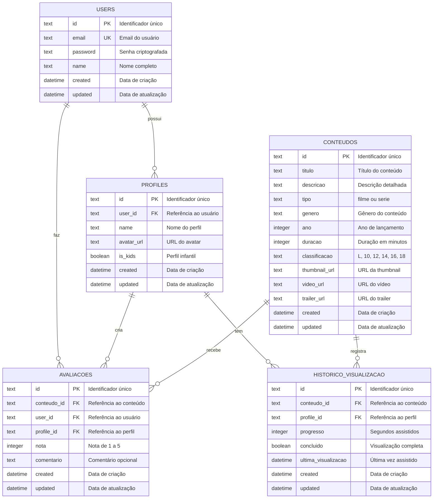
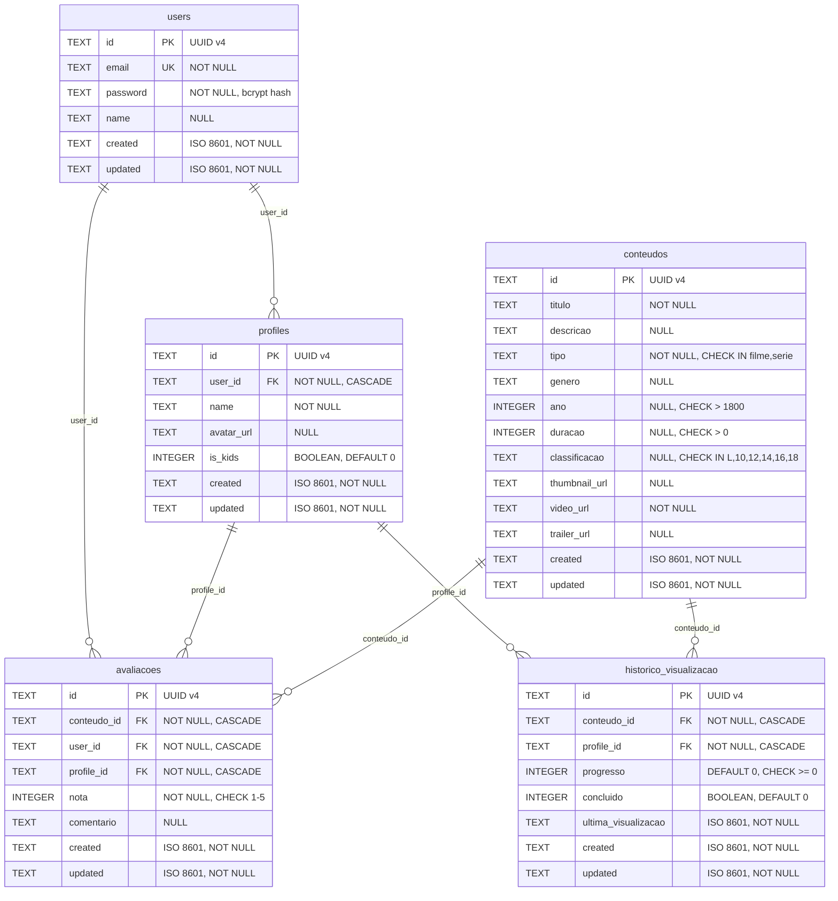

# 📊 Modelagem de Banco de Dados - JavaFlix

## 📑 Índice

1. [Introdução](#introdução)
2. [Diagrama MER Conceitual](#diagrama-mer-conceitual)
3. [Dicionário de Dados](#dicionário-de-dados)
4. [Relacionamentos Detalhados](#relacionamentos-detalhados)
5. [Índices e Performance](#índices-e-performance)
6. [Normalização](#normalização)
7. [Diagrama DER Físico](#diagrama-der-físico)

---

## 1. Introdução

### 1.1 Sobre MER/DER

O **Modelo Entidade-Relacionamento (MER)** é uma representação conceitual dos dados e seus relacionamentos em um sistema. O **Diagrama Entidade-Relacionamento (DER)** é a representação gráfica do MER, facilitando a visualização e compreensão da estrutura do banco de dados.

### 1.2 Tecnologia Utilizada

- **Banco de Dados**: PocketBase (baseado em SQLite)
- **Tipo**: Banco de dados relacional embutido
- **Versão SQLite**: 3.x
- **ORM/Client**: PocketBase SDK + REST API

### 1.3 Convenções de Nomenclatura

- **Tabelas**: Nomes em português, plural, minúsculas (ex: `users`, `profiles`, `conteudos`)
- **Campos**: Snake_case em português (ex: `user_id`, `avatar_url`, `ultima_visualizacao`)
- **Chaves Primárias**: Campo `id` do tipo TEXT (UUID gerado pelo PocketBase)
- **Chaves Estrangeiras**: Sufixo `_id` referenciando a tabela relacionada
- **Timestamps**: Campos `created` e `updated` automáticos em todas as tabelas

---

## 2. Diagrama MER Conceitual



### 2.1 Legenda do Diagrama

- **PK**: Primary Key (Chave Primária)
- **FK**: Foreign Key (Chave Estrangeira)
- **UK**: Unique Key (Chave Única)
- **||--o{**: Relacionamento Um-para-Muitos (1:N)

---

## 3. Dicionário de Dados

### 3.1 Tabela: users

Armazena informações dos usuários cadastrados na plataforma.

| Campo | Tipo | Restrições | Descrição | Exemplo |
|-------|------|------------|-----------|---------|
| id | TEXT | PK, NOT NULL | Identificador único do usuário (UUID) | `"k8x2m9n4p5q6r7s8"` |
| email | TEXT | UNIQUE, NOT NULL | Email do usuário para login | `"usuario@example.com"` |
| password | TEXT | NOT NULL | Senha criptografada (hash bcrypt) | `"$2a$10$..."` |
| name | TEXT | NULL | Nome completo do usuário | `"João Silva"` |
| created | DATETIME | NOT NULL | Data e hora de criação do registro | `"2024-01-15 10:30:00"` |
| updated | DATETIME | NOT NULL | Data e hora da última atualização | `"2024-01-20 14:45:00"` |

**Índices:**
- PRIMARY KEY: `id`
- UNIQUE INDEX: `email`

---

### 3.2 Tabela: profiles

Armazena os perfis de visualização associados a cada usuário.

| Campo | Tipo | Restrições | Descrição | Exemplo |
|-------|------|------------|-----------|---------|
| id | TEXT | PK, NOT NULL | Identificador único do perfil (UUID) | `"a1b2c3d4e5f6g7h8"` |
| user_id | TEXT | FK, NOT NULL | Referência ao usuário proprietário | `"k8x2m9n4p5q6r7s8"` |
| name | TEXT | NOT NULL | Nome do perfil | `"João"`, `"Kids"` |
| avatar_url | TEXT | NULL | URL do avatar do perfil | `"/avatars/avatar1.png"` |
| is_kids | BOOLEAN | DEFAULT false | Indica se é perfil infantil | `true`, `false` |
| created | DATETIME | NOT NULL | Data e hora de criação do registro | `"2024-01-15 10:35:00"` |
| updated | DATETIME | NOT NULL | Data e hora da última atualização | `"2024-01-15 10:35:00"` |

**Índices:**
- PRIMARY KEY: `id`
- FOREIGN KEY: `user_id` → `users(id)`
- INDEX: `user_id` (para consultas por usuário)

---

### 3.3 Tabela: conteudos

Armazena o catálogo de filmes e séries disponíveis na plataforma.

| Campo | Tipo | Restrições | Descrição | Exemplo |
|-------|------|------------|-----------|---------|
| id | TEXT | PK, NOT NULL | Identificador único do conteúdo (UUID) | `"x9y8z7w6v5u4t3s2"` |
| titulo | TEXT | NOT NULL | Título do filme ou série | `"Matrix"`, `"Breaking Bad"` |
| descricao | TEXT | NULL | Sinopse ou descrição detalhada | `"Um hacker descobre..."` |
| tipo | TEXT | NOT NULL | Tipo de conteúdo | `"filme"`, `"serie"` |
| genero | TEXT | NULL | Gênero do conteúdo | `"Ação"`, `"Drama"`, `"Ficção"` |
| ano | INTEGER | NULL | Ano de lançamento | `1999`, `2008` |
| duracao | INTEGER | NULL | Duração em minutos (para filmes) | `136`, `45` |
| classificacao | TEXT | NULL | Classificação indicativa brasileira | `"L"`, `"10"`, `"12"`, `"14"`, `"16"`, `"18"` |
| thumbnail_url | TEXT | NULL | URL da imagem de capa | `"/thumbnails/matrix.jpg"` |
| video_url | TEXT | NOT NULL | URL do arquivo de vídeo | `"/videos/matrix.mp4"` |
| trailer_url | TEXT | NULL | URL do trailer | `"/trailers/matrix.mp4"` |
| created | DATETIME | NOT NULL | Data e hora de criação do registro | `"2024-01-10 08:00:00"` |
| updated | DATETIME | NOT NULL | Data e hora da última atualização | `"2024-01-10 08:00:00"` |

**Índices:**
- PRIMARY KEY: `id`
- INDEX: `tipo` (para filtrar por tipo)
- INDEX: `genero` (para filtrar por gênero)
- INDEX: `classificacao` (para controle parental)

---

### 3.4 Tabela: avaliacoes

Armazena as avaliações (notas e comentários) dos usuários sobre os conteúdos.

| Campo | Tipo | Restrições | Descrição | Exemplo |
|-------|------|------------|-----------|---------|
| id | TEXT | PK, NOT NULL | Identificador único da avaliação (UUID) | `"m5n6o7p8q9r0s1t2"` |
| conteudo_id | TEXT | FK, NOT NULL | Referência ao conteúdo avaliado | `"x9y8z7w6v5u4t3s2"` |
| user_id | TEXT | FK, NOT NULL | Referência ao usuário que avaliou | `"k8x2m9n4p5q6r7s8"` |
| profile_id | TEXT | FK, NOT NULL | Referência ao perfil que fez a avaliação | `"a1b2c3d4e5f6g7h8"` |
| nota | INTEGER | NOT NULL, CHECK(1-5) | Nota de 1 a 5 estrelas | `5`, `4`, `3` |
| comentario | TEXT | NULL | Comentário opcional do usuário | `"Filme excelente!"` |
| created | DATETIME | NOT NULL | Data e hora de criação do registro | `"2024-01-16 20:15:00"` |
| updated | DATETIME | NOT NULL | Data e hora da última atualização | `"2024-01-16 20:15:00"` |

**Índices:**
- PRIMARY KEY: `id`
- FOREIGN KEY: `conteudo_id` → `conteudos(id)`
- FOREIGN KEY: `user_id` → `users(id)`
- FOREIGN KEY: `profile_id` → `profiles(id)`
- INDEX: `conteudo_id` (para listar avaliações de um conteúdo)
- UNIQUE INDEX: `(conteudo_id, profile_id)` (um perfil avalia uma vez)

---

### 3.5 Tabela: historico_visualizacao

Armazena o histórico de visualização e progresso de cada perfil.

| Campo | Tipo | Restrições | Descrição | Exemplo |
|-------|------|------------|-----------|---------|
| id | TEXT | PK, NOT NULL | Identificador único do histórico (UUID) | `"h1i2j3k4l5m6n7o8"` |
| conteudo_id | TEXT | FK, NOT NULL | Referência ao conteúdo assistido | `"x9y8z7w6v5u4t3s2"` |
| profile_id | TEXT | FK, NOT NULL | Referência ao perfil que assistiu | `"a1b2c3d4e5f6g7h8"` |
| progresso | INTEGER | DEFAULT 0 | Tempo assistido em segundos | `3600`, `7200` |
| concluido | BOOLEAN | DEFAULT false | Indica se foi assistido completamente | `true`, `false` |
| ultima_visualizacao | DATETIME | NOT NULL | Data e hora da última visualização | `"2024-01-17 21:30:00"` |
| created | DATETIME | NOT NULL | Data e hora de criação do registro | `"2024-01-17 21:00:00"` |
| updated | DATETIME | NOT NULL | Data e hora da última atualização | `"2024-01-17 21:30:00"` |

**Índices:**
- PRIMARY KEY: `id`
- FOREIGN KEY: `conteudo_id` → `conteudos(id)`
- FOREIGN KEY: `profile_id` → `profiles(id)`
- INDEX: `profile_id` (para listar histórico de um perfil)
- INDEX: `ultima_visualizacao` (para ordenar por recência)
- UNIQUE INDEX: `(conteudo_id, profile_id)` (um registro por conteúdo/perfil)

---

## 4. Relacionamentos Detalhados

### 4.1 users → profiles (1:N)

**Descrição**: Um usuário pode ter múltiplos perfis de visualização.

- **Entidades**: `users` (1) → `profiles` (N)
- **Tipo**: Um-para-Muitos (1:N)
- **Cardinalidade**: 
  - Mínima: 1 usuário pode ter 0 perfis
  - Máxima: 1 usuário pode ter N perfis (recomendado: até 5)
- **Chave Estrangeira**: `profiles.user_id` → `users.id`
- **Regras de Negócio**:
  - Um usuário deve criar pelo menos um perfil para usar a plataforma
  - Limite recomendado de 5 perfis por usuário
  - Cada perfil pode ter configurações independentes (avatar, nome, modo kids)
- **Integridade Referencial**: 
  - `ON DELETE CASCADE`: Ao deletar um usuário, todos os seus perfis são deletados
  - `ON UPDATE CASCADE`: Ao atualizar o ID do usuário, atualiza em todos os perfis

---

### 4.2 users → avaliacoes (1:N)

**Descrição**: Um usuário pode fazer múltiplas avaliações de diferentes conteúdos.

- **Entidades**: `users` (1) → `avaliacoes` (N)
- **Tipo**: Um-para-Muitos (1:N)
- **Cardinalidade**: 
  - Mínima: 1 usuário pode ter 0 avaliações
  - Máxima: 1 usuário pode ter N avaliações
- **Chave Estrangeira**: `avaliacoes.user_id` → `users.id`
- **Regras de Negócio**:
  - Um usuário pode avaliar múltiplos conteúdos
  - Cada avaliação está vinculada a um perfil específico
  - Usuários podem editar suas próprias avaliações
- **Integridade Referencial**: 
  - `ON DELETE CASCADE`: Ao deletar um usuário, todas as suas avaliações são deletadas
  - `ON UPDATE CASCADE`: Ao atualizar o ID do usuário, atualiza em todas as avaliações

---

### 4.3 profiles → avaliacoes (1:N)

**Descrição**: Um perfil pode criar múltiplas avaliações, mas apenas uma por conteúdo.

- **Entidades**: `profiles` (1) → `avaliacoes` (N)
- **Tipo**: Um-para-Muitos (1:N)
- **Cardinalidade**: 
  - Mínima: 1 perfil pode ter 0 avaliações
  - Máxima: 1 perfil pode ter N avaliações (1 por conteúdo)
- **Chave Estrangeira**: `avaliacoes.profile_id` → `profiles.id`
- **Regras de Negócio**:
  - Um perfil pode avaliar cada conteúdo apenas uma vez
  - Constraint UNIQUE em `(conteudo_id, profile_id)`
  - Perfis infantis podem ter restrições de avaliação
- **Integridade Referencial**: 
  - `ON DELETE CASCADE`: Ao deletar um perfil, todas as suas avaliações são deletadas
  - `ON UPDATE CASCADE`: Ao atualizar o ID do perfil, atualiza em todas as avaliações

---

### 4.4 conteudos → avaliacoes (1:N)

**Descrição**: Um conteúdo pode receber múltiplas avaliações de diferentes perfis.

- **Entidades**: `conteudos` (1) → `avaliacoes` (N)
- **Tipo**: Um-para-Muitos (1:N)
- **Cardinalidade**: 
  - Mínima: 1 conteúdo pode ter 0 avaliações
  - Máxima: 1 conteúdo pode ter N avaliações
- **Chave Estrangeira**: `avaliacoes.conteudo_id` → `conteudos.id`
- **Regras de Negócio**:
  - Cada conteúdo pode ser avaliado por múltiplos perfis
  - A média das notas é calculada para exibição
  - Avaliações são usadas para sistema de recomendação
- **Integridade Referencial**: 
  - `ON DELETE CASCADE`: Ao deletar um conteúdo, todas as suas avaliações são deletadas
  - `ON UPDATE CASCADE`: Ao atualizar o ID do conteúdo, atualiza em todas as avaliações

---

### 4.5 profiles → historico_visualizacao (1:N)

**Descrição**: Um perfil mantém histórico de visualização de múltiplos conteúdos.

- **Entidades**: `profiles` (1) → `historico_visualizacao` (N)
- **Tipo**: Um-para-Muitos (1:N)
- **Cardinalidade**: 
  - Mínima: 1 perfil pode ter 0 registros de histórico
  - Máxima: 1 perfil pode ter N registros de histórico
- **Chave Estrangeira**: `historico_visualizacao.profile_id` → `profiles.id`
- **Regras de Negócio**:
  - Cada perfil tem seu próprio histórico independente
  - O progresso é atualizado periodicamente durante a reprodução
  - Histórico é usado para "Continuar Assistindo"
  - Constraint UNIQUE em `(conteudo_id, profile_id)`
- **Integridade Referencial**: 
  - `ON DELETE CASCADE`: Ao deletar um perfil, todo o seu histórico é deletado
  - `ON UPDATE CASCADE`: Ao atualizar o ID do perfil, atualiza em todo o histórico

---

### 4.6 conteudos → historico_visualizacao (1:N)

**Descrição**: Um conteúdo pode ter múltiplos registros de visualização de diferentes perfis.

- **Entidades**: `conteudos` (1) → `historico_visualizacao` (N)
- **Tipo**: Um-para-Muitos (1:N)
- **Cardinalidade**: 
  - Mínima: 1 conteúdo pode ter 0 visualizações
  - Máxima: 1 conteúdo pode ter N visualizações
- **Chave Estrangeira**: `historico_visualizacao.conteudo_id` → `conteudos.id`
- **Regras de Negócio**:
  - Cada visualização é registrada por perfil
  - Usado para métricas de popularidade
  - Usado para sistema de recomendação
  - Histórico mantém o ponto de parada para retomar
- **Integridade Referencial**: 
  - `ON DELETE CASCADE`: Ao deletar um conteúdo, todo o histórico relacionado é deletado
  - `ON UPDATE CASCADE`: Ao atualizar o ID do conteúdo, atualiza em todo o histórico

---

## 5. Índices e Performance

### 5.1 Índices Primários (Primary Keys)

Todas as tabelas utilizam `id` (TEXT/UUID) como chave primária:

```sql
-- Índices automáticos criados pelo PocketBase
CREATE UNIQUE INDEX idx_users_id ON users(id);
CREATE UNIQUE INDEX idx_profiles_id ON profiles(id);
CREATE UNIQUE INDEX idx_conteudos_id ON conteudos(id);
CREATE UNIQUE INDEX idx_avaliacoes_id ON avaliacoes(id);
CREATE UNIQUE INDEX idx_historico_id ON historico_visualizacao(id);
```

**Justificativa**: UUIDs garantem unicidade global e facilitam distribuição/replicação.

---

### 5.2 Índices de Chaves Estrangeiras

```sql
-- Índices para otimizar JOINs e consultas relacionadas
CREATE INDEX idx_profiles_user_id ON profiles(user_id);
CREATE INDEX idx_avaliacoes_conteudo_id ON avaliacoes(conteudo_id);
CREATE INDEX idx_avaliacoes_user_id ON avaliacoes(user_id);
CREATE INDEX idx_avaliacoes_profile_id ON avaliacoes(profile_id);
CREATE INDEX idx_historico_conteudo_id ON historico_visualizacao(conteudo_id);
CREATE INDEX idx_historico_profile_id ON historico_visualizacao(profile_id);
```

**Justificativa**: Aceleram consultas que buscam registros relacionados (ex: "todos os perfis de um usuário").

---

### 5.3 Índices Únicos (Unique Constraints)

```sql
-- Garantir unicidade de email
CREATE UNIQUE INDEX idx_users_email ON users(email);

-- Um perfil avalia um conteúdo apenas uma vez
CREATE UNIQUE INDEX idx_avaliacoes_unique ON avaliacoes(conteudo_id, profile_id);

-- Um perfil tem apenas um registro de histórico por conteúdo
CREATE UNIQUE INDEX idx_historico_unique ON historico_visualizacao(conteudo_id, profile_id);
```

**Justificativa**: Previnem duplicação de dados e garantem integridade das regras de negócio.

---

### 5.4 Índices de Busca e Filtro

```sql
-- Busca por tipo de conteúdo (filme/série)
CREATE INDEX idx_conteudos_tipo ON conteudos(tipo);

-- Filtro por gênero
CREATE INDEX idx_conteudos_genero ON conteudos(genero);

-- Controle parental por classificação
CREATE INDEX idx_conteudos_classificacao ON conteudos(classificacao);

-- Ordenação por data de visualização
CREATE INDEX idx_historico_ultima_visualizacao ON historico_visualizacao(ultima_visualizacao DESC);
```

**Justificativa**: Otimizam consultas frequentes de filtro e ordenação no catálogo.

---

### 5.5 Campos Frequentemente Consultados

| Tabela | Campo | Frequência | Operação | Índice |
|--------|-------|------------|----------|--------|
| users | email | Alta | SELECT, WHERE | UNIQUE |
| profiles | user_id | Alta | JOIN, WHERE | INDEX |
| conteudos | tipo | Alta | WHERE, GROUP BY | INDEX |
| conteudos | genero | Média | WHERE, GROUP BY | INDEX |
| conteudos | classificacao | Média | WHERE (controle parental) | INDEX |
| avaliacoes | conteudo_id | Alta | JOIN, WHERE, AVG | INDEX |
| avaliacoes | profile_id | Alta | JOIN, WHERE | INDEX |
| historico_visualizacao | profile_id | Alta | JOIN, WHERE, ORDER BY | INDEX |
| historico_visualizacao | ultima_visualizacao | Alta | ORDER BY DESC | INDEX |

---

## 6. Normalização

### 6.1 Primeira Forma Normal (1FN)

✅ **Atendida**: Todas as tabelas possuem:
- Chave primária única (`id`)
- Valores atômicos (não há campos multivalorados)
- Sem grupos repetitivos

**Exemplo**: O campo `genero` em `conteudos` armazena um único valor. Se precisássemos de múltiplos gêneros, criaríamos uma tabela `conteudos_generos` (N:M).

---

### 6.2 Segunda Forma Normal (2FN)

✅ **Atendida**: Todas as tabelas possuem:
- Chave primária simples (não composta)
- Todos os atributos não-chave dependem totalmente da chave primária

**Exemplo**: Em `avaliacoes`, tanto `nota` quanto `comentario` dependem completamente de `id`, não de parte da chave.

---

### 6.3 Terceira Forma Normal (3FN)

✅ **Atendida**: Não há dependências transitivas:
- Nenhum atributo não-chave depende de outro atributo não-chave
- Todos os atributos dependem diretamente da chave primária

**Exemplo**: Em `profiles`, `avatar_url` depende de `id`, não de `name` ou outro campo.

---

### 6.4 Justificativa das Decisões de Design

#### 6.4.1 Separação de users e profiles

**Decisão**: Criar tabelas separadas ao invés de uma única tabela de usuários.

**Justificativa**:
- Permite múltiplos perfis por conta (família)
- Histórico e avaliações independentes por perfil
- Controle parental por perfil (is_kids)
- Flexibilidade para adicionar configurações específicas de perfil

**Trade-off**: Mais JOINs nas consultas, mas melhor organização e escalabilidade.

---

#### 6.4.2 Campos de timestamp automáticos

**Decisão**: Incluir `created` e `updated` em todas as tabelas.

**Justificativa**:
- Auditoria e rastreabilidade
- Ordenação cronológica
- Sincronização e cache
- Debugging e análise de dados

**Trade-off**: Pequeno overhead de armazenamento, mas essencial para produção.

---

#### 6.4.3 Uso de TEXT para IDs (UUID)

**Decisão**: Usar TEXT/UUID ao invés de INTEGER AUTO_INCREMENT.

**Justificativa**:
- Unicidade global (importante para sistemas distribuídos)
- Segurança (IDs não sequenciais)
- Facilita migração e replicação
- Padrão do PocketBase

**Trade-off**: Maior uso de espaço (16 bytes vs 4-8 bytes), mas benefícios superam.

---

#### 6.4.4 Desnormalização controlada

**Decisão**: Manter `user_id` em `avaliacoes` mesmo tendo `profile_id`.

**Justificativa**:
- Facilita consultas de "todas avaliações de um usuário"
- Evita JOIN adicional com `profiles`
- Melhora performance em relatórios
- Redundância mínima e controlada

**Trade-off**: Pequena redundância, mas ganho significativo de performance.

---

### 6.5 Trade-offs Considerados

| Aspecto | Decisão | Alternativa | Justificativa |
|---------|---------|-------------|---------------|
| **Múltiplos perfis** | Tabela separada | Campo JSON em users | Melhor normalização e consultas |
| **Tipo de ID** | UUID (TEXT) | INTEGER | Unicidade global e segurança |
| **Histórico** | Tabela dedicada | Campo JSON | Consultas e índices eficientes |
| **Classificação** | Campo TEXT | Tabela lookup | Simplicidade (valores fixos) |
| **Gênero** | Campo TEXT | Tabela N:M | Simplicidade inicial (pode evoluir) |
| **Timestamps** | Campos dedicados | Triggers | Automação do PocketBase |

---

## 7. Diagrama DER Físico

### 7.1 Diagrama Completo com Tipos SQLite



---

### 7.2 Constraints e Validações

#### 7.2.1 Check Constraints

```sql
-- Validação de nota (1 a 5 estrelas)
ALTER TABLE avaliacoes ADD CONSTRAINT chk_nota 
CHECK (nota >= 1 AND nota <= 5);

-- Validação de tipo de conteúdo
ALTER TABLE conteudos ADD CONSTRAINT chk_tipo 
CHECK (tipo IN ('filme', 'serie'));

-- Validação de classificação indicativa
ALTER TABLE conteudos ADD CONSTRAINT chk_classificacao 
CHECK (classificacao IN ('L', '10', '12', '14', '16', '18'));

-- Validação de ano
ALTER TABLE conteudos ADD CONSTRAINT chk_ano 
CHECK (ano > 1800 AND ano <= strftime('%Y', 'now'));

-- Validação de duração
ALTER TABLE conteudos ADD CONSTRAINT chk_duracao 
CHECK (duracao > 0);

-- Validação de progresso
ALTER TABLE historico_visualizacao ADD CONSTRAINT chk_progresso 
CHECK (progresso >= 0);
```

---

#### 7.2.2 Foreign Key Constraints

```sql
-- profiles.user_id → users.id
ALTER TABLE profiles ADD CONSTRAINT fk_profiles_user 
FOREIGN KEY (user_id) REFERENCES users(id) 
ON DELETE CASCADE ON UPDATE CASCADE;

-- avaliacoes.conteudo_id → conteudos.id
ALTER TABLE avaliacoes ADD CONSTRAINT fk_avaliacoes_conteudo 
FOREIGN KEY (conteudo_id) REFERENCES conteudos(id) 
ON DELETE CASCADE ON UPDATE CASCADE;

-- avaliacoes.user_id → users.id
ALTER TABLE avaliacoes ADD CONSTRAINT fk_avaliacoes_user 
FOREIGN KEY (user_id) REFERENCES users(id) 
ON DELETE CASCADE ON UPDATE CASCADE;

-- avaliacoes.profile_id → profiles.id
ALTER TABLE avaliacoes ADD CONSTRAINT fk_avaliacoes_profile 
FOREIGN KEY (profile_id) REFERENCES profiles(id) 
ON DELETE CASCADE ON UPDATE CASCADE;

-- historico_visualizacao.conteudo_id → conteudos.id
ALTER TABLE historico_visualizacao ADD CONSTRAINT fk_historico_conteudo 
FOREIGN KEY (conteudo_id) REFERENCES conteudos(id) 
ON DELETE CASCADE ON UPDATE CASCADE;

-- historico_visualizacao.profile_id → profiles.id
ALTER TABLE historico_visualizacao ADD CONSTRAINT fk_historico_profile 
FOREIGN KEY (profile_id) REFERENCES profiles(id) 
ON DELETE CASCADE ON UPDATE CASCADE;
```

---

### 7.3 Triggers Automáticos do PocketBase

O PocketBase gerencia automaticamente:

```sql
-- Trigger para atualizar campo 'updated' automaticamente
CREATE TRIGGER update_users_timestamp 
AFTER UPDATE ON users
BEGIN
    UPDATE users SET updated = datetime('now') WHERE id = NEW.id;
END;

-- Similar para todas as outras tabelas
CREATE TRIGGER update_profiles_timestamp AFTER UPDATE ON profiles ...
CREATE TRIGGER update_conteudos_timestamp AFTER UPDATE ON conteudos ...
CREATE TRIGGER update_avaliacoes_timestamp AFTER UPDATE ON avaliacoes ...
CREATE TRIGGER update_historico_timestamp AFTER UPDATE ON historico_visualizacao ...
```

---

### 7.4 Views Úteis (Opcional)

```sql
-- View: Média de avaliações por conteúdo
CREATE VIEW vw_conteudos_rating AS
SELECT 
    c.id,
    c.titulo,
    c.tipo,
    COUNT(a.id) as total_avaliacoes,
    AVG(a.nota) as nota_media,
    MAX(a.created) as ultima_avaliacao
FROM conteudos c
LEFT JOIN avaliacoes a ON c.id = a.conteudo_id
GROUP BY c.id;

-- View: Conteúdos mais assistidos
CREATE VIEW vw_conteudos_populares AS
SELECT 
    c.id,
    c.titulo,
    c.tipo,
    COUNT(DISTINCT h.profile_id) as total_visualizacoes,
    COUNT(CASE WHEN h.concluido = 1 THEN 1 END) as visualizacoes_completas
FROM conteudos c
LEFT JOIN historico_visualizacao h ON c.id = h.conteudo_id
GROUP BY c.id
ORDER BY total_visualizacoes DESC;

-- View: Histórico recente por perfil
CREATE VIEW vw_continuar_assistindo AS
SELECT 
    h.profile_id,
    c.id as conteudo_id,
    c.titulo,
    c.thumbnail_url,
    h.progresso,
    h.ultima_visualizacao
FROM historico_visualizacao h
JOIN conteudos c ON h.conteudo_id = c.id
WHERE h.concluido = 0
ORDER BY h.ultima_visualizacao DESC;
```

---

## 📊 Resumo da Modelagem

### Estatísticas do Banco de Dados

- **Total de Tabelas**: 5
- **Total de Relacionamentos**: 6
- **Forma Normal**: 3FN (Terceira Forma Normal)
- **Tipo de Banco**: Relacional (SQLite via PocketBase)
- **Total de Índices**: 15+ (incluindo PKs, FKs e índices de busca)
- **Total de Constraints**: 10+ (CHECK, UNIQUE, FK)

### Tabelas e Cardinalidades

| Tabela | Registros Esperados | Crescimento | Índices |
|--------|---------------------|-------------|---------|
| users | Milhares | Médio | 2 |
| profiles | Milhares | Médio | 2 |
| conteudos | Centenas/Milhares | Baixo | 5 |
| avaliacoes | Dezenas de milhares | Alto | 5 |
| historico_visualizacao | Dezenas de milhares | Alto | 4 |

### Pontos Fortes da Modelagem

✅ **Normalização adequada** (3FN)  
✅ **Integridade referencial** garantida  
✅ **Índices otimizados** para consultas frequentes  
✅ **Escalabilidade** para crescimento futuro  
✅ **Flexibilidade** para novos recursos  
✅ **Auditoria** com timestamps automáticos  
✅ **Segurança** com UUIDs e validações  

### Possíveis Evoluções Futuras

🔮 **Tabela de gêneros** (N:M com conteudos)  
🔮 **Tabela de temporadas/episódios** (para séries)  
🔮 **Tabela de listas personalizadas** (favoritos, assistir depois)  
🔮 **Tabela de notificações** (novos conteúdos, recomendações)  
🔮 **Tabela de assinaturas/planos** (monetização)  
🔮 **Tabela de dispositivos** (controle de sessões)  
🔮 **Tabela de legendas/áudios** (multilíngue)  

---

## 📚 Referências

- [PocketBase Documentation](https://pocketbase.io/docs/)
- [SQLite Data Types](https://www.sqlite.org/datatype3.html)
- [Database Normalization](https://en.wikipedia.org/wiki/Database_normalization)
- [Entity-Relationship Model](https://en.wikipedia.org/wiki/Entity%E2%80%93relationship_model)
- [Mermaid ER Diagrams](https://mermaid.js.org/syntax/entityRelationshipDiagram.html)

---

**Documento criado em**: 2024-01-22  
**Versão**: 1.0  
**Autor**: Equipe JavaFlix  
**Última atualização**: 2024-01-22