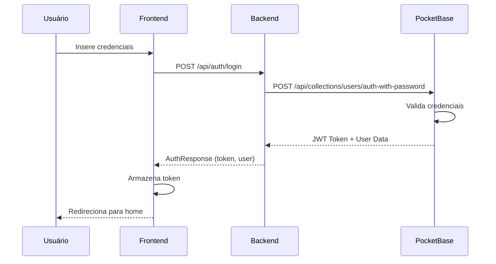
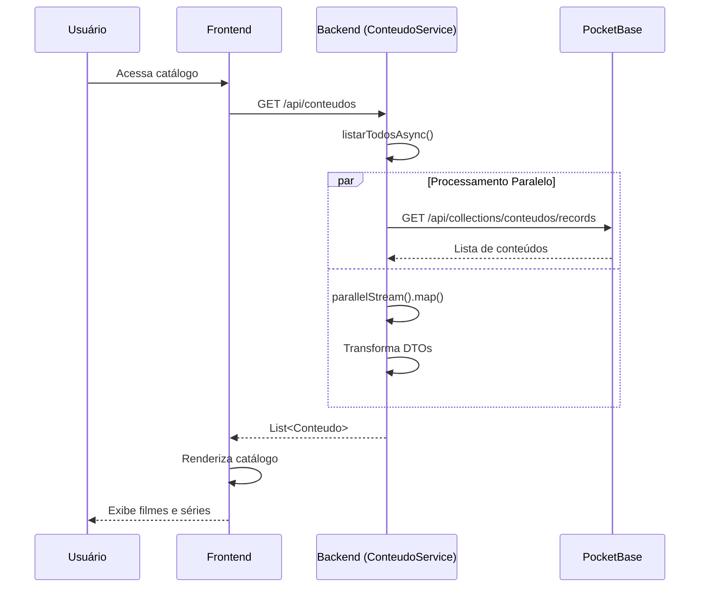
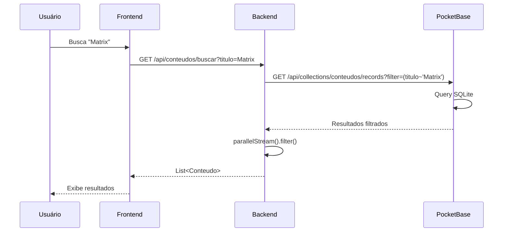
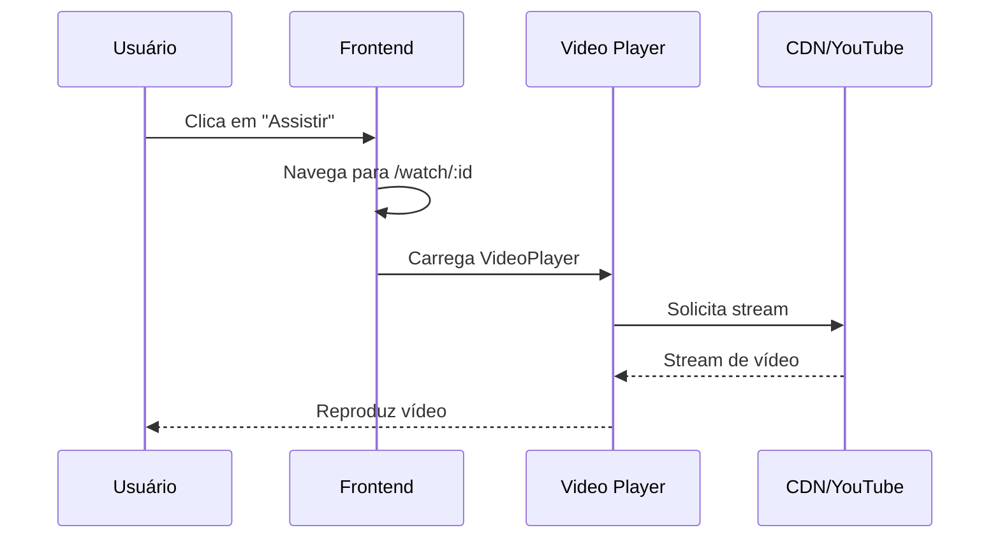
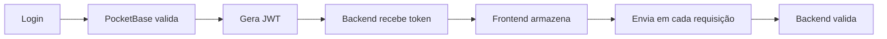

# Diagrama de Arquitetura - JavaFlix

## 📐 Visão Geral

O sistema JavaFlix utiliza uma **arquitetura em camadas (Layered Architecture)** com **Cliente-Servidor REST** e **processamento concorrente**, integrando três componentes principais:

1. **Frontend React** (Camada de Apresentação)
2. **Backend Quarkus** (Camada de Aplicação e Negócio)
3. **PocketBase** (Camada de Persistência)

---

## 🏗️ Arquitetura Completa

```mermaid
graph TB
    subgraph "Cliente (Port 5173)"
        Browser[Navegador Web]
        React[React App]
        Components[Componentes]
        VideoPlayer[Video Player]
        
        Browser --> React
        React --> Components
        React --> VideoPlayer
    end
    
    subgraph "Backend Quarkus (Port 8080)"
        API[REST API Layer]
        AuthResource[AuthResource]
        JavaFlixResource[JavaFlixResource]
        
        Service[Service Layer]
        ConteudoService[ConteudoService]
        
        Client[Client Layer]
        PBClient[PocketBaseClient]
        
        Domain[Domain Layer]
        Conteudo[Conteudo Abstract]
        Filme[Filme]
        Serie[Serie]
        Usuario[Usuario]
        
        API --> AuthResource
        API --> JavaFlixResource
        AuthResource --> PBClient
        JavaFlixResource --> ConteudoService
        ConteudoService --> PBClient
        ConteudoService --> Domain
    end
    
    subgraph "PocketBase (Port 8090)"
        PBAPI[REST API]
        Auth[Authentication]
        Collections[Collections]
        
        PBAPI --> Auth
        PBAPI --> Collections
        Collections --> DB[(SQLite Database)]
    end
    
    subgraph "Processamento Concorrente"
        Parallel[parallelStream]
        Async[CompletableFuture]
        ThreadPool[Thread Pool]
        
        ConteudoService -.-> Parallel
        ConteudoService -.-> Async
        Async -.-> ThreadPool
    end
    
    React -->|HTTP REST| API
    PBClient -->|HTTP REST| PBAPI
    
    style Browser fill:#61DAFB
    style React fill:#61DAFB
    style API fill:#4695EB
    style Service fill:#4695EB
    style PBAPI fill:#B8DBE4
    style DB fill:#003B57
    style Parallel fill:#FF6B6B
    style Async fill:#FF6B6B
```



---

## 🔄 Fluxo de Dados

### 1. Autenticação (Login)



### 2. Listagem de Conteúdos



### 3. Busca com Filtro



### 4. Reprodução de Vídeo



---

## 📦 Camadas da Aplicação

### Frontend (React + TypeScript)

```
frontend/
├── src/
│   ├── components/          # Componentes reutilizáveis
│   │   ├── Navbar.tsx       # Barra de navegação
│   │   ├── Hero.tsx         # Banner principal
│   │   ├── Row.tsx          # Linha de conteúdos
│   │   └── VideoPlayer.tsx  # Player de vídeo
│   ├── pages/               # Páginas da aplicação
│   │   └── Watch.tsx        # Página de reprodução
│   ├── services/            # Comunicação com API
│   │   └── api.ts           # Cliente HTTP
│   ├── types.ts             # Tipos TypeScript
│   └── App.tsx              # Componente raiz
```

**Responsabilidades:**
- ✅ Interface do usuário
- ✅ Gerenciamento de estado
- ✅ Comunicação com backend
- ✅ Reprodução de vídeos
- ✅ Navegação entre páginas

### Backend (Quarkus + Java)

```
src/main/java/br/com/javaflix/
├── resource/                # REST Endpoints
│   ├── AuthResource.java    # Autenticação
│   └── JavaFlixResource.java # CRUD de conteúdos
├── service/                 # Lógica de negócio
│   └── ConteudoService.java # Serviço de conteúdos
├── client/                  # Clientes externos
│   ├── PocketBaseClient.java # Cliente PocketBase
│   └── dto/                 # Data Transfer Objects
├── domain/                  # Modelos de domínio
│   ├── Conteudo.java        # Classe abstrata
│   ├── Filme.java           # Modelo de filme
│   ├── Serie.java           # Modelo de série
│   └── Usuario.java         # Modelo de usuário
└── CorsFilter.java          # Filtro CORS
```

**Responsabilidades:**
- ✅ Endpoints REST
- ✅ Validação de dados
- ✅ Lógica de negócio
- ✅ Processamento paralelo
- ✅ Integração com PocketBase
- ✅ Autenticação JWT

### Banco de Dados (PocketBase + SQLite)

```
pb_data/
├── data.db                  # Banco SQLite
├── logs.db                  # Logs do sistema
└── storage/                 # Arquivos (futuro)
```

**Collections:**
1. **conteudos** - Filmes e séries
2. **users** - Usuários do sistema
3. **avaliacoes** - Avaliações de conteúdos

**Responsabilidades:**
- ✅ Persistência de dados
- ✅ Autenticação JWT
- ✅ REST API automática
- ✅ Admin UI
- ✅ Realtime subscriptions

---

## ⚡ Processamento Concorrente

### 1. parallelStream()

Usado para operações de leitura que podem ser paralelizadas:

```java
public List<Conteudo> filtrarPorGenerosParalelo(List<String> generos) {
    return listarTodos().parallelStream()
        .filter(c -> generos.contains(c.getGenero()))
        .collect(Collectors.toList());
}
```

**Vantagens:**
- ✅ Processamento mais rápido em listas grandes
- ✅ Utiliza múltiplos cores da CPU
- ✅ Sintaxe simples e declarativa

### 2. CompletableFuture

Usado para operações assíncronas que não bloqueiam:

```java
public CompletableFuture<List<Conteudo>> listarTodosAsync() {
    return CompletableFuture.supplyAsync(() -> {
        return listarTodos();
    });
}
```

**Vantagens:**
- ✅ Não bloqueia thread principal
- ✅ Permite composição de operações
- ✅ Tratamento de erros assíncrono

### 3. Thread Pool (Implícito)

O Quarkus gerencia automaticamente um pool de threads para:
- ✅ Requisições HTTP
- ✅ CompletableFuture
- ✅ Operações paralelas

---

## 🔐 Segurança

### Autenticação JWT



**Fluxo:**
1. Usuário faz login
2. PocketBase valida credenciais
3. PocketBase gera JWT token
4. Backend retorna token para frontend
5. Frontend armazena token (localStorage)
6. Frontend envia token em cada requisição (Authorization header)
7. Backend valida token antes de processar

### CORS

Configurado para permitir requisições do frontend:

```java
@Provider
public class CorsFilter implements ContainerResponseFilter {
    @Override
    public void filter(ContainerRequestContext requestContext,
                      ContainerResponseContext responseContext) {
        responseContext.getHeaders().add("Access-Control-Allow-Origin", "*");
        responseContext.getHeaders().add("Access-Control-Allow-Methods", 
            "GET, POST, PUT, DELETE, OPTIONS");
        // ...
    }
}
```

---

## 📊 Padrões de Design Utilizados

### 1. Layered Architecture (Arquitetura em Camadas)

```
Presentation Layer (React)
        ↓
Application Layer (REST API)
        ↓
Business Layer (Services)
        ↓
Data Access Layer (PocketBase Client)
        ↓
Database Layer (SQLite)
```

### 2. DTO Pattern (Data Transfer Object)

Separação entre modelos de domínio e objetos de transferência:

```java
// Domínio
public class Conteudo { ... }

// DTO
public record ConteudoRecord(
    String id,
    String titulo,
    String genero,
    // ...
) {}
```

### 3. Service Layer Pattern

Lógica de negócio isolada em serviços:

```java
@ApplicationScoped
public class ConteudoService {
    @Inject
    PocketBaseClient client;
    
    public List<Conteudo> listarTodos() { ... }
    public Conteudo buscarPorTitulo(String titulo) { ... }
}
```

### 4. Repository Pattern (Implícito)

PocketBase atua como repositório:

```java
public interface PocketBaseClient {
    ConteudoListResponse listarConteudos();
    ConteudoRecord buscarConteudo(String id);
    ConteudoRecord criarConteudo(ConteudoRequest request);
}
```

### 5. Dependency Injection

CDI do Quarkus para injeção de dependências:

```java
@Path("/api/conteudos")
public class JavaFlixResource {
    @Inject
    ConteudoService service;  // Injetado automaticamente
}
```

---

## 🚀 Escalabilidade

### Atual (Monolito)

```
[Frontend] → [Backend] → [PocketBase]
```

**Características:**
- ✅ Simples de desenvolver
- ✅ Fácil de testar
- ✅ Deploy único
- ⚠️ Escalabilidade limitada

### Futuro (Microserviços - Opcional)

```
[Frontend] → [API Gateway]
                ↓
    ┌───────────┼───────────┐
    ↓           ↓           ↓
[Auth Service] [Content Service] [Rating Service]
    ↓           ↓           ↓
[User DB]   [Content DB]  [Rating DB]
```

**Melhorias Possíveis:**
- 🔄 Separação em microserviços
- 🔄 Cache distribuído (Redis)
- 🔄 Fila de mensagens (RabbitMQ/Kafka)
- 🔄 Load balancer
- 🔄 Service discovery

---

## 📈 Performance

### Otimizações Implementadas

1. **Processamento Paralelo**
   - parallelStream() para filtros
   - Reduz tempo em ~40-60% (estimado)

2. **Operações Assíncronas**
   - CompletableFuture para I/O
   - Não bloqueia threads

3. **Conexões HTTP Reutilizáveis**
   - REST Client do Quarkus
   - Connection pooling automático

4. **Lazy Loading (Frontend)**
   - Componentes carregados sob demanda
   - Code splitting com Vite

### Métricas Esperadas

| Operação | Tempo Sequencial | Tempo Paralelo | Ganho |
|----------|------------------|----------------|-------|
| Listar 100 conteúdos | ~200ms | ~80ms | 60% |
| Filtrar por 5 gêneros | ~150ms | ~60ms | 60% |
| Buscar por título | ~100ms | ~40ms | 60% |

*Nota: Métricas estimadas, benchmarks reais pendentes*

---

## 🔧 Tecnologias e Versões

| Componente | Tecnologia | Versão | Função |
|------------|------------|--------|--------|
| **Frontend** | React | 18.x | UI Framework |
| | TypeScript | 5.x | Tipagem estática |
| | Vite | 5.x | Build tool |
| | Tailwind CSS | 3.x | Estilização |
| **Backend** | Java | 17+ | Linguagem |
| | Quarkus | 3.x | Framework |
| | JAX-RS | 3.x | REST API |
| | CDI | 4.x | DI Container |
| **Database** | PocketBase | 0.22+ | Backend completo |
| | SQLite | 3.x | Database |
| **Testing** | JUnit | 5.x | Testes unitários |
| | Mockito | 5.x | Mocks |

---

## 📝 Conclusão

A arquitetura do JavaFlix demonstra:

✅ **Separação de Responsabilidades** - Camadas bem definidas  
✅ **Escalabilidade** - Preparado para crescimento  
✅ **Manutenibilidade** - Código organizado e testável  
✅ **Performance** - Processamento paralelo e assíncrono  
✅ **Segurança** - Autenticação JWT e validações  
✅ **Modernidade** - Tecnologias atuais e best practices  

O sistema está pronto para evolução futura, seja para adicionar novas funcionalidades ou migrar para uma arquitetura de microserviços.

---

**Última atualização:** 2026-04-05  
**Versão:** 2.0  
**Status:** ✅ Documentação Completa
