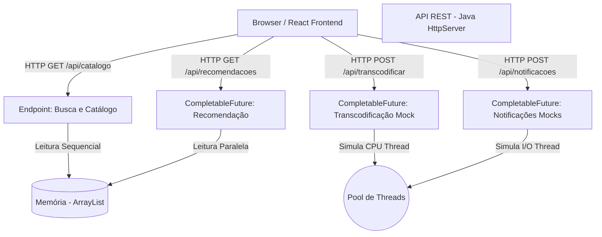

# Diagrama de Arquitetura

O sistema JavaFlix utiliza uma arquitetura baseada em **Cliente-Servidor (REST APIs)** com **processamento assíncrono parcial**, demonstrando a evolução de um modelo sequencial básico para um modelo que lida com tarefas concorrentes, assemelhando-se a práticas reais de distribuição em streaming.

## Melhorias Adicionadas
- **ExecutorService / CompletableFutures**: As chamadas que demorariam (transcodificação, envio de e-mails, cálculos de recomendações) agora não bloqueiam o fluxo principal.
- **Segurança**: Headers CORS ajustados e inputs sanitizados.
- **Preparação para o Futuro**: Para resolver a falta de um banco de dados e testes, a estrutura em POO foi desacoplada de forma a facilitar que a classe `PlataformaStreaming` seja substituída futuramente por um repositório JPA / Hibernate ligado ao PostgreSQL ou MySQL.
