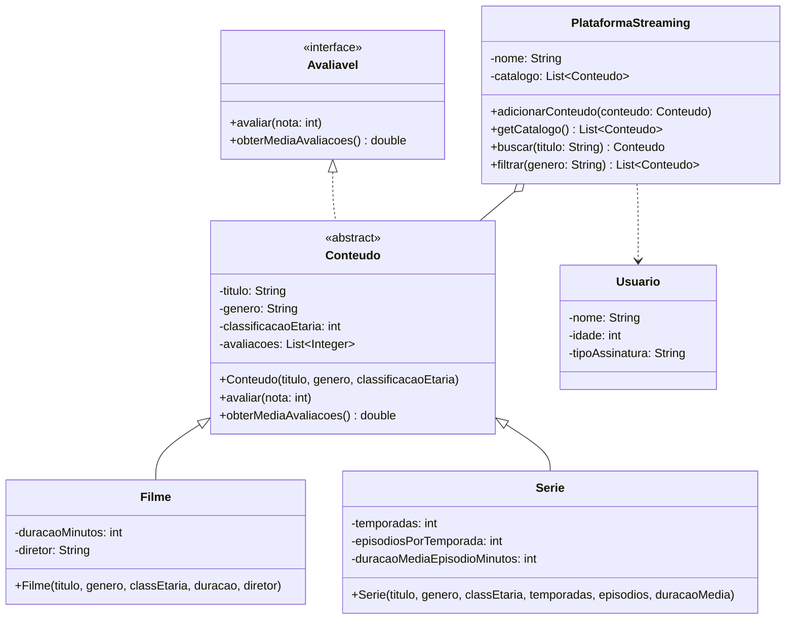

# Diagrama UML - Classes

```mermaid
classDiagram
    class Avaliavel {
        <<interface>>
        +avaliar(nota: int)
        +obterMediaAvaliacoes() double
    }

    class Conteudo {
        <<abstract>>
        -titulo: String
        -genero: String
        -classificacaoEtaria: int
        -avaliacoes: List~Integer~
        +Conteudo(titulo, genero, classificacaoEtaria)
        +avaliar(nota: int)
        +obterMediaAvaliacoes() double
    }

    class Filme {
        -duracaoMinutos: int
        -diretor: String
        +Filme(titulo, genero, classEtaria, duracao, diretor)
    }

    class Serie {
        -temporadas: int
        -episodiosPorTemporada: int
        -duracaoMediaEpisodioMinutos: int
        +Serie(titulo, genero, classEtaria, temporadas, episodios, duracaoMedia)
    }

    class PlataformaStreaming {
        -nome: String
        -catalogo: List~Conteudo~
        +adicionarConteudo(conteudo: Conteudo)
        +getCatalogo() List~Conteudo~
        +buscar(titulo: String) Conteudo
        +filtrar(genero: String) List~Conteudo~
    }

    class Usuario {
        -nome: String
        -idade: int
        -tipoAssinatura: String
    }

    Avaliavel <|.. Conteudo
    Conteudo <|-- Filme
    Conteudo <|-- Serie
    PlataformaStreaming o-- Conteudo
    PlataformaStreaming ..> Usuario
```
