# Diagrama UML - Classes JavaFlix

## 📐 Visão Geral

Este documento apresenta os diagramas UML completos do sistema JavaFlix, incluindo:
- Classes de domínio
- DTOs (Data Transfer Objects)
- Services e Resources
- Relacionamentos e dependências

---

## 🎯 Diagrama Principal - Classes de Domínio

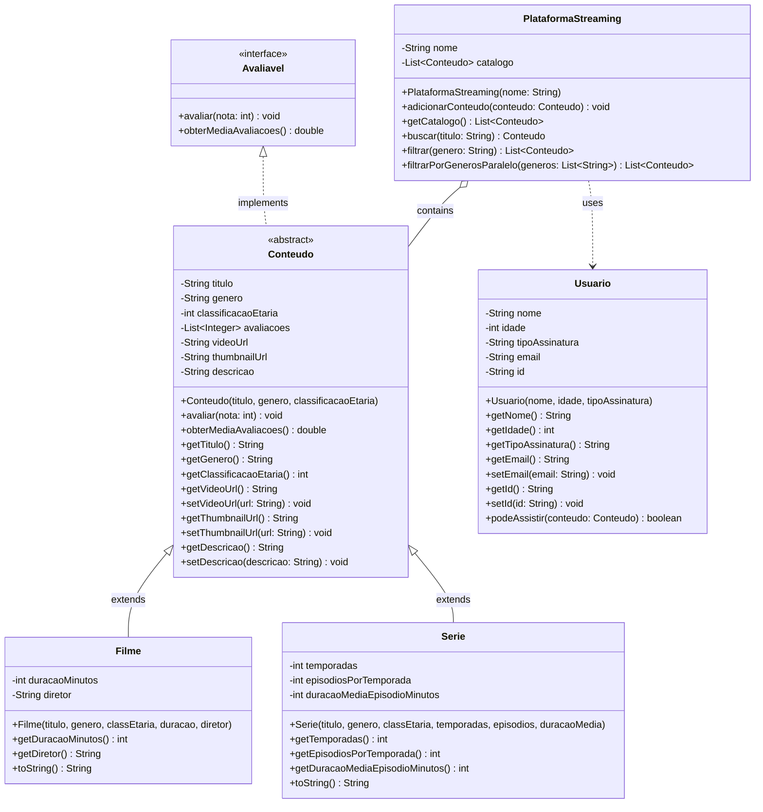

---

## 🔄 Diagrama de DTOs (Data Transfer Objects)

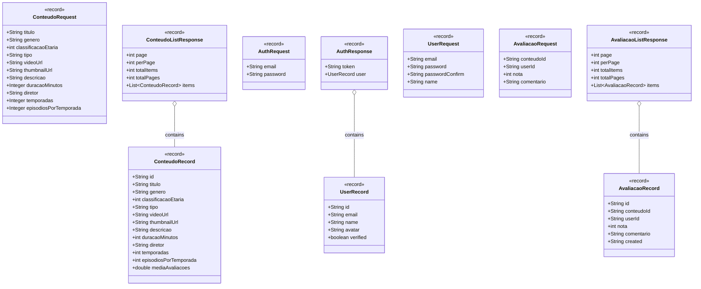

---

## 🌐 Diagrama de Resources (REST Endpoints)

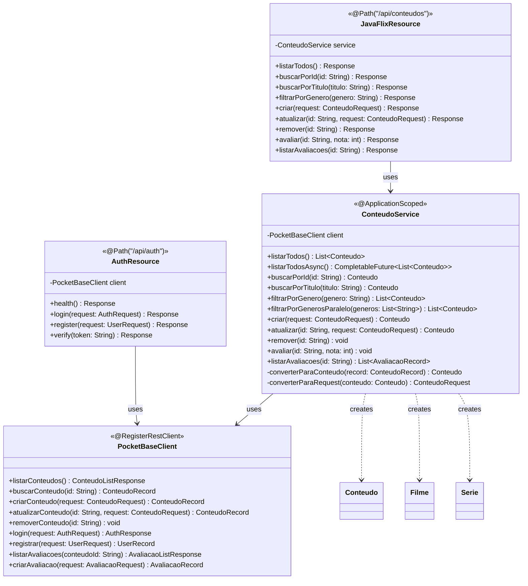

---

## 🔐 Diagrama de Segurança

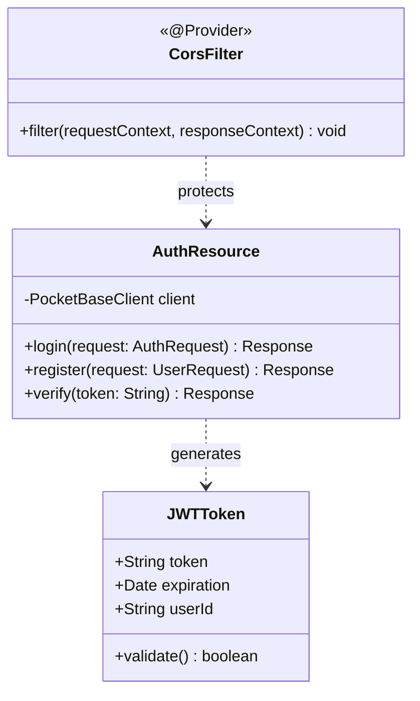

---

## 📊 Diagrama de Relacionamentos Completo

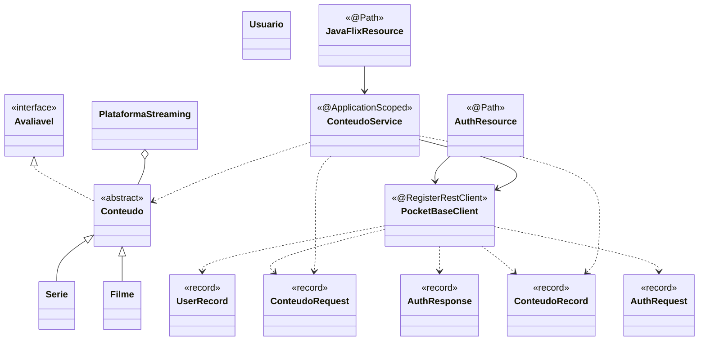

---

## 🎨 Padrões de Design Identificados

### 1. Template Method Pattern

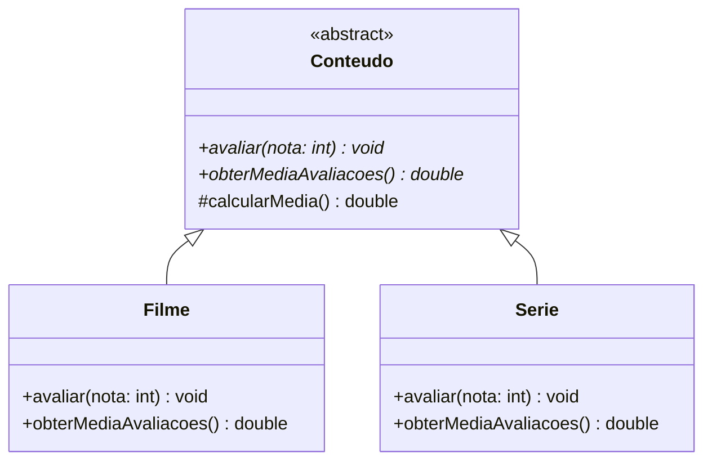

### 2. DTO Pattern

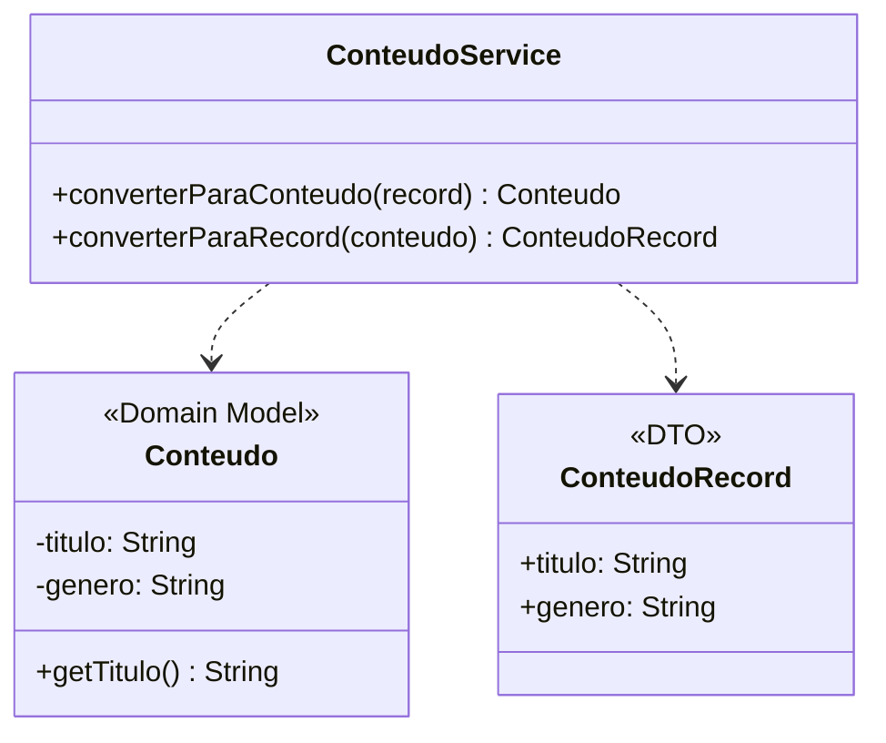

### 3. Service Layer Pattern

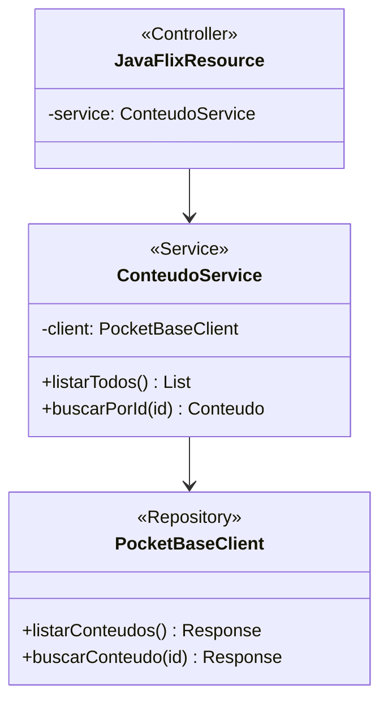

### 4. Dependency Injection Pattern

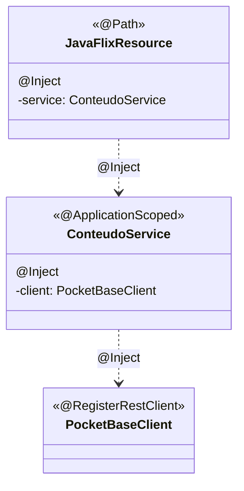

---

## 🔄 Diagrama de Sequência - Criar Conteúdo

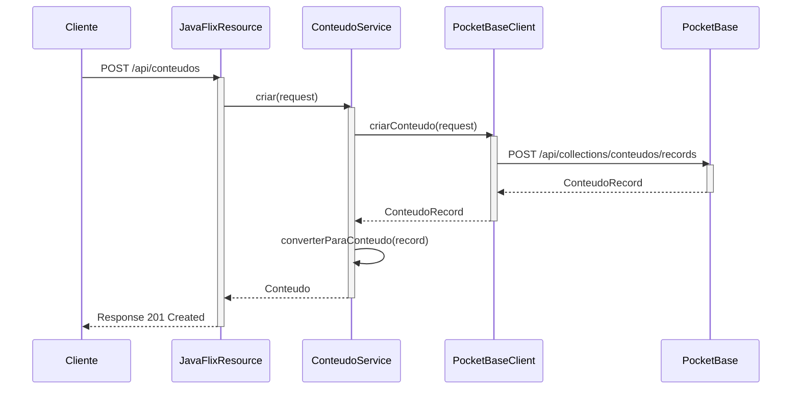

---

## 🔄 Diagrama de Sequência - Autenticação

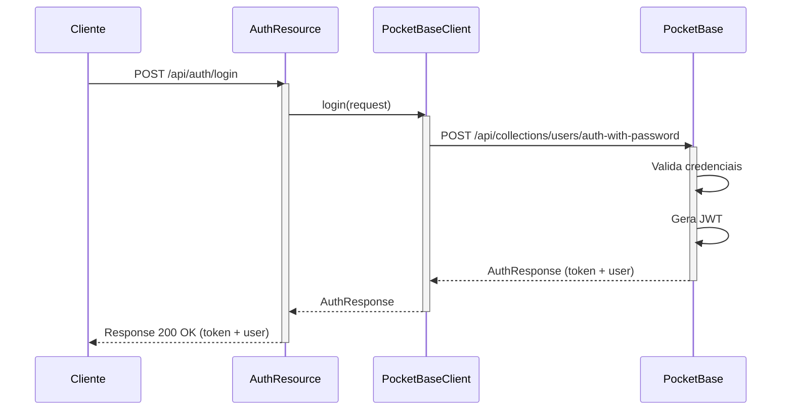

---

## 📦 Diagrama de Pacotes

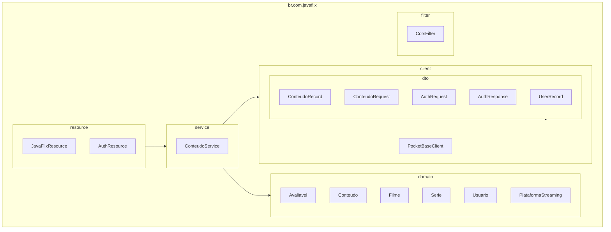

---

## 📊 Estatísticas das Classes

| Categoria | Quantidade | Descrição |
|-----------|------------|-----------|
| **Interfaces** | 1 | Avaliavel |
| **Classes Abstratas** | 1 | Conteudo |
| **Classes Concretas** | 5 | Filme, Serie, Usuario, PlataformaStreaming, ConteudoService |
| **Records (DTOs)** | 9 | ConteudoRecord, ConteudoRequest, etc. |
| **Resources** | 2 | JavaFlixResource, AuthResource |
| **Clients** | 1 | PocketBaseClient |
| **Filters** | 1 | CorsFilter |
| **Total** | 20 | Classes/Interfaces/Records |

---

## 🎯 Princípios SOLID Aplicados

### Single Responsibility Principle (SRP)
✅ Cada classe tem uma única responsabilidade:
- `ConteudoService` - Lógica de negócio
- `PocketBaseClient` - Comunicação com API
- `JavaFlixResource` - Endpoints REST

### Open/Closed Principle (OCP)
✅ Classes abertas para extensão, fechadas para modificação:
- `Conteudo` é abstrata, permite novos tipos
- Novos tipos de conteúdo podem ser adicionados sem modificar código existente

### Liskov Substitution Principle (LSP)
✅ Subclasses podem substituir classes base:
- `Filme` e `Serie` podem ser usados onde `Conteudo` é esperado
- Polimorfismo funciona corretamente

### Interface Segregation Principle (ISP)
✅ Interfaces específicas e coesas:
- `Avaliavel` define apenas métodos de avaliação
- Clientes não dependem de métodos que não usam

### Dependency Inversion Principle (DIP)
✅ Dependências de abstrações, não de implementações:
- `ConteudoService` depende de interface `PocketBaseClient`
- Injeção de dependência via CDI

---

## 📝 Conclusão

O diagrama UML do JavaFlix demonstra:

✅ **Hierarquia Clara** - Herança e polimorfismo bem definidos  
✅ **Separação de Responsabilidades** - Camadas distintas  
✅ **Padrões de Design** - DTO, Service Layer, DI  
✅ **SOLID Principles** - Todos os 5 princípios aplicados  
✅ **Extensibilidade** - Fácil adicionar novos tipos de conteúdo  
✅ **Manutenibilidade** - Código organizado e testável  

---

**Última atualização:** 2026-04-05  
**Versão:** 2.0  
**Status:** ✅ Documentação Completa
